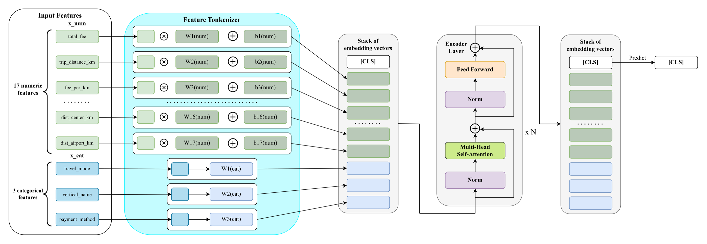

# Matching Rider Cancellation Rate

Rider/customer cancellation prediction project — predicting whether a rider will cancel a trip **after** a driver has already been dispatched (post-dispatch), so the matching/dispatch system can act on that risk before it happens.

This README covers the project's public write-up site (`docs/`), deployed via GitHub Pages.

## Live site

```
https://thanhhiepvo.github.io/Matching-Rider-Cancellation-Rate/
```

The home page is the FT-Transformer architecture deep-dive:



## Site contents

Multi-page site, shared nav bar on every page (`docs/shared.css`):

| Page | Content |
|---|---|
| [`docs/index.html`](docs/index.html) | **Kiến trúc FT-Transformer** — single-page math report: input features, Feature Tokenizer formulas, `[CLS]`, Transformer Encoder, prediction head, real tuned hyperparameters. |
| [`docs/gioi-thieu.html`](docs/gioi-thieu.html) | **Bài toán** — problem statement, business context, dispatch pipeline (pre/post), ML approach, original 6-feature baseline, reading list. |
| [`docs/tuan-1.html`](docs/tuan-1.html) | **Tuần 1** — reproduced LightGBM baseline (14 features), frozen benchmark (ROC-AUC post-dispatch 0,7267). |
| [`docs/tuan-2.html`](docs/tuan-2.html) | **Tuần 2** — segment/SHAP error analysis, 28 feature-engineering experiments (6 kept), FAIR before/after comparison, reproducibility fixes, `is_post_dispatch` feature→rule change. |
| [`docs/tuan-3.html`](docs/tuan-3.html) | **Tuần 3** — 6 model class comparison (LightGBM/XGBoost/CatBoost/MLP/FT-Transformer/MambaTab) tuned on Cancel PR-AUC, imbalance handling + calibration, Model V3. |

Supporting assets: `docs/shared.css` (design system + nav shared by every page), `docs/img/` (SHAP/report charts used on the Tuần 2 page), `docs/ft-transformer-architecture.png` (architecture diagram, hand-drawn in draw.io).

No build step — plain HTML/CSS/JS, KaTeX and Google Fonts loaded from CDN.

## Regenerating real numbers

The box-plots and category distributions embedded in `docs/index.html` are computed from the real dataset. To refresh them after the underlying data changes:

```bash
python3 Baseline/export_feature_stats.py
```
