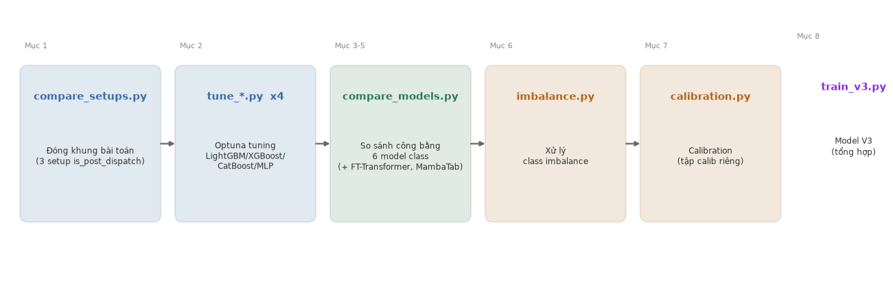
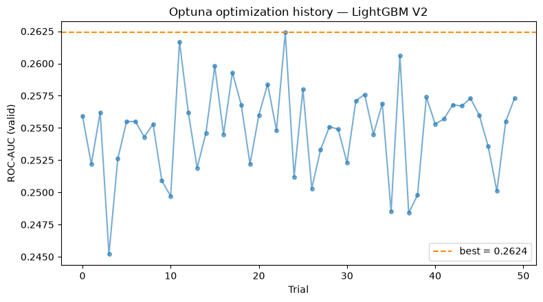
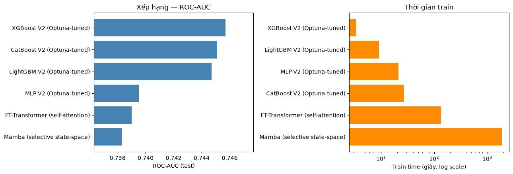
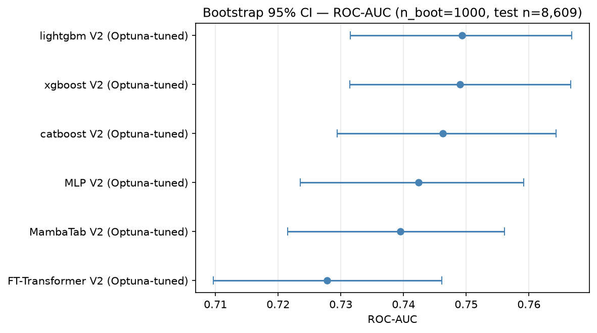
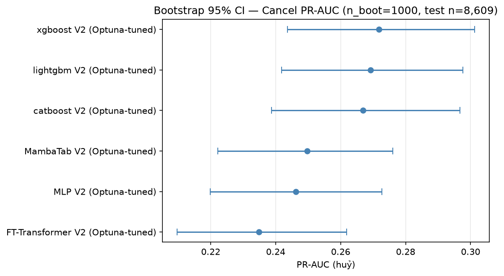
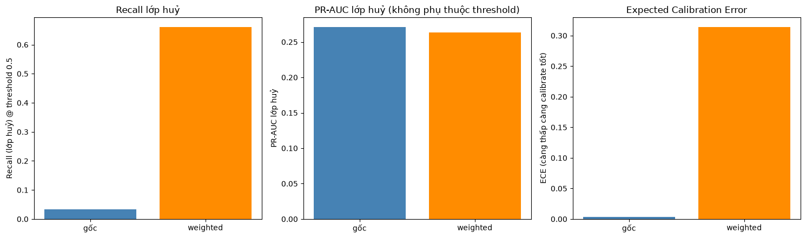
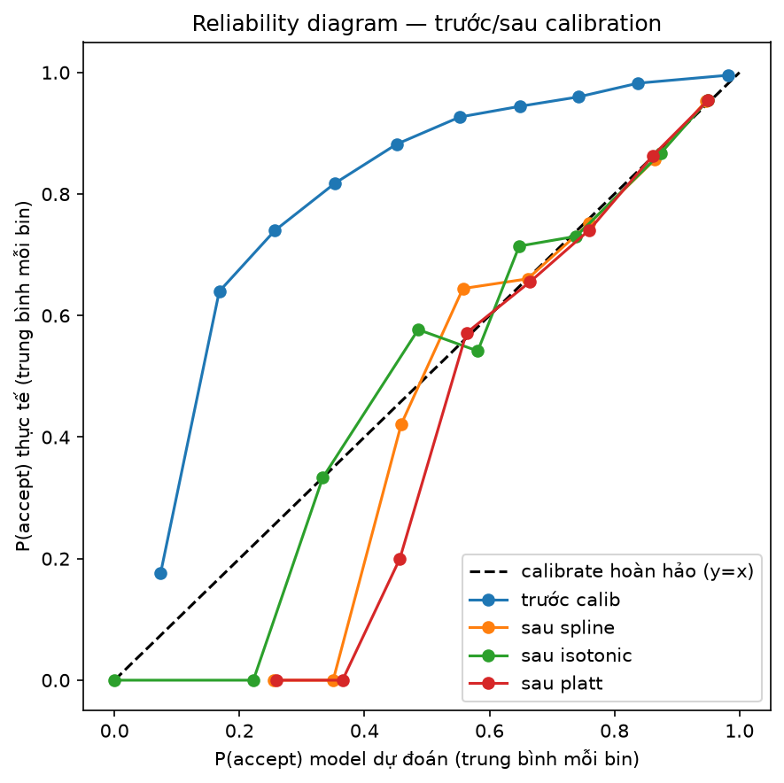
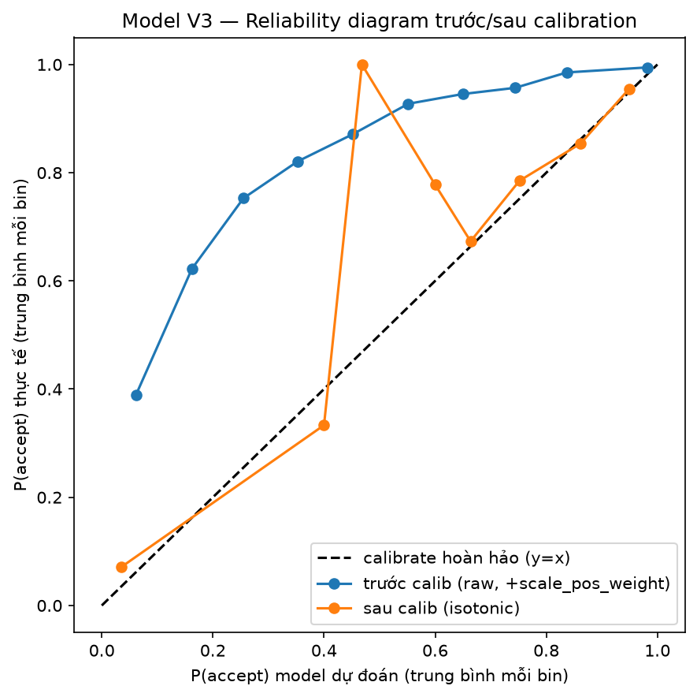

# W3 Results — Rider Acceptance Prediction: Modeling, Training & Evaluation

| | | | |
|---|---|---|---|
| **Dự án** | Rider Acceptance (Matching & Dispatch) | **Tuần** | W3 (03/08–09/08/2026) |
| **Mục tiêu** | Từ short-list feature của W2 -> BUILD -> TRAIN -> EVALUATION thành pipeline chuẩn cho mọi model class; cải thiện thuật toán ML/DL để đạt độ chính xác cao nhất | **Test set** | 13/07/2026 (post-dispatch), n=8.609 |

## Định nghĩa of Done (DOD) — bám sát để đọc kết quả

1. Pipeline training post-dispatch train & đo trên CÙNG test set với feature list W2 (20 feature, gồm `is_rainy_3h`).
2. Thử nghiệm + đề xuất 1 model class khác LightGBM baseline.
3. Bảng so sánh ≥4 model class trên CÙNG split, kèm train/test time.
4. Toàn bộ run log MLflow, tái lập bằng 1 lệnh.
5. (Optional) Ý tưởng feature mới nếu có phát sinh trong lúc build — **`is_rainy_3h`** (thời tiết, Open-Meteo).

## Cấu trúc notebook

0. Pipeline training — sơ đồ luồng các bước + mục tiêu từng bước (script nào chạy trước/sau, vì sao)
- Metrics dùng trong báo cáo — định nghĩa từng metric trước khi đọc kết quả
1. So sánh 3 setup xử lý `is_post_dispatch` (Task 1)
2. LightGBM V2 — Optuna tuning (Task 3)
3. So sánh TẤT CẢ 6 model class (GBDT + MLP + FT-Transformer + MambaTab), kèm thời gian train/test (Task 3 + DOD 2/3)
3b. Bootstrap 95% CI — đo độ tin cậy, SỬA LẠI đề xuất model class thành XGBoost V2
4. FT-Transformer — kiến trúc & phát hiện, đào sâu (Task 3 mở rộng)
5. MambaTab — kiến trúc khác FT-Transformer & cách huấn luyện, đào sâu (Task 3 mở rộng)
6. Xử lý Class Imbalance (Task 3)
7. Calibration trên tập calib riêng (Task 3)
8. Model V3 — tổng hợp toàn bộ (Task 4)
9. Feature mới: thời tiết `is_rainy_3h` (DOD item 5)
10. Kết luận chung + đối chiếu DOD

Notebook này ĐỌC LẠI kết quả đã chạy (artifact JSON/CSV trong `artifacts/` + MLflow `mlflow.db`) — không train lại từ đầu.


```python
import sys, os
sys.path.insert(0, os.path.abspath('.'))
import json
import pandas as pd
import numpy as np
import matplotlib.pyplot as plt
import mlflow
from IPython.display import display, Image

ART = os.path.abspath('../artifacts')
mlflow.set_tracking_uri('sqlite:///' + os.path.abspath('../mlflow.db'))
client = mlflow.tracking.MlflowClient()
EXP = client.get_experiment_by_name('rider-cancellation-prediction')

pd.set_option('display.width', 160)
pd.set_option('display.max_columns', 30)


def latest_run(run_name: str):
    runs = client.search_runs([EXP.experiment_id],
                               filter_string=f"tags.mlflow.runName = '{run_name}' and attributes.status = 'FINISHED'",
                               order_by=['attributes.start_time DESC'], max_results=1)
    return runs[0] if runs else None


def metrics_with_prefix(run, prefix: str) -> dict:
    return {k[len(prefix):]: v for k, v in run.data.metrics.items() if k.startswith(prefix)}


def load_json(name):
    return json.load(open(os.path.join(ART, name)))
```

## 0. Pipeline training — sơ đồ luồng các bước

Toàn bộ pipeline W3 chạy được bằng 1 lệnh (`run_w3_pipeline.py`, DOD item 4). Sơ đồ dưới đây tóm tắt thứ tự các script và output chính của từng bước.


```python
import matplotlib.patches as mpatches
from matplotlib.patches import FancyBboxPatch, FancyArrowPatch

fig, ax = plt.subplots(figsize=(13, 4.2))
ax.set_xlim(0, 13); ax.set_ylim(0, 4.2); ax.axis('off')

stages = [
    (0.3, 'compare_setups.py', 'Đóng khung bài toán\n(3 setup is_post_dispatch)'),
    (2.9, 'tune_*.py  x4', 'Optuna tuning\nLightGBM/XGBoost/\nCatBoost/MLP'),
    (5.5, 'compare_models.py', 'So sánh công bằng\n6 model class\n(+ FT-Transformer, MambaTab)'),
    (8.1, 'imbalance.py', 'Xử lý\nclass imbalance'),
    (10.7, 'calibration.py', 'Calibration\n(tập calib riêng)'),
]
w, h, y = 2.2, 2.3, 0.9
colors = ['#3b6ea5', '#3b6ea5', '#2f7d5b', '#b5651d', '#b5651d']
for (x, title, sub), c in zip(stages, colors):
    box = FancyBboxPatch((x, y), w, h, boxstyle='round,pad=0.08,rounding_size=0.12',
                          linewidth=1.4, edgecolor=c, facecolor=c, alpha=0.15)
    ax.add_patch(box)
    ax.text(x + w/2, y + h - 0.42, title, ha='center', va='center', fontsize=10.5, fontweight='bold', color=c)
    ax.text(x + w/2, y + h - 1.35, sub, ha='center', va='center', fontsize=8.7, color='#333')

for i in range(len(stages) - 1):
    x0 = stages[i][0] + w
    x1 = stages[i + 1][0]
    ax.annotate('', xy=(x1 - 0.05, y + h/2), xytext=(x0 + 0.05, y + h/2),
                arrowprops=dict(arrowstyle='-|>', color='#666', linewidth=1.6))

final_x = 10.7 + w + 0.35
box = FancyBboxPatch((final_x, y - 0.15), 1.9, h + 0.3, boxstyle='round,pad=0.08,rounding_size=0.12',
                      linewidth=1.6, edgecolor='#8a2be2', facecolor='#8a2be2', alpha=0.18)
ax.add_patch(box)
ax.text(final_x + 0.95, y + h - 0.42 + 0.15, 'train_v3.py', ha='center', va='center', fontsize=10.5, fontweight='bold', color='#8a2be2')
ax.text(final_x + 0.95, y + h - 1.35 + 0.15, 'Model V3\n(tổng hợp)', ha='center', va='center', fontsize=8.7, color='#333')
ax.annotate('', xy=(final_x - 0.05, y + h/2), xytext=(10.7 + w + 0.05, y + h/2),
            arrowprops=dict(arrowstyle='-|>', color='#666', linewidth=1.6))

ax.text(0.3, y + h + 0.35, 'Mục 1', fontsize=8, color='#888')
ax.text(2.9, y + h + 0.35, 'Mục 2', fontsize=8, color='#888')
ax.text(5.5, y + h + 0.35, 'Mục 3-5', fontsize=8, color='#888')
ax.text(8.1, y + h + 0.35, 'Mục 6', fontsize=8, color='#888')
ax.text(10.7, y + h + 0.35, 'Mục 7', fontsize=8, color='#888')
ax.text(final_x, y + h + 0.35 + 0.15, 'Mục 8', fontsize=8, color='#888')

plt.tight_layout()
display(fig)
plt.close(fig)
```


    

    


**Mục tiêu từng bước** (script nào làm gì, vì sao cần bước đó):

| Bước | Script | Mục tiêu |
|---|---|---|
| 1 | `compare_setups.py` | **Đóng khung bài toán** — xác định phạm vi train ĐÚNG kiến trúc production (post-dispatch-only + rule xử lý phần còn lại), so với phương án gộp toàn bộ dữ liệu làm đối chứng. Chọn TRƯỚC khi train, không đoán mò. |
| 2 | `tune_lightgbm.py` · `tune_xgboost.py` · `tune_catboost.py` · `tune_mlp.py` | **Optuna tuning** cho 4 model class CPU-friendly — tìm hyperparameter tốt nhất, early-stop trên `valid` (không đụng `test`), đảm bảo mục 3 so sánh công bằng. **FT-Transformer & MambaTab dùng ngân sách Optuna riêng, nhỏ hơn** (mục 5) — không phải vì kiến trúc kém, mà vì GIỚI HẠN PHẦN CỨNG: máy build không có GPU/CUDA, và 2 model này train chậm hơn GBDT hàng chục-hàng trăm lần trên CPU/MPS (xem mục 3), nên chỉ chạy 10 trial × 30-60 epoch/trial thay vì 25-50 trial như GBDT/MLP. CẢ 6 model class đều đã qua Optuna, đối xử NGANG HÀNG ở mọi bảng so sánh. |
| 3 | `compare_models.py` | **So sánh công bằng — 6 model class** — train LẠI cả 6 model TRONG CÙNG process/máy để đo train/predict time công bằng (không lấy số liệu từ các lần chạy riêng lẻ, khác thời điểm) — DOD item 3. |
| 4 | `train.py --imbalance weighted` | **Xử lý Class Imbalance** — đo tác động của việc tăng trọng số lớp huỷ (thiểu số ~9-10%) lên recall VÀ lên PR-AUC/calibration, xác nhận đánh đổi cần xử lý tiếp ở bước 5. |
| 5 | `calibration.py` | **Calibration** — khôi phục ý nghĩa xác suất (đã bị bước 4 phá) bằng cách fit 3 calibrator trên tập `calib` RIÊNG (không phải train/test), chọn phương pháp tốt nhất. |
| 6 | `train_v3.py` | **Model V3 — tổng hợp** — kết hợp model thắng (mục 3) + kỹ thuật imbalance (mục 4) + calibration (mục 5) + chọn lại threshold thành 1 model production-ready, đo đầy đủ Evaluation Metric. |

### Sơ đồ pipeline sklearn từng model (`estimator_html_repr`)

Mỗi script build model (cả 6) đều tự vẽ sơ đồ CẤU TRÚC estimator ngay trong code (`pipeline_diagram.py`, dùng `sklearn.utils.estimator_html_repr`), lưu vào `artifacts/pipeline_<model>.html`:
- **CatBoost** dùng đúng object `CatBoostClassifier` thật sẽ được train.
- **LightGBM/XGBoost** train qua native Booster API (`lgb.train`/`xgb.train`) để early-stop đúng cách nên sơ đồ dựng 1 estimator sklearn TƯƠNG ĐƯƠNG (cùng hyperparameter) chỉ để trực quan hoá.
- **FT-Transformer/MambaTab** là `nn.Module` (PyTorch), không tự sklearn-compatible — sơ đồ bọc các khối kiến trúc thật (FT-Transformer: Feature Tokenizer → self-attention → head; MambaTab: embedding 1-token → khối SSM xếp chồng → head) bằng các class `BaseEstimator` "vỏ", CÙNG hyperparameter đang train, chỉ để trực quan hoá cấu trúc (không transform/fit dữ liệu thật).


```python
from IPython.display import HTML

for name, fname in [('LightGBM', 'pipeline_lightgbm.html'),
                     ('XGBoost', 'pipeline_xgboost.html'),
                     ('CatBoost', 'pipeline_catboost.html'),
                     ('FT-Transformer', 'pipeline_ft_transformer.html'),
                     ('MambaTab', 'pipeline_mambatab.html')]:
    print(f'--- {name} ---')
    display(HTML(open(os.path.join(ART, fname)).read()))
```

    --- LightGBM ---


<style>.sk-global {
  /* Definition of color scheme common for light and dark mode */
  --sklearn-color-text: #000;
  --sklearn-color-text-muted: #666;
  --sklearn-color-line: gray;
  /* Definition of color scheme for unfitted estimators */
  --sklearn-color-unfitted-level-0: #fff5e6;
  --sklearn-color-unfitted-level-1: #f6e4d2;
  --sklearn-color-unfitted-level-2: #ffe0b3;
  --sklearn-color-unfitted-level-3: chocolate;
  /* Definition of color scheme for fitted estimators */
  --sklearn-color-fitted-level-0: #f0f8ff;
  --sklearn-color-fitted-level-1: #d4ebff;
  --sklearn-color-fitted-level-2: #b3dbfd;
  --sklearn-color-fitted-level-3: cornflowerblue;
}

.sk-global.light {
  /* Specific color for light theme */
  --sklearn-color-text-on-default-background: black;
  --sklearn-color-background: white;
  --sklearn-color-border-box: black;
  --sklearn-color-icon: #696969;
}

.sk-global.dark {
  --sklearn-color-text-on-default-background: white;
  --sklearn-color-background: #111;
  --sklearn-color-border-box: white;
  --sklearn-color-icon: #878787;
}

.sk-global {
  color: var(--sklearn-color-text);
}

.sk-global pre {
  padding: 0;
}

.sk-global input.sk-hidden--visually {
  border: 0;
  clip-path: inset(100%);
  height: 1px;
  margin: -1px;
  overflow: hidden;
  padding: 0;
  position: absolute;
  width: 1px;
}

.sk-global div.sk-dashed-wrapped {
  border: 1px dashed var(--sklearn-color-line);
  margin: 0 0.4em 0.5em 0.4em;
  box-sizing: border-box;
  padding-bottom: 0.4em;
  background-color: var(--sklearn-color-background);
}

.sk-global div.sk-container {
  /* jupyter's `normalize.less` sets `[hidden] { display: none; }`
     but bootstrap.min.css set `[hidden] { display: none !important; }`
     so we also need the `!important` here to be able to override the
     default hidden behavior on the sphinx rendered scikit-learn.org.
     See: https://github.com/scikit-learn/scikit-learn/issues/21755 */
  display: inline-block !important;
  position: relative;
}

.sk-global div.sk-text-repr-fallback {
  display: none;
}

div.sk-parallel-item,
div.sk-serial,
div.sk-item {
  /* draw centered vertical line to link estimators */
  background-image: linear-gradient(var(--sklearn-color-text-on-default-background), var(--sklearn-color-text-on-default-background));
  background-size: 2px 100%;
  background-repeat: no-repeat;
  background-position: center center;
}

/* Parallel-specific style estimator block */

.sk-global div.sk-parallel-item::after {
  content: "";
  width: 100%;
  border-bottom: 2px solid var(--sklearn-color-text-on-default-background);
  flex-grow: 1;
}

.sk-global div.sk-parallel {
  display: flex;
  align-items: stretch;
  justify-content: center;
  background-color: var(--sklearn-color-background);
  position: relative;
}

.sk-global div.sk-parallel-item {
  display: flex;
  flex-direction: column;
}

.sk-global div.sk-parallel-item:first-child::after {
  align-self: flex-end;
  width: 50%;
}

.sk-global div.sk-parallel-item:last-child::after {
  align-self: flex-start;
  width: 50%;
}

.sk-global div.sk-parallel-item:only-child::after {
  width: 0;
}

/* Serial-specific style estimator block */

.sk-global div.sk-serial {
  display: flex;
  flex-direction: column;
  align-items: center;
  background-color: var(--sklearn-color-background);
  padding-right: 1em;
  padding-left: 1em;
}


/* Toggleable style: style used for estimator/Pipeline/ColumnTransformer box that is
clickable and can be expanded/collapsed.
- Pipeline and ColumnTransformer use this feature and define the default style
- Estimators will overwrite some part of the style using the `sk-estimator` class
*/

/* Pipeline and ColumnTransformer style (default) */

.sk-global div.sk-toggleable {
  /* Default theme specific background. It is overwritten whether we have a
  specific estimator or a Pipeline/ColumnTransformer */
  background-color: var(--sklearn-color-background);
}

/* Toggleable label */
.sk-global label.sk-toggleable__label {
  cursor: pointer;
  display: flex;
  width: 100%;
  margin-bottom: 0;
  padding: 0.5em;
  box-sizing: border-box;
  text-align: center;
  align-items: center;
  justify-content: center;
  gap: 0.5em;
}

.sk-global label.sk-toggleable__label .caption {
  font-size: 0.6rem;
  font-weight: lighter;
  color: var(--sklearn-color-text-muted);
}

.sk-global label.sk-toggleable__label-arrow:before {
  /* Arrow on the left of the label */
  content: "▸";
  float: left;
  margin-right: 0.25em;
  color: var(--sklearn-color-icon);
}

.sk-global label.sk-toggleable__label-arrow:hover:before {
  color: var(--sklearn-color-text);
}

/* Toggleable content - dropdown */

.sk-global div.sk-toggleable__content {
  display: none;
  text-align: left;
  /* unfitted */
  background-color: var(--sklearn-color-unfitted-level-0);
}

.sk-global div.sk-toggleable__content.fitted {
  /* fitted */
  background-color: var(--sklearn-color-fitted-level-0);
}

.sk-global div.sk-toggleable__content pre {
  margin: 0.2em;
  border-radius: 0.25em;
  color: var(--sklearn-color-text);
  /* unfitted */
  background-color: var(--sklearn-color-unfitted-level-0);
}

.sk-global div.sk-toggleable__content.fitted pre {
  /* unfitted */
  background-color: var(--sklearn-color-fitted-level-0);
}

.sk-global input.sk-toggleable__control:checked~div.sk-toggleable__content {
  /* Expand drop-down */
  display: block;
  width: 100%;
  overflow: visible;
}

.sk-global input.sk-toggleable__control:checked~label.sk-toggleable__label-arrow:before {
  content: "▾";
}

/* Pipeline/ColumnTransformer-specific style */

.sk-global div.sk-label input.sk-toggleable__control:checked~label.sk-toggleable__label {
  color: var(--sklearn-color-text);
  background-color: var(--sklearn-color-unfitted-level-2);
}

.sk-global div.sk-label.fitted input.sk-toggleable__control:checked~label.sk-toggleable__label {
  background-color: var(--sklearn-color-fitted-level-2);
}

/* Estimator-specific style */

/* Colorize estimator box */
.sk-global div.sk-estimator input.sk-toggleable__control:checked~label.sk-toggleable__label {
  /* unfitted */
  background-color: var(--sklearn-color-unfitted-level-2);
}

.sk-global div.sk-estimator.fitted input.sk-toggleable__control:checked~label.sk-toggleable__label {
  /* fitted */
  background-color: var(--sklearn-color-fitted-level-2);
}

.sk-global div.sk-label label.sk-toggleable__label,
.sk-global div.sk-label label {
  /* The background is the default theme color */
  color: var(--sklearn-color-text-on-default-background);
}

/* On hover, darken the color of the background */
.sk-global div.sk-label:hover label.sk-toggleable__label {
  color: var(--sklearn-color-text);
  background-color: var(--sklearn-color-unfitted-level-2);
}

/* Label box, darken color on hover, fitted */
.sk-global div.sk-label.fitted:hover label.sk-toggleable__label.fitted {
  color: var(--sklearn-color-text);
  background-color: var(--sklearn-color-fitted-level-2);
}

/* Estimator label */

.sk-global div.sk-label label {
  font-family: monospace;
  font-weight: bold;
  line-height: 1.2em;
}

.sk-global div.sk-label-container {
  text-align: center;
}

/* Estimator-specific */
.sk-global div.sk-estimator {
  font-family: monospace;
  border: 1px dotted var(--sklearn-color-border-box);
  border-radius: 0.25em;
  box-sizing: border-box;
  margin-bottom: 0.5em;
  /* unfitted */
  background-color: var(--sklearn-color-unfitted-level-0);
}

.sk-global div.sk-estimator.fitted {
  /* fitted */
  background-color: var(--sklearn-color-fitted-level-0);
}

/* on hover */
.sk-global div.sk-estimator:hover {
  /* unfitted */
  background-color: var(--sklearn-color-unfitted-level-2);
}

.sk-global div.sk-estimator.fitted:hover {
  /* fitted */
  background-color: var(--sklearn-color-fitted-level-2);
}

/* Specification for estimator info (e.g. "i" and "?") */

/* Common style for "i" and "?" */

.sk-estimator-doc-link,
a:link.sk-estimator-doc-link,
a:visited.sk-estimator-doc-link {
  float: right;
  font-size: smaller;
  line-height: 1em;
  font-family: monospace;
  background-color: var(--sklearn-color-unfitted-level-0);
  border-radius: 1em;
  height: 1em;
  width: 1em;
  text-decoration: none !important;
  margin-left: 0.5em;
  text-align: center;
  /* unfitted */
  border: var(--sklearn-color-unfitted-level-3) 1pt solid;
  color: var(--sklearn-color-unfitted-level-3);
}

.sk-estimator-doc-link.fitted,
a:link.sk-estimator-doc-link.fitted,
a:visited.sk-estimator-doc-link.fitted {
  /* fitted */
  background-color: var(--sklearn-color-fitted-level-0);
  border: var(--sklearn-color-fitted-level-3) 1pt solid;
  color: var(--sklearn-color-fitted-level-3);
}

/* On hover */
div.sk-estimator:hover .sk-estimator-doc-link:hover,
.sk-estimator-doc-link:hover,
div.sk-label-container:hover .sk-estimator-doc-link:hover,
.sk-estimator-doc-link:hover {
  /* unfitted */
  background-color: var(--sklearn-color-unfitted-level-3);
  border: var(--sklearn-color-fitted-level-0) 1pt solid;
  color: var(--sklearn-color-unfitted-level-0);
  text-decoration: none;
}

div.sk-estimator.fitted:hover .sk-estimator-doc-link.fitted:hover,
.sk-estimator-doc-link.fitted:hover,
div.sk-label-container:hover .sk-estimator-doc-link.fitted:hover,
.sk-estimator-doc-link.fitted:hover {
  /* fitted */
  background-color: var(--sklearn-color-fitted-level-3);
  border: var(--sklearn-color-fitted-level-0) 1pt solid;
  color: var(--sklearn-color-fitted-level-0);
  text-decoration: none;
}

/* Span, style for the box shown on hovering the info icon */
.sk-estimator-doc-link span {
  display: none;
  z-index: 9999;
  position: relative;
  font-weight: normal;
  right: .2ex;
  padding: .5ex;
  margin: .5ex;
  width: min-content;
  min-width: 20ex;
  max-width: 50ex;
  color: var(--sklearn-color-text);
  box-shadow: 2pt 2pt 4pt #999;
  /* unfitted */
  background: var(--sklearn-color-unfitted-level-0);
  border: .5pt solid var(--sklearn-color-unfitted-level-3);
}

.sk-estimator-doc-link.fitted span {
  /* fitted */
  background: var(--sklearn-color-fitted-level-0);
  border: var(--sklearn-color-fitted-level-3);
}

.sk-estimator-doc-link:hover span {
  display: block;
}

/* "?"-specific style due to the `<a>` HTML tag */

.sk-global a.estimator_doc_link {
  float: right;
  font-size: 1rem;
  line-height: 1em;
  font-family: monospace;
  background-color: var(--sklearn-color-unfitted-level-0);
  border-radius: 1rem;
  height: 1rem;
  width: 1rem;
  text-decoration: none;
  /* unfitted */
  color: var(--sklearn-color-unfitted-level-1);
  border: var(--sklearn-color-unfitted-level-1) 1pt solid;
}

.sk-global a.estimator_doc_link.fitted {
  /* fitted */
  background-color: var(--sklearn-color-fitted-level-0);
  border: var(--sklearn-color-fitted-level-1) 1pt solid;
  color: var(--sklearn-color-fitted-level-1);
}

/* On hover */
.sk-global a.estimator_doc_link:hover {
  /* unfitted */
  background-color: var(--sklearn-color-unfitted-level-3);
  color: var(--sklearn-color-background);
  text-decoration: none;
}

.sk-global a.estimator_doc_link.fitted:hover {
  /* fitted */
  background-color: var(--sklearn-color-fitted-level-3);
}

.sk-top-container.sk-global {
  /* pydata-sphinx-theme hides overflow, so scrolling is disabled.
   We need to set it to !important and add tabindex="0" in the HTML
   to allow keyboard-only users to navigate the display. */
  overflow-x: scroll !important;
  max-width: 100%;
}

.estimator-table {
    font-family: monospace;
}

.estimator-table summary {
    padding: .5rem;
    cursor: pointer;
}

.estimator-table summary::marker {
    font-size: 0.7rem;
}

.estimator-table details[open] {
    padding-left: 0.1rem;
    padding-right: 0.1rem;
    padding-bottom: 0.3rem;
}

.estimator-table .parameters-table {
    margin-left: auto !important;
    margin-right: auto !important;
    margin-top: 0;
}

.estimator-table .parameters-table tr:nth-child(odd) {
    background-color: #fff;
}

.estimator-table .parameters-table tr:nth-child(even) {
    background-color: #f6f6f6;
}

.estimator-table .parameters-table tr:hover td {
    background-color: #e0e0e0;
}

.estimator-table table :is(td, th) {
    border: 1px solid rgba(106, 105, 104, 0.232);
}

/*
    `table td`is set in notebook with right text-align.
    We need to overwrite it.
*/
.estimator-table table td.param {
    text-align: left;
    position: relative;
    padding: 0;
}

.user-set td {
    color:rgb(255, 94, 0);
    text-align: left !important;
}

.user-set td.value {
    color:rgb(255, 94, 0);
    background-color: transparent;
}

.default td, .estimator-table th {
    color: black;
    text-align: left !important;
}

.user-set td i,
.default td i {
    color: black;
}

td.fitted-att-type {
    white-space: preserve nowrap;
}

/*
    Styles for parameter documentation links
    We need styling for visited so jupyter doesn't overwrite it
*/
a.param-doc-link,
a.param-doc-link:link,
a.param-doc-link:visited {
    text-decoration: underline dashed;
    text-underline-offset: .3em;
    color: inherit;
    display: block;
    padding: .5em;
}

@supports(anchor-name: --doc-link) {
    a.param-doc-link,
    a.param-doc-link:link,
    a.param-doc-link:visited {
    anchor-name: --doc-link;
    }
}

/* "hack" to make the entire area of the cell containing the link clickable */
a.param-doc-link::before {
    position: absolute;
    content: "";
    inset: 0;
}

.param-doc-description {
    display: none;
    position: absolute;
    z-index: 9999;
    left: 0;
    padding: .5ex;
    margin-left: 1.5em;
    color: var(--sklearn-color-text);
    box-shadow: .3em .3em .4em #999;
    width: max-content;
    text-align: left;
    max-height: 10em;
    overflow-y: auto;

    /* unfitted */
    background: var(--sklearn-color-unfitted-level-0);
    border: thin solid var(--sklearn-color-unfitted-level-3);
}

@supports(position-area: center right) {
    .param-doc-description {
    position-area: center right;
    position: fixed;
    margin-left: 0;
    }
}

/* Fitted state for parameter tooltips */
.fitted .param-doc-description {
    /* fitted */
    background: var(--sklearn-color-fitted-level-0);
    border: thin solid var(--sklearn-color-fitted-level-3);
}

.param-doc-link:hover .param-doc-description {
    display: block;
}

.copy-paste-icon {
    background-image: url(data:image/svg+xml;base64,PHN2ZyB4bWxucz0iaHR0cDovL3d3dy53My5vcmcvMjAwMC9zdmciIHZpZXdCb3g9IjAgMCA0NDggNTEyIj48IS0tIUZvbnQgQXdlc29tZSBGcmVlIDYuNy4yIGJ5IEBmb250YXdlc29tZSAtIGh0dHBzOi8vZm9udGF3ZXNvbWUuY29tIExpY2Vuc2UgLSBodHRwczovL2ZvbnRhd2Vzb21lLmNvbS9saWNlbnNlL2ZyZWUgQ29weXJpZ2h0IDIwMjUgRm9udGljb25zLCBJbmMuLS0+PHBhdGggZD0iTTIwOCAwTDMzMi4xIDBjMTIuNyAwIDI0LjkgNS4xIDMzLjkgMTQuMWw2Ny45IDY3LjljOSA5IDE0LjEgMjEuMiAxNC4xIDMzLjlMNDQ4IDMzNmMwIDI2LjUtMjEuNSA0OC00OCA0OGwtMTkyIDBjLTI2LjUgMC00OC0yMS41LTQ4LTQ4bDAtMjg4YzAtMjYuNSAyMS41LTQ4IDQ4LTQ4ek00OCAxMjhsODAgMCAwIDY0LTY0IDAgMCAyNTYgMTkyIDAgMC0zMiA2NCAwIDAgNDhjMCAyNi41LTIxLjUgNDgtNDggNDhMNDggNTEyYy0yNi41IDAtNDgtMjEuNS00OC00OEwwIDE3NmMwLTI2LjUgMjEuNS00OCA0OC00OHoiLz48L3N2Zz4=);
    background-repeat: no-repeat;
    background-size: 14px 14px;
    background-position: 0;
    display: inline-block;
    width: 14px;
    height: 14px;
    cursor: pointer;
}

.features {
  font-family: monospace;
  cursor: pointer;
  background-color: var(--sklearn-color-unfitted-level-0);
  border: 1px dotted var(--sklearn-color-border-box);
  border-radius: .20em;
  margin-bottom: 0.5em;
  font-size: inherit; /* Needed for jupyter */
}

.features.fitted {
  background-color: var(--sklearn-color-fitted-level-0);
}

.features summary {
  cursor: pointer;
  display: flex;
  margin-bottom: 0;
  text-align: center;
  align-items: center;
  justify-content: center;
  gap: 0.5em;
  padding: .25em;
}

.features details[open] > summary {
  color: var(--sklearn-color-text);
  background-color: var(--sklearn-color-unfitted-level-2);
  border-radius: .20em 0 0 0;
}

.features.fitted details[open] > summary {
  background-color: var(--sklearn-color-fitted-level-2);
  border-radius: .20em 0 0 0;
}

.features details > summary .arrow::before {
  content: "▸";
  color: grey;
}

.features details[open] > summary .arrow::before {
  content: "▾";
}

.features details:hover > summary {
  margin: 0;
  background-color: var(--sklearn-color-unfitted-level-2);
}

.features.fitted details:hover > summary {
  margin: 0;
  background-color: var(--sklearn-color-fitted-level-2);
}

.features .features-container {
  max-width: 15em;
  max-height: 10em;
  overflow: auto;
  scrollbar-width: thin;
  padding: .25em 0.1rem;
  background-color: var(--sklearn-color-unfitted-level-0);
  border-radius: 0 0 .5em .5em;
}

.features.fitted .features-container {
  background-color: var(--sklearn-color-fitted-level-0);
}

.features .image-container {
  block-size: 1em;
  inline-size: 1em;
  padding: 0;
  margin: 0%;
  display: flex;
  justify-content: center;
  align-items: center;
}

.features .copy-paste-icon {
  background-size: 1em 1em;
  width: 1em;
  height: 1em;
  filter: grayscale(100%) opacity(60%);
}

.features .features-container table {
  width: 100%;
  margin: 0.01em;
}

.features .features-container table tr:nth-child(odd) {
  background-color: #fff;
}

.features .features-container table tr:nth-child(even) {
  background-color: #f6f6f6;
}

.features .features-container table tr:hover {
  background-color: #e0e0e0;
}

.features .features-container table {
  table-layout: inherit;
}

.features .features-container table td {
  text-align: left;
  padding: 0 0.5em;
  border: 1px solid rgba(106, 105, 104, 0.232);
  white-space: nowrap;
  color: var(--sklearn-color-text);
}

.total_features {
  display: flex;
  justify-content: center;
  margin-top: 0.5em;
}
</style><body><div id="sk-container-id-1" tabindex="0" class="sk-top-container sk-global"><div class="sk-text-repr-fallback"><pre>Pipeline(steps=[(&#x27;lightgbm&#x27;,
                 LGBMClassifier(feature_fraction=0.9, learning_rate=0.05,
                                metric=[&#x27;auc&#x27;, &#x27;binary_logloss&#x27;],
                                min_data_in_leaf=100, n_estimators=500,
                                num_threads=8, objective=&#x27;binary&#x27;, seed=42,
                                verbosity=-1))])</pre><b>In a Jupyter environment, please rerun this cell to show the HTML representation or trust the notebook. <br />On GitHub, the HTML representation is unable to render, please try loading this page with nbviewer.org.</b></div><div class="sk-container" hidden><div class="sk-item sk-dashed-wrapped"><div class="sk-label-container"><div class="sk-label  sk-toggleable"><input class="sk-toggleable__control sk-hidden--visually sk-global" id="sk-estimator-id-1" type="checkbox" ><label for="sk-estimator-id-1" class="sk-toggleable__label  sk-toggleable__label-arrow"><div><div>Pipeline</div></div><div><a class="sk-estimator-doc-link " rel="noreferrer" target="_blank" href="https://scikit-learn.org/1.9/modules/generated/sklearn.pipeline.Pipeline.html">?<span>Documentation for Pipeline</span></a><span class="sk-estimator-doc-link ">i<span>Not fitted</span></span></div></label><div class="sk-toggleable__content " data-param-prefix="">
        <div class="estimator-table">
            <details>
                <summary>Parameters</summary>
                <table class="parameters-table">
                  <tbody>

        <tr class="user-set">
            <td><i class="copy-paste-icon"
                 onclick="copyToClipboard('steps',
                          this.parentElement.nextElementSibling)"
            ></i></td>
            <td class="param">
        <a class="param-doc-link"
            style="anchor-name: --doc-link-steps;"
            rel="noreferrer" target="_blank" href="https://scikit-learn.org/1.9/modules/generated/sklearn.pipeline.Pipeline.html#:~:text=steps,-list%20of%20tuples">
            steps
            <span class="param-doc-description"
            style="position-anchor: --doc-link-steps;">
            steps: list of tuples<br><br>List of (name of step, estimator) tuples that are to be chained in<br>sequential order. To be compatible with the scikit-learn API, all steps<br>must define `fit`. All non-last steps must also define `transform`. See<br>:ref:`Combining Estimators &lt;combining_estimators&gt;` for more details.</span>
        </a>
    </td>
            <td class="value">[(&#x27;lightgbm&#x27;, ...)]</td>
        </tr>


        <tr class="default">
            <td><i class="copy-paste-icon"
                 onclick="copyToClipboard('transform_input',
                          this.parentElement.nextElementSibling)"
            ></i></td>
            <td class="param">
        <a class="param-doc-link"
            style="anchor-name: --doc-link-transform_input;"
            rel="noreferrer" target="_blank" href="https://scikit-learn.org/1.9/modules/generated/sklearn.pipeline.Pipeline.html#:~:text=transform_input,-list%20of%20str%2C%20default%3DNone">
            transform_input
            <span class="param-doc-description"
            style="position-anchor: --doc-link-transform_input;">
            transform_input: list of str, default=None<br><br>The names of the :term:`metadata` parameters that should be transformed by the<br>pipeline before passing it to the step consuming it.<br><br>This enables transforming some input arguments to ``fit`` (other than ``X``)<br>to be transformed by the steps of the pipeline up to the step which requires<br>them. Requirement is defined via :ref:`metadata routing &lt;metadata_routing&gt;`.<br>For instance, this can be used to pass a validation set through the pipeline.<br><br>You can only set this if metadata routing is enabled, which you<br>can enable using ``sklearn.set_config(enable_metadata_routing=True)``.<br><br>.. versionadded:: 1.6</span>
        </a>
    </td>
            <td class="value">None</td>
        </tr>


        <tr class="default">
            <td><i class="copy-paste-icon"
                 onclick="copyToClipboard('memory',
                          this.parentElement.nextElementSibling)"
            ></i></td>
            <td class="param">
        <a class="param-doc-link"
            style="anchor-name: --doc-link-memory;"
            rel="noreferrer" target="_blank" href="https://scikit-learn.org/1.9/modules/generated/sklearn.pipeline.Pipeline.html#:~:text=memory,-str%20or%20object%20with%20the%20joblib.Memory%20interface%2C%20default%3DNone">
            memory
            <span class="param-doc-description"
            style="position-anchor: --doc-link-memory;">
            memory: str or object with the joblib.Memory interface, default=None<br><br>Used to cache the fitted transformers of the pipeline. The last step<br>will never be cached, even if it is a transformer. By default, no<br>caching is performed. If a string is given, it is the path to the<br>caching directory. Enabling caching triggers a clone of the transformers<br>before fitting. Therefore, the transformer instance given to the<br>pipeline cannot be inspected directly. Use the attribute ``named_steps``<br>or ``steps`` to inspect estimators within the pipeline. Caching the<br>transformers is advantageous when fitting is time consuming. See<br>:ref:`sphx_glr_auto_examples_neighbors_plot_caching_nearest_neighbors.py`<br>for an example on how to enable caching.</span>
        </a>
    </td>
            <td class="value">None</td>
        </tr>


        <tr class="default">
            <td><i class="copy-paste-icon"
                 onclick="copyToClipboard('verbose',
                          this.parentElement.nextElementSibling)"
            ></i></td>
            <td class="param">
        <a class="param-doc-link"
            style="anchor-name: --doc-link-verbose;"
            rel="noreferrer" target="_blank" href="https://scikit-learn.org/1.9/modules/generated/sklearn.pipeline.Pipeline.html#:~:text=verbose,-bool%2C%20default%3DFalse">
            verbose
            <span class="param-doc-description"
            style="position-anchor: --doc-link-verbose;">
            verbose: bool, default=False<br><br>If True, the time elapsed while fitting each step will be printed as it<br>is completed.</span>
        </a>
    </td>
            <td class="value">False</td>
        </tr>

                  </tbody>
                </table>
            </details>
        </div>
    </div></div></div><div class="sk-serial"><div class="sk-item"><div class="sk-estimator  sk-toggleable"><input class="sk-toggleable__control sk-hidden--visually sk-global" id="sk-estimator-id-2" type="checkbox" ><label for="sk-estimator-id-2" class="sk-toggleable__label  sk-toggleable__label-arrow"><div><div>LGBMClassifier</div></div></label><div class="sk-toggleable__content " data-param-prefix="lightgbm__">
        <div class="estimator-table">
            <details>
                <summary>Parameters</summary>
                <table class="parameters-table">
                  <tbody>

        <tr class="user-set">
            <td><i class="copy-paste-icon"
                 onclick="copyToClipboard('learning_rate',
                          this.parentElement.nextElementSibling)"
            ></i></td>
            <td class="param">learning_rate</td>
            <td class="value">0.05</td>
        </tr>


        <tr class="user-set">
            <td><i class="copy-paste-icon"
                 onclick="copyToClipboard('n_estimators',
                          this.parentElement.nextElementSibling)"
            ></i></td>
            <td class="param">n_estimators</td>
            <td class="value">500</td>
        </tr>


        <tr class="user-set">
            <td><i class="copy-paste-icon"
                 onclick="copyToClipboard('objective',
                          this.parentElement.nextElementSibling)"
            ></i></td>
            <td class="param">objective</td>
            <td class="value">&#x27;binary&#x27;</td>
        </tr>


        <tr class="user-set">
            <td><i class="copy-paste-icon"
                 onclick="copyToClipboard('metric',
                          this.parentElement.nextElementSibling)"
            ></i></td>
            <td class="param">metric</td>
            <td class="value">[&#x27;auc&#x27;, &#x27;binary_logloss&#x27;]</td>
        </tr>


        <tr class="user-set">
            <td><i class="copy-paste-icon"
                 onclick="copyToClipboard('min_data_in_leaf',
                          this.parentElement.nextElementSibling)"
            ></i></td>
            <td class="param">min_data_in_leaf</td>
            <td class="value">100</td>
        </tr>


        <tr class="user-set">
            <td><i class="copy-paste-icon"
                 onclick="copyToClipboard('feature_fraction',
                          this.parentElement.nextElementSibling)"
            ></i></td>
            <td class="param">feature_fraction</td>
            <td class="value">0.9</td>
        </tr>


        <tr class="user-set">
            <td><i class="copy-paste-icon"
                 onclick="copyToClipboard('verbosity',
                          this.parentElement.nextElementSibling)"
            ></i></td>
            <td class="param">verbosity</td>
            <td class="value">-1</td>
        </tr>


        <tr class="user-set">
            <td><i class="copy-paste-icon"
                 onclick="copyToClipboard('num_threads',
                          this.parentElement.nextElementSibling)"
            ></i></td>
            <td class="param">num_threads</td>
            <td class="value">8</td>
        </tr>


        <tr class="user-set">
            <td><i class="copy-paste-icon"
                 onclick="copyToClipboard('seed',
                          this.parentElement.nextElementSibling)"
            ></i></td>
            <td class="param">seed</td>
            <td class="value">42</td>
        </tr>


        <tr class="default">
            <td><i class="copy-paste-icon"
                 onclick="copyToClipboard('boosting_type',
                          this.parentElement.nextElementSibling)"
            ></i></td>
            <td class="param">boosting_type</td>
            <td class="value">&#x27;gbdt&#x27;</td>
        </tr>


        <tr class="default">
            <td><i class="copy-paste-icon"
                 onclick="copyToClipboard('num_leaves',
                          this.parentElement.nextElementSibling)"
            ></i></td>
            <td class="param">num_leaves</td>
            <td class="value">31</td>
        </tr>


        <tr class="default">
            <td><i class="copy-paste-icon"
                 onclick="copyToClipboard('max_depth',
                          this.parentElement.nextElementSibling)"
            ></i></td>
            <td class="param">max_depth</td>
            <td class="value">-1</td>
        </tr>


        <tr class="default">
            <td><i class="copy-paste-icon"
                 onclick="copyToClipboard('subsample_for_bin',
                          this.parentElement.nextElementSibling)"
            ></i></td>
            <td class="param">subsample_for_bin</td>
            <td class="value">200000</td>
        </tr>


        <tr class="default">
            <td><i class="copy-paste-icon"
                 onclick="copyToClipboard('class_weight',
                          this.parentElement.nextElementSibling)"
            ></i></td>
            <td class="param">class_weight</td>
            <td class="value">None</td>
        </tr>


        <tr class="default">
            <td><i class="copy-paste-icon"
                 onclick="copyToClipboard('min_split_gain',
                          this.parentElement.nextElementSibling)"
            ></i></td>
            <td class="param">min_split_gain</td>
            <td class="value">0.0</td>
        </tr>


        <tr class="default">
            <td><i class="copy-paste-icon"
                 onclick="copyToClipboard('min_child_weight',
                          this.parentElement.nextElementSibling)"
            ></i></td>
            <td class="param">min_child_weight</td>
            <td class="value">0.001</td>
        </tr>


        <tr class="default">
            <td><i class="copy-paste-icon"
                 onclick="copyToClipboard('min_child_samples',
                          this.parentElement.nextElementSibling)"
            ></i></td>
            <td class="param">min_child_samples</td>
            <td class="value">20</td>
        </tr>


        <tr class="default">
            <td><i class="copy-paste-icon"
                 onclick="copyToClipboard('subsample',
                          this.parentElement.nextElementSibling)"
            ></i></td>
            <td class="param">subsample</td>
            <td class="value">1.0</td>
        </tr>


        <tr class="default">
            <td><i class="copy-paste-icon"
                 onclick="copyToClipboard('subsample_freq',
                          this.parentElement.nextElementSibling)"
            ></i></td>
            <td class="param">subsample_freq</td>
            <td class="value">0</td>
        </tr>


        <tr class="default">
            <td><i class="copy-paste-icon"
                 onclick="copyToClipboard('colsample_bytree',
                          this.parentElement.nextElementSibling)"
            ></i></td>
            <td class="param">colsample_bytree</td>
            <td class="value">1.0</td>
        </tr>


        <tr class="default">
            <td><i class="copy-paste-icon"
                 onclick="copyToClipboard('reg_alpha',
                          this.parentElement.nextElementSibling)"
            ></i></td>
            <td class="param">reg_alpha</td>
            <td class="value">0.0</td>
        </tr>


        <tr class="default">
            <td><i class="copy-paste-icon"
                 onclick="copyToClipboard('reg_lambda',
                          this.parentElement.nextElementSibling)"
            ></i></td>
            <td class="param">reg_lambda</td>
            <td class="value">0.0</td>
        </tr>


        <tr class="default">
            <td><i class="copy-paste-icon"
                 onclick="copyToClipboard('random_state',
                          this.parentElement.nextElementSibling)"
            ></i></td>
            <td class="param">random_state</td>
            <td class="value">None</td>
        </tr>


        <tr class="default">
            <td><i class="copy-paste-icon"
                 onclick="copyToClipboard('n_jobs',
                          this.parentElement.nextElementSibling)"
            ></i></td>
            <td class="param">n_jobs</td>
            <td class="value">None</td>
        </tr>


        <tr class="default">
            <td><i class="copy-paste-icon"
                 onclick="copyToClipboard('importance_type',
                          this.parentElement.nextElementSibling)"
            ></i></td>
            <td class="param">importance_type</td>
            <td class="value">&#x27;split&#x27;</td>
        </tr>

                  </tbody>
                </table>
            </details>
        </div>
    </div></div></div></div></div></div></div><script>/*  Authors: The scikit-learn developers
 SPDX-License-Identifier: BSD-3-Clause
*/

function copyToClipboard(text, element) {
    // Get the parameter prefix from the closest toggleable content
    const toggleableContent = element.closest('.sk-toggleable__content');
    const paramPrefix = toggleableContent ? toggleableContent.dataset.paramPrefix : '';
    const fullParamName = paramPrefix ? `${paramPrefix}${text}` : text;

    const originalStyle = element.style;
    const computedStyle = window.getComputedStyle(element);
    const originalWidth = computedStyle.width;
    const originalHTML = element.innerHTML.replace('Copied!', '');

    navigator.clipboard.writeText(fullParamName)
        .then(() => {
            element.style.width = originalWidth;
            element.style.color = 'green';
            element.innerHTML = "Copied!";

            setTimeout(() => {
                element.innerHTML = originalHTML;
                element.style = originalStyle;
            }, 2000);
        })
        .catch(err => {
            console.error('Failed to copy:', err);
            element.style.color = 'red';
            element.innerHTML = "Failed!";
            setTimeout(() => {
                element.innerHTML = originalHTML;
                element.style = originalStyle;
            }, 2000);
        });
    return false;
}

document.querySelectorAll('.copy-paste-icon').forEach(function(element) {
    const toggleableContent = element.closest('.sk-toggleable__content');
    const paramPrefix = toggleableContent ? toggleableContent.dataset.paramPrefix : '';

    const parent = element.parentElement;
    if (!parent || !parent.nextElementSibling) {
        console.warn('Expected copy-paste icon is missing from the DOM structure');
        return;
    }

    const paramName = element.parentElement.nextElementSibling
        .textContent.trim().split(' ')[0];
    const fullParamName = paramPrefix ? `${paramPrefix}${paramName}` : paramName;

    element.setAttribute('title', fullParamName);
});

/**
 * Copy the list of feature names formatted as a Python list.
 *
 * @param {HTMLElement} element - The copy button inside a `.features` block; its siblings
 *   contain a `details` element and a table containing feature named.
 * @returns {boolean} Always returns `false` so callers can prevent the default click behavior.
 */
function copyFeatureNamesToClipboard(element) {
    var detailsElem = element.closest('.features').querySelector('details');
    var wasOpen = detailsElem.open;
    detailsElem.open = true;
    var content = element.closest('.features').querySelector('tbody')
                  .innerText.trim();
    if (!wasOpen) detailsElem.open = false;
    const rows = content.split('\n').map(row => `    "${row}"`);
    const formattedText = `[\n${rows.join(',\n')},\n]`;
    const originalHTML = element.innerHTML.replace('✔', '');
    const originalStyle = element.style;
    const copyMark = document.createElement('span');
    copyMark.innerHTML = '✔';
    copyMark.style.color = 'blue';
    copyMark.style.fontSize = '1em';

    navigator.clipboard.writeText(formattedText)
        .then(() => {
            element.style.display = 'none';
            element.parentElement.appendChild(copyMark);

            setTimeout(() => {
                copyMark.remove();
                element.innerHTML = originalHTML;
                element.style = originalStyle;
            }, 1000);
        })
        .catch(err => {
            console.error('Failed to copy:', err);
            element.style.color = 'orange';
            element.innerHTML = "Failed!";
            setTimeout(() => {
                element.innerHTML = originalHTML;
                element.style = originalStyle;
            }, 1000);
        });
    return false;
}
/**
 * Adapted from Skrub
 * https://github.com/skrub-data/skrub/blob/403466d1d5d4dc76a7ef569b3f8228db59a31dc3/skrub/_reporting/_data/templates/report.js#L789
 * @returns "light" or "dark"
 */
function detectTheme(element) {
    const body = document.querySelector('body');

    // Check VSCode theme
    const themeKindAttr = body.getAttribute('data-vscode-theme-kind');
    const themeNameAttr = body.getAttribute('data-vscode-theme-name');

    if (themeKindAttr && themeNameAttr) {
        const themeKind = themeKindAttr.toLowerCase();
        const themeName = themeNameAttr.toLowerCase();

        if (themeKind.includes("dark") || themeName.includes("dark")) {
            return "dark";
        }
        if (themeKind.includes("light") || themeName.includes("light")) {
            return "light";
        }
    }

    // Check Jupyter theme
    if (body.getAttribute('data-jp-theme-light') === 'false') {
        return 'dark';
    } else if (body.getAttribute('data-jp-theme-light') === 'true') {
        return 'light';
    }

    // Guess based on a parent element's color
    const color = window.getComputedStyle(element.parentNode, null).getPropertyValue('color');
    const match = color.match(/^rgb\s*\(\s*(\d+)\s*,\s*(\d+)\s*,\s*(\d+)\s*\)\s*$/i);
    if (match) {
        const [r, g, b] = [
            parseFloat(match[1]),
            parseFloat(match[2]),
            parseFloat(match[3])
        ];

        // https://en.wikipedia.org/wiki/HSL_and_HSV#Lightness
        const luma = 0.299 * r + 0.587 * g + 0.114 * b;

        if (luma > 180) {
            // If the text is very bright we have a dark theme
            return 'dark';
        }
        if (luma < 75) {
            // If the text is very dark we have a light theme
            return 'light';
        }
        // Otherwise fall back to the next heuristic.
    }

    // Fallback to system preference
    return window.matchMedia('(prefers-color-scheme: dark)').matches ? 'dark' : 'light';
}


function forceTheme(elementId) {
    const estimatorElement = document.querySelector(`#${elementId}`);
    if (estimatorElement === null) {
        console.error(`Element with id ${elementId} not found.`);
    } else {
        const theme = detectTheme(estimatorElement);
        estimatorElement.classList.add(theme);
    }
}

forceTheme('sk-container-id-1');</script></body>


    --- XGBoost ---


<style>.sk-global {
  /* Definition of color scheme common for light and dark mode */
  --sklearn-color-text: #000;
  --sklearn-color-text-muted: #666;
  --sklearn-color-line: gray;
  /* Definition of color scheme for unfitted estimators */
  --sklearn-color-unfitted-level-0: #fff5e6;
  --sklearn-color-unfitted-level-1: #f6e4d2;
  --sklearn-color-unfitted-level-2: #ffe0b3;
  --sklearn-color-unfitted-level-3: chocolate;
  /* Definition of color scheme for fitted estimators */
  --sklearn-color-fitted-level-0: #f0f8ff;
  --sklearn-color-fitted-level-1: #d4ebff;
  --sklearn-color-fitted-level-2: #b3dbfd;
  --sklearn-color-fitted-level-3: cornflowerblue;
}

.sk-global.light {
  /* Specific color for light theme */
  --sklearn-color-text-on-default-background: black;
  --sklearn-color-background: white;
  --sklearn-color-border-box: black;
  --sklearn-color-icon: #696969;
}

.sk-global.dark {
  --sklearn-color-text-on-default-background: white;
  --sklearn-color-background: #111;
  --sklearn-color-border-box: white;
  --sklearn-color-icon: #878787;
}

.sk-global {
  color: var(--sklearn-color-text);
}

.sk-global pre {
  padding: 0;
}

.sk-global input.sk-hidden--visually {
  border: 0;
  clip-path: inset(100%);
  height: 1px;
  margin: -1px;
  overflow: hidden;
  padding: 0;
  position: absolute;
  width: 1px;
}

.sk-global div.sk-dashed-wrapped {
  border: 1px dashed var(--sklearn-color-line);
  margin: 0 0.4em 0.5em 0.4em;
  box-sizing: border-box;
  padding-bottom: 0.4em;
  background-color: var(--sklearn-color-background);
}

.sk-global div.sk-container {
  /* jupyter's `normalize.less` sets `[hidden] { display: none; }`
     but bootstrap.min.css set `[hidden] { display: none !important; }`
     so we also need the `!important` here to be able to override the
     default hidden behavior on the sphinx rendered scikit-learn.org.
     See: https://github.com/scikit-learn/scikit-learn/issues/21755 */
  display: inline-block !important;
  position: relative;
}

.sk-global div.sk-text-repr-fallback {
  display: none;
}

div.sk-parallel-item,
div.sk-serial,
div.sk-item {
  /* draw centered vertical line to link estimators */
  background-image: linear-gradient(var(--sklearn-color-text-on-default-background), var(--sklearn-color-text-on-default-background));
  background-size: 2px 100%;
  background-repeat: no-repeat;
  background-position: center center;
}

/* Parallel-specific style estimator block */

.sk-global div.sk-parallel-item::after {
  content: "";
  width: 100%;
  border-bottom: 2px solid var(--sklearn-color-text-on-default-background);
  flex-grow: 1;
}

.sk-global div.sk-parallel {
  display: flex;
  align-items: stretch;
  justify-content: center;
  background-color: var(--sklearn-color-background);
  position: relative;
}

.sk-global div.sk-parallel-item {
  display: flex;
  flex-direction: column;
}

.sk-global div.sk-parallel-item:first-child::after {
  align-self: flex-end;
  width: 50%;
}

.sk-global div.sk-parallel-item:last-child::after {
  align-self: flex-start;
  width: 50%;
}

.sk-global div.sk-parallel-item:only-child::after {
  width: 0;
}

/* Serial-specific style estimator block */

.sk-global div.sk-serial {
  display: flex;
  flex-direction: column;
  align-items: center;
  background-color: var(--sklearn-color-background);
  padding-right: 1em;
  padding-left: 1em;
}


/* Toggleable style: style used for estimator/Pipeline/ColumnTransformer box that is
clickable and can be expanded/collapsed.
- Pipeline and ColumnTransformer use this feature and define the default style
- Estimators will overwrite some part of the style using the `sk-estimator` class
*/

/* Pipeline and ColumnTransformer style (default) */

.sk-global div.sk-toggleable {
  /* Default theme specific background. It is overwritten whether we have a
  specific estimator or a Pipeline/ColumnTransformer */
  background-color: var(--sklearn-color-background);
}

/* Toggleable label */
.sk-global label.sk-toggleable__label {
  cursor: pointer;
  display: flex;
  width: 100%;
  margin-bottom: 0;
  padding: 0.5em;
  box-sizing: border-box;
  text-align: center;
  align-items: center;
  justify-content: center;
  gap: 0.5em;
}

.sk-global label.sk-toggleable__label .caption {
  font-size: 0.6rem;
  font-weight: lighter;
  color: var(--sklearn-color-text-muted);
}

.sk-global label.sk-toggleable__label-arrow:before {
  /* Arrow on the left of the label */
  content: "▸";
  float: left;
  margin-right: 0.25em;
  color: var(--sklearn-color-icon);
}

.sk-global label.sk-toggleable__label-arrow:hover:before {
  color: var(--sklearn-color-text);
}

/* Toggleable content - dropdown */

.sk-global div.sk-toggleable__content {
  display: none;
  text-align: left;
  /* unfitted */
  background-color: var(--sklearn-color-unfitted-level-0);
}

.sk-global div.sk-toggleable__content.fitted {
  /* fitted */
  background-color: var(--sklearn-color-fitted-level-0);
}

.sk-global div.sk-toggleable__content pre {
  margin: 0.2em;
  border-radius: 0.25em;
  color: var(--sklearn-color-text);
  /* unfitted */
  background-color: var(--sklearn-color-unfitted-level-0);
}

.sk-global div.sk-toggleable__content.fitted pre {
  /* unfitted */
  background-color: var(--sklearn-color-fitted-level-0);
}

.sk-global input.sk-toggleable__control:checked~div.sk-toggleable__content {
  /* Expand drop-down */
  display: block;
  width: 100%;
  overflow: visible;
}

.sk-global input.sk-toggleable__control:checked~label.sk-toggleable__label-arrow:before {
  content: "▾";
}

/* Pipeline/ColumnTransformer-specific style */

.sk-global div.sk-label input.sk-toggleable__control:checked~label.sk-toggleable__label {
  color: var(--sklearn-color-text);
  background-color: var(--sklearn-color-unfitted-level-2);
}

.sk-global div.sk-label.fitted input.sk-toggleable__control:checked~label.sk-toggleable__label {
  background-color: var(--sklearn-color-fitted-level-2);
}

/* Estimator-specific style */

/* Colorize estimator box */
.sk-global div.sk-estimator input.sk-toggleable__control:checked~label.sk-toggleable__label {
  /* unfitted */
  background-color: var(--sklearn-color-unfitted-level-2);
}

.sk-global div.sk-estimator.fitted input.sk-toggleable__control:checked~label.sk-toggleable__label {
  /* fitted */
  background-color: var(--sklearn-color-fitted-level-2);
}

.sk-global div.sk-label label.sk-toggleable__label,
.sk-global div.sk-label label {
  /* The background is the default theme color */
  color: var(--sklearn-color-text-on-default-background);
}

/* On hover, darken the color of the background */
.sk-global div.sk-label:hover label.sk-toggleable__label {
  color: var(--sklearn-color-text);
  background-color: var(--sklearn-color-unfitted-level-2);
}

/* Label box, darken color on hover, fitted */
.sk-global div.sk-label.fitted:hover label.sk-toggleable__label.fitted {
  color: var(--sklearn-color-text);
  background-color: var(--sklearn-color-fitted-level-2);
}

/* Estimator label */

.sk-global div.sk-label label {
  font-family: monospace;
  font-weight: bold;
  line-height: 1.2em;
}

.sk-global div.sk-label-container {
  text-align: center;
}

/* Estimator-specific */
.sk-global div.sk-estimator {
  font-family: monospace;
  border: 1px dotted var(--sklearn-color-border-box);
  border-radius: 0.25em;
  box-sizing: border-box;
  margin-bottom: 0.5em;
  /* unfitted */
  background-color: var(--sklearn-color-unfitted-level-0);
}

.sk-global div.sk-estimator.fitted {
  /* fitted */
  background-color: var(--sklearn-color-fitted-level-0);
}

/* on hover */
.sk-global div.sk-estimator:hover {
  /* unfitted */
  background-color: var(--sklearn-color-unfitted-level-2);
}

.sk-global div.sk-estimator.fitted:hover {
  /* fitted */
  background-color: var(--sklearn-color-fitted-level-2);
}

/* Specification for estimator info (e.g. "i" and "?") */

/* Common style for "i" and "?" */

.sk-estimator-doc-link,
a:link.sk-estimator-doc-link,
a:visited.sk-estimator-doc-link {
  float: right;
  font-size: smaller;
  line-height: 1em;
  font-family: monospace;
  background-color: var(--sklearn-color-unfitted-level-0);
  border-radius: 1em;
  height: 1em;
  width: 1em;
  text-decoration: none !important;
  margin-left: 0.5em;
  text-align: center;
  /* unfitted */
  border: var(--sklearn-color-unfitted-level-3) 1pt solid;
  color: var(--sklearn-color-unfitted-level-3);
}

.sk-estimator-doc-link.fitted,
a:link.sk-estimator-doc-link.fitted,
a:visited.sk-estimator-doc-link.fitted {
  /* fitted */
  background-color: var(--sklearn-color-fitted-level-0);
  border: var(--sklearn-color-fitted-level-3) 1pt solid;
  color: var(--sklearn-color-fitted-level-3);
}

/* On hover */
div.sk-estimator:hover .sk-estimator-doc-link:hover,
.sk-estimator-doc-link:hover,
div.sk-label-container:hover .sk-estimator-doc-link:hover,
.sk-estimator-doc-link:hover {
  /* unfitted */
  background-color: var(--sklearn-color-unfitted-level-3);
  border: var(--sklearn-color-fitted-level-0) 1pt solid;
  color: var(--sklearn-color-unfitted-level-0);
  text-decoration: none;
}

div.sk-estimator.fitted:hover .sk-estimator-doc-link.fitted:hover,
.sk-estimator-doc-link.fitted:hover,
div.sk-label-container:hover .sk-estimator-doc-link.fitted:hover,
.sk-estimator-doc-link.fitted:hover {
  /* fitted */
  background-color: var(--sklearn-color-fitted-level-3);
  border: var(--sklearn-color-fitted-level-0) 1pt solid;
  color: var(--sklearn-color-fitted-level-0);
  text-decoration: none;
}

/* Span, style for the box shown on hovering the info icon */
.sk-estimator-doc-link span {
  display: none;
  z-index: 9999;
  position: relative;
  font-weight: normal;
  right: .2ex;
  padding: .5ex;
  margin: .5ex;
  width: min-content;
  min-width: 20ex;
  max-width: 50ex;
  color: var(--sklearn-color-text);
  box-shadow: 2pt 2pt 4pt #999;
  /* unfitted */
  background: var(--sklearn-color-unfitted-level-0);
  border: .5pt solid var(--sklearn-color-unfitted-level-3);
}

.sk-estimator-doc-link.fitted span {
  /* fitted */
  background: var(--sklearn-color-fitted-level-0);
  border: var(--sklearn-color-fitted-level-3);
}

.sk-estimator-doc-link:hover span {
  display: block;
}

/* "?"-specific style due to the `<a>` HTML tag */

.sk-global a.estimator_doc_link {
  float: right;
  font-size: 1rem;
  line-height: 1em;
  font-family: monospace;
  background-color: var(--sklearn-color-unfitted-level-0);
  border-radius: 1rem;
  height: 1rem;
  width: 1rem;
  text-decoration: none;
  /* unfitted */
  color: var(--sklearn-color-unfitted-level-1);
  border: var(--sklearn-color-unfitted-level-1) 1pt solid;
}

.sk-global a.estimator_doc_link.fitted {
  /* fitted */
  background-color: var(--sklearn-color-fitted-level-0);
  border: var(--sklearn-color-fitted-level-1) 1pt solid;
  color: var(--sklearn-color-fitted-level-1);
}

/* On hover */
.sk-global a.estimator_doc_link:hover {
  /* unfitted */
  background-color: var(--sklearn-color-unfitted-level-3);
  color: var(--sklearn-color-background);
  text-decoration: none;
}

.sk-global a.estimator_doc_link.fitted:hover {
  /* fitted */
  background-color: var(--sklearn-color-fitted-level-3);
}

.sk-top-container.sk-global {
  /* pydata-sphinx-theme hides overflow, so scrolling is disabled.
   We need to set it to !important and add tabindex="0" in the HTML
   to allow keyboard-only users to navigate the display. */
  overflow-x: scroll !important;
  max-width: 100%;
}

.estimator-table {
    font-family: monospace;
}

.estimator-table summary {
    padding: .5rem;
    cursor: pointer;
}

.estimator-table summary::marker {
    font-size: 0.7rem;
}

.estimator-table details[open] {
    padding-left: 0.1rem;
    padding-right: 0.1rem;
    padding-bottom: 0.3rem;
}

.estimator-table .parameters-table {
    margin-left: auto !important;
    margin-right: auto !important;
    margin-top: 0;
}

.estimator-table .parameters-table tr:nth-child(odd) {
    background-color: #fff;
}

.estimator-table .parameters-table tr:nth-child(even) {
    background-color: #f6f6f6;
}

.estimator-table .parameters-table tr:hover td {
    background-color: #e0e0e0;
}

.estimator-table table :is(td, th) {
    border: 1px solid rgba(106, 105, 104, 0.232);
}

/*
    `table td`is set in notebook with right text-align.
    We need to overwrite it.
*/
.estimator-table table td.param {
    text-align: left;
    position: relative;
    padding: 0;
}

.user-set td {
    color:rgb(255, 94, 0);
    text-align: left !important;
}

.user-set td.value {
    color:rgb(255, 94, 0);
    background-color: transparent;
}

.default td, .estimator-table th {
    color: black;
    text-align: left !important;
}

.user-set td i,
.default td i {
    color: black;
}

td.fitted-att-type {
    white-space: preserve nowrap;
}

/*
    Styles for parameter documentation links
    We need styling for visited so jupyter doesn't overwrite it
*/
a.param-doc-link,
a.param-doc-link:link,
a.param-doc-link:visited {
    text-decoration: underline dashed;
    text-underline-offset: .3em;
    color: inherit;
    display: block;
    padding: .5em;
}

@supports(anchor-name: --doc-link) {
    a.param-doc-link,
    a.param-doc-link:link,
    a.param-doc-link:visited {
    anchor-name: --doc-link;
    }
}

/* "hack" to make the entire area of the cell containing the link clickable */
a.param-doc-link::before {
    position: absolute;
    content: "";
    inset: 0;
}

.param-doc-description {
    display: none;
    position: absolute;
    z-index: 9999;
    left: 0;
    padding: .5ex;
    margin-left: 1.5em;
    color: var(--sklearn-color-text);
    box-shadow: .3em .3em .4em #999;
    width: max-content;
    text-align: left;
    max-height: 10em;
    overflow-y: auto;

    /* unfitted */
    background: var(--sklearn-color-unfitted-level-0);
    border: thin solid var(--sklearn-color-unfitted-level-3);
}

@supports(position-area: center right) {
    .param-doc-description {
    position-area: center right;
    position: fixed;
    margin-left: 0;
    }
}

/* Fitted state for parameter tooltips */
.fitted .param-doc-description {
    /* fitted */
    background: var(--sklearn-color-fitted-level-0);
    border: thin solid var(--sklearn-color-fitted-level-3);
}

.param-doc-link:hover .param-doc-description {
    display: block;
}

.copy-paste-icon {
    background-image: url(data:image/svg+xml;base64,PHN2ZyB4bWxucz0iaHR0cDovL3d3dy53My5vcmcvMjAwMC9zdmciIHZpZXdCb3g9IjAgMCA0NDggNTEyIj48IS0tIUZvbnQgQXdlc29tZSBGcmVlIDYuNy4yIGJ5IEBmb250YXdlc29tZSAtIGh0dHBzOi8vZm9udGF3ZXNvbWUuY29tIExpY2Vuc2UgLSBodHRwczovL2ZvbnRhd2Vzb21lLmNvbS9saWNlbnNlL2ZyZWUgQ29weXJpZ2h0IDIwMjUgRm9udGljb25zLCBJbmMuLS0+PHBhdGggZD0iTTIwOCAwTDMzMi4xIDBjMTIuNyAwIDI0LjkgNS4xIDMzLjkgMTQuMWw2Ny45IDY3LjljOSA5IDE0LjEgMjEuMiAxNC4xIDMzLjlMNDQ4IDMzNmMwIDI2LjUtMjEuNSA0OC00OCA0OGwtMTkyIDBjLTI2LjUgMC00OC0yMS41LTQ4LTQ4bDAtMjg4YzAtMjYuNSAyMS41LTQ4IDQ4LTQ4ek00OCAxMjhsODAgMCAwIDY0LTY0IDAgMCAyNTYgMTkyIDAgMC0zMiA2NCAwIDAgNDhjMCAyNi41LTIxLjUgNDgtNDggNDhMNDggNTEyYy0yNi41IDAtNDgtMjEuNS00OC00OEwwIDE3NmMwLTI2LjUgMjEuNS00OCA0OC00OHoiLz48L3N2Zz4=);
    background-repeat: no-repeat;
    background-size: 14px 14px;
    background-position: 0;
    display: inline-block;
    width: 14px;
    height: 14px;
    cursor: pointer;
}

.features {
  font-family: monospace;
  cursor: pointer;
  background-color: var(--sklearn-color-unfitted-level-0);
  border: 1px dotted var(--sklearn-color-border-box);
  border-radius: .20em;
  margin-bottom: 0.5em;
  font-size: inherit; /* Needed for jupyter */
}

.features.fitted {
  background-color: var(--sklearn-color-fitted-level-0);
}

.features summary {
  cursor: pointer;
  display: flex;
  margin-bottom: 0;
  text-align: center;
  align-items: center;
  justify-content: center;
  gap: 0.5em;
  padding: .25em;
}

.features details[open] > summary {
  color: var(--sklearn-color-text);
  background-color: var(--sklearn-color-unfitted-level-2);
  border-radius: .20em 0 0 0;
}

.features.fitted details[open] > summary {
  background-color: var(--sklearn-color-fitted-level-2);
  border-radius: .20em 0 0 0;
}

.features details > summary .arrow::before {
  content: "▸";
  color: grey;
}

.features details[open] > summary .arrow::before {
  content: "▾";
}

.features details:hover > summary {
  margin: 0;
  background-color: var(--sklearn-color-unfitted-level-2);
}

.features.fitted details:hover > summary {
  margin: 0;
  background-color: var(--sklearn-color-fitted-level-2);
}

.features .features-container {
  max-width: 15em;
  max-height: 10em;
  overflow: auto;
  scrollbar-width: thin;
  padding: .25em 0.1rem;
  background-color: var(--sklearn-color-unfitted-level-0);
  border-radius: 0 0 .5em .5em;
}

.features.fitted .features-container {
  background-color: var(--sklearn-color-fitted-level-0);
}

.features .image-container {
  block-size: 1em;
  inline-size: 1em;
  padding: 0;
  margin: 0%;
  display: flex;
  justify-content: center;
  align-items: center;
}

.features .copy-paste-icon {
  background-size: 1em 1em;
  width: 1em;
  height: 1em;
  filter: grayscale(100%) opacity(60%);
}

.features .features-container table {
  width: 100%;
  margin: 0.01em;
}

.features .features-container table tr:nth-child(odd) {
  background-color: #fff;
}

.features .features-container table tr:nth-child(even) {
  background-color: #f6f6f6;
}

.features .features-container table tr:hover {
  background-color: #e0e0e0;
}

.features .features-container table {
  table-layout: inherit;
}

.features .features-container table td {
  text-align: left;
  padding: 0 0.5em;
  border: 1px solid rgba(106, 105, 104, 0.232);
  white-space: nowrap;
  color: var(--sklearn-color-text);
}

.total_features {
  display: flex;
  justify-content: center;
  margin-top: 0.5em;
}
</style><body><div id="sk-container-id-1" tabindex="0" class="sk-top-container sk-global"><div class="sk-text-repr-fallback"><pre>Pipeline(steps=[(&#x27;xgboost&#x27;,
                 XGBClassifier(base_score=None, booster=None, callbacks=None,
                               colsample_bylevel=None, colsample_bynode=None,
                               colsample_bytree=0.9, device=None,
                               early_stopping_rounds=None,
                               enable_categorical=True, eval_metric=&#x27;auc&#x27;,
                               feature_types=None, feature_weights=None,
                               gamma=None, grow_policy=None,
                               importance_type=None,
                               interaction_constraints=None, learning_rate=0.05,
                               max_bin=None, max_cat_threshold=None,
                               max_cat_to_onehot=None, max_delta_step=None,
                               max_depth=6, max_leaves=None,
                               min_child_weight=20, missing=nan,
                               monotone_constraints=None, multi_strategy=None,
                               n_estimators=1000, n_jobs=None, nthread=8, ...))])</pre><b>In a Jupyter environment, please rerun this cell to show the HTML representation or trust the notebook. <br />On GitHub, the HTML representation is unable to render, please try loading this page with nbviewer.org.</b></div><div class="sk-container" hidden><div class="sk-item sk-dashed-wrapped"><div class="sk-label-container"><div class="sk-label  sk-toggleable"><input class="sk-toggleable__control sk-hidden--visually sk-global" id="sk-estimator-id-1" type="checkbox" ><label for="sk-estimator-id-1" class="sk-toggleable__label  sk-toggleable__label-arrow"><div><div>Pipeline</div></div><div><a class="sk-estimator-doc-link " rel="noreferrer" target="_blank" href="https://scikit-learn.org/1.9/modules/generated/sklearn.pipeline.Pipeline.html">?<span>Documentation for Pipeline</span></a><span class="sk-estimator-doc-link ">i<span>Not fitted</span></span></div></label><div class="sk-toggleable__content " data-param-prefix="">
        <div class="estimator-table">
            <details>
                <summary>Parameters</summary>
                <table class="parameters-table">
                  <tbody>

        <tr class="user-set">
            <td><i class="copy-paste-icon"
                 onclick="copyToClipboard('steps',
                          this.parentElement.nextElementSibling)"
            ></i></td>
            <td class="param">
        <a class="param-doc-link"
            style="anchor-name: --doc-link-steps;"
            rel="noreferrer" target="_blank" href="https://scikit-learn.org/1.9/modules/generated/sklearn.pipeline.Pipeline.html#:~:text=steps,-list%20of%20tuples">
            steps
            <span class="param-doc-description"
            style="position-anchor: --doc-link-steps;">
            steps: list of tuples<br><br>List of (name of step, estimator) tuples that are to be chained in<br>sequential order. To be compatible with the scikit-learn API, all steps<br>must define `fit`. All non-last steps must also define `transform`. See<br>:ref:`Combining Estimators &lt;combining_estimators&gt;` for more details.</span>
        </a>
    </td>
            <td class="value">[(&#x27;xgboost&#x27;, ...)]</td>
        </tr>


        <tr class="default">
            <td><i class="copy-paste-icon"
                 onclick="copyToClipboard('transform_input',
                          this.parentElement.nextElementSibling)"
            ></i></td>
            <td class="param">
        <a class="param-doc-link"
            style="anchor-name: --doc-link-transform_input;"
            rel="noreferrer" target="_blank" href="https://scikit-learn.org/1.9/modules/generated/sklearn.pipeline.Pipeline.html#:~:text=transform_input,-list%20of%20str%2C%20default%3DNone">
            transform_input
            <span class="param-doc-description"
            style="position-anchor: --doc-link-transform_input;">
            transform_input: list of str, default=None<br><br>The names of the :term:`metadata` parameters that should be transformed by the<br>pipeline before passing it to the step consuming it.<br><br>This enables transforming some input arguments to ``fit`` (other than ``X``)<br>to be transformed by the steps of the pipeline up to the step which requires<br>them. Requirement is defined via :ref:`metadata routing &lt;metadata_routing&gt;`.<br>For instance, this can be used to pass a validation set through the pipeline.<br><br>You can only set this if metadata routing is enabled, which you<br>can enable using ``sklearn.set_config(enable_metadata_routing=True)``.<br><br>.. versionadded:: 1.6</span>
        </a>
    </td>
            <td class="value">None</td>
        </tr>


        <tr class="default">
            <td><i class="copy-paste-icon"
                 onclick="copyToClipboard('memory',
                          this.parentElement.nextElementSibling)"
            ></i></td>
            <td class="param">
        <a class="param-doc-link"
            style="anchor-name: --doc-link-memory;"
            rel="noreferrer" target="_blank" href="https://scikit-learn.org/1.9/modules/generated/sklearn.pipeline.Pipeline.html#:~:text=memory,-str%20or%20object%20with%20the%20joblib.Memory%20interface%2C%20default%3DNone">
            memory
            <span class="param-doc-description"
            style="position-anchor: --doc-link-memory;">
            memory: str or object with the joblib.Memory interface, default=None<br><br>Used to cache the fitted transformers of the pipeline. The last step<br>will never be cached, even if it is a transformer. By default, no<br>caching is performed. If a string is given, it is the path to the<br>caching directory. Enabling caching triggers a clone of the transformers<br>before fitting. Therefore, the transformer instance given to the<br>pipeline cannot be inspected directly. Use the attribute ``named_steps``<br>or ``steps`` to inspect estimators within the pipeline. Caching the<br>transformers is advantageous when fitting is time consuming. See<br>:ref:`sphx_glr_auto_examples_neighbors_plot_caching_nearest_neighbors.py`<br>for an example on how to enable caching.</span>
        </a>
    </td>
            <td class="value">None</td>
        </tr>


        <tr class="default">
            <td><i class="copy-paste-icon"
                 onclick="copyToClipboard('verbose',
                          this.parentElement.nextElementSibling)"
            ></i></td>
            <td class="param">
        <a class="param-doc-link"
            style="anchor-name: --doc-link-verbose;"
            rel="noreferrer" target="_blank" href="https://scikit-learn.org/1.9/modules/generated/sklearn.pipeline.Pipeline.html#:~:text=verbose,-bool%2C%20default%3DFalse">
            verbose
            <span class="param-doc-description"
            style="position-anchor: --doc-link-verbose;">
            verbose: bool, default=False<br><br>If True, the time elapsed while fitting each step will be printed as it<br>is completed.</span>
        </a>
    </td>
            <td class="value">False</td>
        </tr>

                  </tbody>
                </table>
            </details>
        </div>
    </div></div></div><div class="sk-serial"><div class="sk-item"><div class="sk-estimator  sk-toggleable"><input class="sk-toggleable__control sk-hidden--visually sk-global" id="sk-estimator-id-2" type="checkbox" ><label for="sk-estimator-id-2" class="sk-toggleable__label  sk-toggleable__label-arrow"><div><div>XGBClassifier</div></div><div><a class="sk-estimator-doc-link " rel="noreferrer" target="_blank" href="https://xgboost.readthedocs.io/en/release_3.3.0/python/python_api.html#xgboost.XGBClassifier">?<span>Documentation for XGBClassifier</span></a></div></label><div class="sk-toggleable__content " data-param-prefix="xgboost__">
        <div class="estimator-table">
            <details>
                <summary>Parameters</summary>
                <table class="parameters-table">
                  <tbody>

        <tr class="user-set">
            <td><i class="copy-paste-icon"
                 onclick="copyToClipboard('base_score',
                          this.parentElement.nextElementSibling)"
            ></i></td>
            <td class="param">
        <a class="param-doc-link"
            style="anchor-name: --doc-link-base_score;"
            rel="noreferrer" target="_blank" href="https://xgboost.readthedocs.io/en/release_3.3.0/python/python_api.html#xgboost.XGBClassifier#:~:text=base_score,-typing.Union%5Bfloat%2C%20typing.List%5Bfloat%5D%2C%20NoneType%5D">
            base_score
            <span class="param-doc-description"
            style="position-anchor: --doc-link-base_score;">
            base_score: typing.Union[float, typing.List[float], NoneType]<br><br>The initial prediction score of all instances, global bias.</span>
        </a>
    </td>
            <td class="value">None</td>
        </tr>


        <tr class="user-set">
            <td><i class="copy-paste-icon"
                 onclick="copyToClipboard('booster',
                          this.parentElement.nextElementSibling)"
            ></i></td>
            <td class="param">booster</td>
            <td class="value">None</td>
        </tr>


        <tr class="user-set">
            <td><i class="copy-paste-icon"
                 onclick="copyToClipboard('callbacks',
                          this.parentElement.nextElementSibling)"
            ></i></td>
            <td class="param">
        <a class="param-doc-link"
            style="anchor-name: --doc-link-callbacks;"
            rel="noreferrer" target="_blank" href="https://xgboost.readthedocs.io/en/release_3.3.0/python/python_api.html#xgboost.XGBClassifier#:~:text=callbacks,-typing.Optional%5Btyping.List%5Bxgboost.callback.TrainingCallback%5D%5D">
            callbacks
            <span class="param-doc-description"
            style="position-anchor: --doc-link-callbacks;">
            callbacks: typing.Optional[typing.List[xgboost.callback.TrainingCallback]]<br><br>List of callback functions that are applied at end of each iteration.<br>It is possible to use predefined callbacks by using<br>:ref:`Callback API &lt;callback_api&gt;`.<br><br>.. note::<br><br>   States in callback are not preserved during training, which means callback<br>   objects can not be reused for multiple training sessions without<br>   reinitialization or deepcopy.<br><br>.. code-block:: python<br><br>    for params in parameters_grid:<br>        # be sure to (re)initialize the callbacks before each run<br>        callbacks = [xgb.callback.LearningRateScheduler(custom_rates)]<br>        reg = xgboost.XGBRegressor(**params, callbacks=callbacks)<br>        reg.fit(X, y)</span>
        </a>
    </td>
            <td class="value">None</td>
        </tr>


        <tr class="user-set">
            <td><i class="copy-paste-icon"
                 onclick="copyToClipboard('colsample_bylevel',
                          this.parentElement.nextElementSibling)"
            ></i></td>
            <td class="param">
        <a class="param-doc-link"
            style="anchor-name: --doc-link-colsample_bylevel;"
            rel="noreferrer" target="_blank" href="https://xgboost.readthedocs.io/en/release_3.3.0/python/python_api.html#xgboost.XGBClassifier#:~:text=colsample_bylevel,-typing.Optional%5Bfloat%5D">
            colsample_bylevel
            <span class="param-doc-description"
            style="position-anchor: --doc-link-colsample_bylevel;">
            colsample_bylevel: typing.Optional[float]<br><br>Subsample ratio of columns for each level.</span>
        </a>
    </td>
            <td class="value">None</td>
        </tr>


        <tr class="user-set">
            <td><i class="copy-paste-icon"
                 onclick="copyToClipboard('colsample_bynode',
                          this.parentElement.nextElementSibling)"
            ></i></td>
            <td class="param">
        <a class="param-doc-link"
            style="anchor-name: --doc-link-colsample_bynode;"
            rel="noreferrer" target="_blank" href="https://xgboost.readthedocs.io/en/release_3.3.0/python/python_api.html#xgboost.XGBClassifier#:~:text=colsample_bynode,-typing.Optional%5Bfloat%5D">
            colsample_bynode
            <span class="param-doc-description"
            style="position-anchor: --doc-link-colsample_bynode;">
            colsample_bynode: typing.Optional[float]<br><br>Subsample ratio of columns for each split.</span>
        </a>
    </td>
            <td class="value">None</td>
        </tr>


        <tr class="user-set">
            <td><i class="copy-paste-icon"
                 onclick="copyToClipboard('colsample_bytree',
                          this.parentElement.nextElementSibling)"
            ></i></td>
            <td class="param">
        <a class="param-doc-link"
            style="anchor-name: --doc-link-colsample_bytree;"
            rel="noreferrer" target="_blank" href="https://xgboost.readthedocs.io/en/release_3.3.0/python/python_api.html#xgboost.XGBClassifier#:~:text=colsample_bytree,-typing.Optional%5Bfloat%5D">
            colsample_bytree
            <span class="param-doc-description"
            style="position-anchor: --doc-link-colsample_bytree;">
            colsample_bytree: typing.Optional[float]<br><br>Subsample ratio of columns when constructing each tree.</span>
        </a>
    </td>
            <td class="value">0.9</td>
        </tr>


        <tr class="user-set">
            <td><i class="copy-paste-icon"
                 onclick="copyToClipboard('device',
                          this.parentElement.nextElementSibling)"
            ></i></td>
            <td class="param">
        <a class="param-doc-link"
            style="anchor-name: --doc-link-device;"
            rel="noreferrer" target="_blank" href="https://xgboost.readthedocs.io/en/release_3.3.0/python/python_api.html#xgboost.XGBClassifier#:~:text=device,-typing.Optional%5Bstr%5D">
            device
            <span class="param-doc-description"
            style="position-anchor: --doc-link-device;">
            device: typing.Optional[str]<br><br>.. versionadded:: 2.0.0<br><br>Device ordinal, available options are `cpu`, `cuda`, and `gpu`.</span>
        </a>
    </td>
            <td class="value">None</td>
        </tr>


        <tr class="user-set">
            <td><i class="copy-paste-icon"
                 onclick="copyToClipboard('early_stopping_rounds',
                          this.parentElement.nextElementSibling)"
            ></i></td>
            <td class="param">
        <a class="param-doc-link"
            style="anchor-name: --doc-link-early_stopping_rounds;"
            rel="noreferrer" target="_blank" href="https://xgboost.readthedocs.io/en/release_3.3.0/python/python_api.html#xgboost.XGBClassifier#:~:text=early_stopping_rounds,-typing.Optional%5Bint%5D">
            early_stopping_rounds
            <span class="param-doc-description"
            style="position-anchor: --doc-link-early_stopping_rounds;">
            early_stopping_rounds: typing.Optional[int]<br><br>.. versionadded:: 1.6.0<br><br>- Activates early stopping. Validation metric needs to improve at least once in<br>  every **early_stopping_rounds** round(s) to continue training.  Requires at<br>  least one item in **eval_set** in :py:meth:`fit`.<br><br>- If early stopping occurs, the model will have two additional attributes:<br>  :py:attr:`best_score` and :py:attr:`best_iteration`. These are used by the<br>  :py:meth:`predict` and :py:meth:`apply` methods to determine the optimal<br>  number of trees during inference. If users want to access the full model<br>  (including trees built after early stopping), they can specify the<br>  `iteration_range` in these inference methods. In addition, other utilities<br>  like model plotting can also use the entire model.<br><br>- If you prefer to discard the trees after `best_iteration`, consider using the<br>  callback function :py:class:`xgboost.callback.EarlyStopping`.<br><br>- If there&#x27;s more than one item in **eval_set**, the last entry will be used for<br>  early stopping.  If there&#x27;s more than one metric in **eval_metric**, the last<br>  metric will be used for early stopping.</span>
        </a>
    </td>
            <td class="value">None</td>
        </tr>


        <tr class="user-set">
            <td><i class="copy-paste-icon"
                 onclick="copyToClipboard('enable_categorical',
                          this.parentElement.nextElementSibling)"
            ></i></td>
            <td class="param">
        <a class="param-doc-link"
            style="anchor-name: --doc-link-enable_categorical;"
            rel="noreferrer" target="_blank" href="https://xgboost.readthedocs.io/en/release_3.3.0/python/python_api.html#xgboost.XGBClassifier#:~:text=enable_categorical,-bool">
            enable_categorical
            <span class="param-doc-description"
            style="position-anchor: --doc-link-enable_categorical;">
            enable_categorical: bool<br><br>See the same parameter of :py:class:`DMatrix` for details.</span>
        </a>
    </td>
            <td class="value">True</td>
        </tr>


        <tr class="user-set">
            <td><i class="copy-paste-icon"
                 onclick="copyToClipboard('eval_metric',
                          this.parentElement.nextElementSibling)"
            ></i></td>
            <td class="param">
        <a class="param-doc-link"
            style="anchor-name: --doc-link-eval_metric;"
            rel="noreferrer" target="_blank" href="https://xgboost.readthedocs.io/en/release_3.3.0/python/python_api.html#xgboost.XGBClassifier#:~:text=eval_metric,-typing.Union%5Bstr%2C%20typing.List%5Btyping.Union%5Bstr%2C%20typing.Callable%5D%5D%2C%20typing.Callable%2C%20NoneType%5D">
            eval_metric
            <span class="param-doc-description"
            style="position-anchor: --doc-link-eval_metric;">
            eval_metric: typing.Union[str, typing.List[typing.Union[str, typing.Callable]], typing.Callable, NoneType]<br><br>.. versionadded:: 1.6.0<br><br>Metric used for monitoring the training result and early stopping.  It can be a<br>string or list of strings as names of predefined metric in XGBoost (See<br>:doc:`/parameter`), one of the metrics in :py:mod:`sklearn.metrics`, or any<br>other user defined metric that looks like `sklearn.metrics`.<br><br>If custom objective is also provided, then custom metric should implement the<br>corresponding reverse link function.<br><br>Unlike the `scoring` parameter commonly used in scikit-learn, when a callable<br>object is provided, it&#x27;s assumed to be a cost function and by default XGBoost<br>will minimize the result during early stopping.<br><br>For advanced usage on Early stopping like directly choosing to maximize instead<br>of minimize, see :py:obj:`xgboost.callback.EarlyStopping`.<br><br>See :doc:`/tutorials/custom_metric_obj` and :ref:`custom-obj-metric` for more<br>information.<br><br>.. code-block:: python<br><br>    from sklearn.datasets import load_diabetes<br>    from sklearn.metrics import mean_absolute_error<br>    X, y = load_diabetes(return_X_y=True)<br>    reg = xgb.XGBRegressor(<br>        tree_method=&quot;hist&quot;,<br>        eval_metric=mean_absolute_error,<br>    )<br>    reg.fit(X, y, eval_set=[(X, y)])</span>
        </a>
    </td>
            <td class="value">&#x27;auc&#x27;</td>
        </tr>


        <tr class="user-set">
            <td><i class="copy-paste-icon"
                 onclick="copyToClipboard('feature_types',
                          this.parentElement.nextElementSibling)"
            ></i></td>
            <td class="param">
        <a class="param-doc-link"
            style="anchor-name: --doc-link-feature_types;"
            rel="noreferrer" target="_blank" href="https://xgboost.readthedocs.io/en/release_3.3.0/python/python_api.html#xgboost.XGBClassifier#:~:text=feature_types,-typing.Optional%5Btyping.Sequence%5Bstr%5D%5D">
            feature_types
            <span class="param-doc-description"
            style="position-anchor: --doc-link-feature_types;">
            feature_types: typing.Optional[typing.Sequence[str]]<br><br>.. versionadded:: 1.7.0<br><br>Used for specifying feature types without constructing a dataframe. See<br>the :py:class:`DMatrix` for details.</span>
        </a>
    </td>
            <td class="value">None</td>
        </tr>


        <tr class="user-set">
            <td><i class="copy-paste-icon"
                 onclick="copyToClipboard('feature_weights',
                          this.parentElement.nextElementSibling)"
            ></i></td>
            <td class="param">
        <a class="param-doc-link"
            style="anchor-name: --doc-link-feature_weights;"
            rel="noreferrer" target="_blank" href="https://xgboost.readthedocs.io/en/release_3.3.0/python/python_api.html#xgboost.XGBClassifier#:~:text=feature_weights,-Optional%5BArrayLike%5D">
            feature_weights
            <span class="param-doc-description"
            style="position-anchor: --doc-link-feature_weights;">
            feature_weights: Optional[ArrayLike]<br><br>Weight for each feature, defines the probability of each feature being selected<br>when colsample is being used.  All values must be greater than 0, otherwise a<br>`ValueError` is thrown.</span>
        </a>
    </td>
            <td class="value">None</td>
        </tr>


        <tr class="user-set">
            <td><i class="copy-paste-icon"
                 onclick="copyToClipboard('gamma',
                          this.parentElement.nextElementSibling)"
            ></i></td>
            <td class="param">
        <a class="param-doc-link"
            style="anchor-name: --doc-link-gamma;"
            rel="noreferrer" target="_blank" href="https://xgboost.readthedocs.io/en/release_3.3.0/python/python_api.html#xgboost.XGBClassifier#:~:text=gamma,-typing.Optional%5Bfloat%5D">
            gamma
            <span class="param-doc-description"
            style="position-anchor: --doc-link-gamma;">
            gamma: typing.Optional[float]<br><br>(min_split_loss) Minimum loss reduction required to make a further partition on<br>a leaf node of the tree.</span>
        </a>
    </td>
            <td class="value">None</td>
        </tr>


        <tr class="user-set">
            <td><i class="copy-paste-icon"
                 onclick="copyToClipboard('grow_policy',
                          this.parentElement.nextElementSibling)"
            ></i></td>
            <td class="param">
        <a class="param-doc-link"
            style="anchor-name: --doc-link-grow_policy;"
            rel="noreferrer" target="_blank" href="https://xgboost.readthedocs.io/en/release_3.3.0/python/python_api.html#xgboost.XGBClassifier#:~:text=grow_policy,-typing.Optional%5Bstr%5D">
            grow_policy
            <span class="param-doc-description"
            style="position-anchor: --doc-link-grow_policy;">
            grow_policy: typing.Optional[str]<br><br>Tree growing policy.<br><br>- depthwise: Favors splitting at nodes closest to the node,<br>- lossguide: Favors splitting at nodes with highest loss change.</span>
        </a>
    </td>
            <td class="value">None</td>
        </tr>


        <tr class="user-set">
            <td><i class="copy-paste-icon"
                 onclick="copyToClipboard('importance_type',
                          this.parentElement.nextElementSibling)"
            ></i></td>
            <td class="param">importance_type</td>
            <td class="value">None</td>
        </tr>


        <tr class="user-set">
            <td><i class="copy-paste-icon"
                 onclick="copyToClipboard('interaction_constraints',
                          this.parentElement.nextElementSibling)"
            ></i></td>
            <td class="param">
        <a class="param-doc-link"
            style="anchor-name: --doc-link-interaction_constraints;"
            rel="noreferrer" target="_blank" href="https://xgboost.readthedocs.io/en/release_3.3.0/python/python_api.html#xgboost.XGBClassifier#:~:text=interaction_constraints,-typing.Union%5Bstr%2C%20typing.List%5Btyping.Tuple%5Bstr%5D%5D%2C%20NoneType%5D">
            interaction_constraints
            <span class="param-doc-description"
            style="position-anchor: --doc-link-interaction_constraints;">
            interaction_constraints: typing.Union[str, typing.List[typing.Tuple[str]], NoneType]<br><br>Constraints for interaction representing permitted interactions.  The<br>constraints must be specified in the form of a nested list, e.g. ``[[0, 1], [2,<br>3, 4]]``, where each inner list is a group of indices of features that are<br>allowed to interact with each other.  See :doc:`tutorial<br>&lt;/tutorials/feature_interaction_constraint&gt;` for more information</span>
        </a>
    </td>
            <td class="value">None</td>
        </tr>


        <tr class="user-set">
            <td><i class="copy-paste-icon"
                 onclick="copyToClipboard('learning_rate',
                          this.parentElement.nextElementSibling)"
            ></i></td>
            <td class="param">
        <a class="param-doc-link"
            style="anchor-name: --doc-link-learning_rate;"
            rel="noreferrer" target="_blank" href="https://xgboost.readthedocs.io/en/release_3.3.0/python/python_api.html#xgboost.XGBClassifier#:~:text=learning_rate,-typing.Optional%5Bfloat%5D">
            learning_rate
            <span class="param-doc-description"
            style="position-anchor: --doc-link-learning_rate;">
            learning_rate: typing.Optional[float]<br><br>Boosting learning rate (xgb&#x27;s &quot;eta&quot;)</span>
        </a>
    </td>
            <td class="value">0.05</td>
        </tr>


        <tr class="user-set">
            <td><i class="copy-paste-icon"
                 onclick="copyToClipboard('max_bin',
                          this.parentElement.nextElementSibling)"
            ></i></td>
            <td class="param">
        <a class="param-doc-link"
            style="anchor-name: --doc-link-max_bin;"
            rel="noreferrer" target="_blank" href="https://xgboost.readthedocs.io/en/release_3.3.0/python/python_api.html#xgboost.XGBClassifier#:~:text=max_bin,-typing.Optional%5Bint%5D">
            max_bin
            <span class="param-doc-description"
            style="position-anchor: --doc-link-max_bin;">
            max_bin: typing.Optional[int]<br><br>If using histogram-based algorithm, maximum number of bins per feature</span>
        </a>
    </td>
            <td class="value">None</td>
        </tr>


        <tr class="user-set">
            <td><i class="copy-paste-icon"
                 onclick="copyToClipboard('max_cat_threshold',
                          this.parentElement.nextElementSibling)"
            ></i></td>
            <td class="param">
        <a class="param-doc-link"
            style="anchor-name: --doc-link-max_cat_threshold;"
            rel="noreferrer" target="_blank" href="https://xgboost.readthedocs.io/en/release_3.3.0/python/python_api.html#xgboost.XGBClassifier#:~:text=max_cat_threshold,-typing.Optional%5Bint%5D">
            max_cat_threshold
            <span class="param-doc-description"
            style="position-anchor: --doc-link-max_cat_threshold;">
            max_cat_threshold: typing.Optional[int]<br><br>.. versionadded:: 1.7.0<br><br>.. note:: This parameter is experimental<br><br>Maximum number of categories considered for each split. Used only by<br>partition-based splits for preventing over-fitting. Also, `enable_categorical`<br>needs to be set to have categorical feature support. See :doc:`Categorical Data<br>&lt;/tutorials/categorical&gt;` and :ref:`cat-param` for details.</span>
        </a>
    </td>
            <td class="value">None</td>
        </tr>


        <tr class="user-set">
            <td><i class="copy-paste-icon"
                 onclick="copyToClipboard('max_cat_to_onehot',
                          this.parentElement.nextElementSibling)"
            ></i></td>
            <td class="param">
        <a class="param-doc-link"
            style="anchor-name: --doc-link-max_cat_to_onehot;"
            rel="noreferrer" target="_blank" href="https://xgboost.readthedocs.io/en/release_3.3.0/python/python_api.html#xgboost.XGBClassifier#:~:text=max_cat_to_onehot,-Optional%5Bint%5D">
            max_cat_to_onehot
            <span class="param-doc-description"
            style="position-anchor: --doc-link-max_cat_to_onehot;">
            max_cat_to_onehot: Optional[int]<br><br>.. versionadded:: 1.6.0<br><br>.. note:: This parameter is experimental<br><br>A threshold for deciding whether XGBoost should use one-hot encoding based split<br>for categorical data.  When number of categories is lesser than the threshold<br>then one-hot encoding is chosen, otherwise the categories will be partitioned<br>into children nodes. Also, `enable_categorical` needs to be set to have<br>categorical feature support. See :doc:`Categorical Data<br>&lt;/tutorials/categorical&gt;` and :ref:`cat-param` for details.</span>
        </a>
    </td>
            <td class="value">None</td>
        </tr>


        <tr class="user-set">
            <td><i class="copy-paste-icon"
                 onclick="copyToClipboard('max_delta_step',
                          this.parentElement.nextElementSibling)"
            ></i></td>
            <td class="param">
        <a class="param-doc-link"
            style="anchor-name: --doc-link-max_delta_step;"
            rel="noreferrer" target="_blank" href="https://xgboost.readthedocs.io/en/release_3.3.0/python/python_api.html#xgboost.XGBClassifier#:~:text=max_delta_step,-typing.Optional%5Bfloat%5D">
            max_delta_step
            <span class="param-doc-description"
            style="position-anchor: --doc-link-max_delta_step;">
            max_delta_step: typing.Optional[float]<br><br>Maximum delta step we allow each tree&#x27;s weight estimation to be.</span>
        </a>
    </td>
            <td class="value">None</td>
        </tr>


        <tr class="user-set">
            <td><i class="copy-paste-icon"
                 onclick="copyToClipboard('max_depth',
                          this.parentElement.nextElementSibling)"
            ></i></td>
            <td class="param">
        <a class="param-doc-link"
            style="anchor-name: --doc-link-max_depth;"
            rel="noreferrer" target="_blank" href="https://xgboost.readthedocs.io/en/release_3.3.0/python/python_api.html#xgboost.XGBClassifier#:~:text=max_depth,-%20typing.Optional%5Bint%5D">
            max_depth
            <span class="param-doc-description"
            style="position-anchor: --doc-link-max_depth;">
            max_depth:  typing.Optional[int]<br><br>Maximum tree depth for base learners.</span>
        </a>
    </td>
            <td class="value">6</td>
        </tr>


        <tr class="user-set">
            <td><i class="copy-paste-icon"
                 onclick="copyToClipboard('max_leaves',
                          this.parentElement.nextElementSibling)"
            ></i></td>
            <td class="param">
        <a class="param-doc-link"
            style="anchor-name: --doc-link-max_leaves;"
            rel="noreferrer" target="_blank" href="https://xgboost.readthedocs.io/en/release_3.3.0/python/python_api.html#xgboost.XGBClassifier#:~:text=max_leaves,-typing.Optional%5Bint%5D">
            max_leaves
            <span class="param-doc-description"
            style="position-anchor: --doc-link-max_leaves;">
            max_leaves: typing.Optional[int]<br><br>Maximum number of leaves; 0 indicates no limit.</span>
        </a>
    </td>
            <td class="value">None</td>
        </tr>


        <tr class="user-set">
            <td><i class="copy-paste-icon"
                 onclick="copyToClipboard('min_child_weight',
                          this.parentElement.nextElementSibling)"
            ></i></td>
            <td class="param">
        <a class="param-doc-link"
            style="anchor-name: --doc-link-min_child_weight;"
            rel="noreferrer" target="_blank" href="https://xgboost.readthedocs.io/en/release_3.3.0/python/python_api.html#xgboost.XGBClassifier#:~:text=min_child_weight,-typing.Optional%5Bfloat%5D">
            min_child_weight
            <span class="param-doc-description"
            style="position-anchor: --doc-link-min_child_weight;">
            min_child_weight: typing.Optional[float]<br><br>Minimum sum of instance weight(hessian) needed in a child.</span>
        </a>
    </td>
            <td class="value">20</td>
        </tr>


        <tr class="user-set">
            <td><i class="copy-paste-icon"
                 onclick="copyToClipboard('missing',
                          this.parentElement.nextElementSibling)"
            ></i></td>
            <td class="param">
        <a class="param-doc-link"
            style="anchor-name: --doc-link-missing;"
            rel="noreferrer" target="_blank" href="https://xgboost.readthedocs.io/en/release_3.3.0/python/python_api.html#xgboost.XGBClassifier#:~:text=missing,-float">
            missing
            <span class="param-doc-description"
            style="position-anchor: --doc-link-missing;">
            missing: float<br><br>Value in the data which needs to be present as a missing value. Default to<br>:py:data:`numpy.nan`.</span>
        </a>
    </td>
            <td class="value">nan</td>
        </tr>


        <tr class="user-set">
            <td><i class="copy-paste-icon"
                 onclick="copyToClipboard('monotone_constraints',
                          this.parentElement.nextElementSibling)"
            ></i></td>
            <td class="param">
        <a class="param-doc-link"
            style="anchor-name: --doc-link-monotone_constraints;"
            rel="noreferrer" target="_blank" href="https://xgboost.readthedocs.io/en/release_3.3.0/python/python_api.html#xgboost.XGBClassifier#:~:text=monotone_constraints,-typing.Union%5Btyping.Dict%5Bstr%2C%20int%5D%2C%20str%2C%20NoneType%5D">
            monotone_constraints
            <span class="param-doc-description"
            style="position-anchor: --doc-link-monotone_constraints;">
            monotone_constraints: typing.Union[typing.Dict[str, int], str, NoneType]<br><br>Constraint of variable monotonicity.  See :doc:`tutorial &lt;/tutorials/monotonic&gt;`<br>for more information.</span>
        </a>
    </td>
            <td class="value">None</td>
        </tr>


        <tr class="user-set">
            <td><i class="copy-paste-icon"
                 onclick="copyToClipboard('multi_strategy',
                          this.parentElement.nextElementSibling)"
            ></i></td>
            <td class="param">
        <a class="param-doc-link"
            style="anchor-name: --doc-link-multi_strategy;"
            rel="noreferrer" target="_blank" href="https://xgboost.readthedocs.io/en/release_3.3.0/python/python_api.html#xgboost.XGBClassifier#:~:text=multi_strategy,-typing.Optional%5Bstr%5D">
            multi_strategy
            <span class="param-doc-description"
            style="position-anchor: --doc-link-multi_strategy;">
            multi_strategy: typing.Optional[str]<br><br>.. versionadded:: 2.0.0<br><br>.. note:: This parameter is working-in-progress.<br><br>The strategy used for training multi-target models, including multi-target<br>regression and multi-class classification. See :doc:`/tutorials/multioutput` for<br>more information.<br><br>- ``one_output_per_tree``: One model for each target.<br>- ``multi_output_tree``:  Use multi-target trees.</span>
        </a>
    </td>
            <td class="value">None</td>
        </tr>


        <tr class="user-set">
            <td><i class="copy-paste-icon"
                 onclick="copyToClipboard('n_estimators',
                          this.parentElement.nextElementSibling)"
            ></i></td>
            <td class="param">
        <a class="param-doc-link"
            style="anchor-name: --doc-link-n_estimators;"
            rel="noreferrer" target="_blank" href="https://xgboost.readthedocs.io/en/release_3.3.0/python/python_api.html#xgboost.XGBClassifier#:~:text=n_estimators,-Optional%5Bint%5D">
            n_estimators
            <span class="param-doc-description"
            style="position-anchor: --doc-link-n_estimators;">
            n_estimators: Optional[int]<br><br>Number of boosting rounds.</span>
        </a>
    </td>
            <td class="value">1000</td>
        </tr>


        <tr class="user-set">
            <td><i class="copy-paste-icon"
                 onclick="copyToClipboard('n_jobs',
                          this.parentElement.nextElementSibling)"
            ></i></td>
            <td class="param">
        <a class="param-doc-link"
            style="anchor-name: --doc-link-n_jobs;"
            rel="noreferrer" target="_blank" href="https://xgboost.readthedocs.io/en/release_3.3.0/python/python_api.html#xgboost.XGBClassifier#:~:text=n_jobs,-typing.Optional%5Bint%5D">
            n_jobs
            <span class="param-doc-description"
            style="position-anchor: --doc-link-n_jobs;">
            n_jobs: typing.Optional[int]<br><br>Number of parallel threads used to run xgboost.  When used with other<br>Scikit-Learn algorithms like grid search, you may choose which algorithm to<br>parallelize and balance the threads.  Creating thread contention will<br>significantly slow down both algorithms.</span>
        </a>
    </td>
            <td class="value">None</td>
        </tr>


        <tr class="user-set">
            <td><i class="copy-paste-icon"
                 onclick="copyToClipboard('num_parallel_tree',
                          this.parentElement.nextElementSibling)"
            ></i></td>
            <td class="param">num_parallel_tree</td>
            <td class="value">None</td>
        </tr>


        <tr class="user-set">
            <td><i class="copy-paste-icon"
                 onclick="copyToClipboard('random_state',
                          this.parentElement.nextElementSibling)"
            ></i></td>
            <td class="param">
        <a class="param-doc-link"
            style="anchor-name: --doc-link-random_state;"
            rel="noreferrer" target="_blank" href="https://xgboost.readthedocs.io/en/release_3.3.0/python/python_api.html#xgboost.XGBClassifier#:~:text=random_state,-typing.Union%5Bnumpy.random.mtrand.RandomState%2C%20numpy.random._generator.Generator%2C%20int%2C%20NoneType%5D">
            random_state
            <span class="param-doc-description"
            style="position-anchor: --doc-link-random_state;">
            random_state: typing.Union[numpy.random.mtrand.RandomState, numpy.random._generator.Generator, int, NoneType]<br><br>Random number seed.<br><br>.. note::<br><br>   Using gblinear booster with shotgun updater is nondeterministic as<br>   it uses Hogwild algorithm.</span>
        </a>
    </td>
            <td class="value">None</td>
        </tr>


        <tr class="user-set">
            <td><i class="copy-paste-icon"
                 onclick="copyToClipboard('reg_alpha',
                          this.parentElement.nextElementSibling)"
            ></i></td>
            <td class="param">
        <a class="param-doc-link"
            style="anchor-name: --doc-link-reg_alpha;"
            rel="noreferrer" target="_blank" href="https://xgboost.readthedocs.io/en/release_3.3.0/python/python_api.html#xgboost.XGBClassifier#:~:text=reg_alpha,-typing.Optional%5Bfloat%5D">
            reg_alpha
            <span class="param-doc-description"
            style="position-anchor: --doc-link-reg_alpha;">
            reg_alpha: typing.Optional[float]<br><br>L1 regularization term on weights (xgb&#x27;s alpha).</span>
        </a>
    </td>
            <td class="value">None</td>
        </tr>


        <tr class="user-set">
            <td><i class="copy-paste-icon"
                 onclick="copyToClipboard('reg_lambda',
                          this.parentElement.nextElementSibling)"
            ></i></td>
            <td class="param">
        <a class="param-doc-link"
            style="anchor-name: --doc-link-reg_lambda;"
            rel="noreferrer" target="_blank" href="https://xgboost.readthedocs.io/en/release_3.3.0/python/python_api.html#xgboost.XGBClassifier#:~:text=reg_lambda,-typing.Optional%5Bfloat%5D">
            reg_lambda
            <span class="param-doc-description"
            style="position-anchor: --doc-link-reg_lambda;">
            reg_lambda: typing.Optional[float]<br><br>L2 regularization term on weights (xgb&#x27;s lambda).</span>
        </a>
    </td>
            <td class="value">None</td>
        </tr>


        <tr class="user-set">
            <td><i class="copy-paste-icon"
                 onclick="copyToClipboard('sampling_method',
                          this.parentElement.nextElementSibling)"
            ></i></td>
            <td class="param">
        <a class="param-doc-link"
            style="anchor-name: --doc-link-sampling_method;"
            rel="noreferrer" target="_blank" href="https://xgboost.readthedocs.io/en/release_3.3.0/python/python_api.html#xgboost.XGBClassifier#:~:text=sampling_method,-typing.Optional%5Bstr%5D">
            sampling_method
            <span class="param-doc-description"
            style="position-anchor: --doc-link-sampling_method;">
            sampling_method: typing.Optional[str]<br><br>Sampling method. Used only by the GPU version of ``hist`` tree method.<br><br>- ``uniform``: Select random training instances uniformly.<br>- ``gradient_based``: Select random training instances with higher probability<br>    when the gradient and hessian are larger. (cf. CatBoost)</span>
        </a>
    </td>
            <td class="value">None</td>
        </tr>


        <tr class="user-set">
            <td><i class="copy-paste-icon"
                 onclick="copyToClipboard('scale_pos_weight',
                          this.parentElement.nextElementSibling)"
            ></i></td>
            <td class="param">
        <a class="param-doc-link"
            style="anchor-name: --doc-link-scale_pos_weight;"
            rel="noreferrer" target="_blank" href="https://xgboost.readthedocs.io/en/release_3.3.0/python/python_api.html#xgboost.XGBClassifier#:~:text=scale_pos_weight,-typing.Optional%5Bfloat%5D">
            scale_pos_weight
            <span class="param-doc-description"
            style="position-anchor: --doc-link-scale_pos_weight;">
            scale_pos_weight: typing.Optional[float]<br><br>Balancing of positive and negative weights.</span>
        </a>
    </td>
            <td class="value">None</td>
        </tr>


        <tr class="user-set">
            <td><i class="copy-paste-icon"
                 onclick="copyToClipboard('subsample',
                          this.parentElement.nextElementSibling)"
            ></i></td>
            <td class="param">
        <a class="param-doc-link"
            style="anchor-name: --doc-link-subsample;"
            rel="noreferrer" target="_blank" href="https://xgboost.readthedocs.io/en/release_3.3.0/python/python_api.html#xgboost.XGBClassifier#:~:text=subsample,-typing.Optional%5Bfloat%5D">
            subsample
            <span class="param-doc-description"
            style="position-anchor: --doc-link-subsample;">
            subsample: typing.Optional[float]<br><br>Subsample ratio of the training instance.</span>
        </a>
    </td>
            <td class="value">0.9</td>
        </tr>


        <tr class="user-set">
            <td><i class="copy-paste-icon"
                 onclick="copyToClipboard('tree_method',
                          this.parentElement.nextElementSibling)"
            ></i></td>
            <td class="param">
        <a class="param-doc-link"
            style="anchor-name: --doc-link-tree_method;"
            rel="noreferrer" target="_blank" href="https://xgboost.readthedocs.io/en/release_3.3.0/python/python_api.html#xgboost.XGBClassifier#:~:text=tree_method,-typing.Optional%5Bstr%5D">
            tree_method
            <span class="param-doc-description"
            style="position-anchor: --doc-link-tree_method;">
            tree_method: typing.Optional[str]<br><br>Specify which tree method to use.  Default to auto.  If this parameter is set to<br>default, XGBoost will choose the most conservative option available.  It&#x27;s<br>recommended to study this option from the parameters document :doc:`tree method<br>&lt;/treemethod&gt;`</span>
        </a>
    </td>
            <td class="value">&#x27;hist&#x27;</td>
        </tr>


        <tr class="user-set">
            <td><i class="copy-paste-icon"
                 onclick="copyToClipboard('validate_parameters',
                          this.parentElement.nextElementSibling)"
            ></i></td>
            <td class="param">
        <a class="param-doc-link"
            style="anchor-name: --doc-link-validate_parameters;"
            rel="noreferrer" target="_blank" href="https://xgboost.readthedocs.io/en/release_3.3.0/python/python_api.html#xgboost.XGBClassifier#:~:text=validate_parameters,-typing.Optional%5Bbool%5D">
            validate_parameters
            <span class="param-doc-description"
            style="position-anchor: --doc-link-validate_parameters;">
            validate_parameters: typing.Optional[bool]<br><br>Give warnings for unknown parameter.</span>
        </a>
    </td>
            <td class="value">None</td>
        </tr>


        <tr class="user-set">
            <td><i class="copy-paste-icon"
                 onclick="copyToClipboard('verbosity',
                          this.parentElement.nextElementSibling)"
            ></i></td>
            <td class="param">
        <a class="param-doc-link"
            style="anchor-name: --doc-link-verbosity;"
            rel="noreferrer" target="_blank" href="https://xgboost.readthedocs.io/en/release_3.3.0/python/python_api.html#xgboost.XGBClassifier#:~:text=verbosity,-typing.Optional%5Bint%5D">
            verbosity
            <span class="param-doc-description"
            style="position-anchor: --doc-link-verbosity;">
            verbosity: typing.Optional[int]<br><br>The degree of verbosity. Valid values are 0 (silent) - 3 (debug).</span>
        </a>
    </td>
            <td class="value">None</td>
        </tr>


        <tr class="user-set">
            <td><i class="copy-paste-icon"
                 onclick="copyToClipboard('seed',
                          this.parentElement.nextElementSibling)"
            ></i></td>
            <td class="param">seed</td>
            <td class="value">42</td>
        </tr>


        <tr class="user-set">
            <td><i class="copy-paste-icon"
                 onclick="copyToClipboard('nthread',
                          this.parentElement.nextElementSibling)"
            ></i></td>
            <td class="param">nthread</td>
            <td class="value">8</td>
        </tr>


        <tr class="default">
            <td><i class="copy-paste-icon"
                 onclick="copyToClipboard('objective',
                          this.parentElement.nextElementSibling)"
            ></i></td>
            <td class="param">
        <a class="param-doc-link"
            style="anchor-name: --doc-link-objective;"
            rel="noreferrer" target="_blank" href="https://xgboost.readthedocs.io/en/release_3.3.0/python/python_api.html#xgboost.XGBClassifier#:~:text=objective,-typing.Union%5Bstr%2C%20xgboost.sklearn._SklObjWProto%2C%20typing.Callable%5B%5Btyping.Any%2C%20typing.Any%5D%2C%20typing.Tuple%5Bnumpy.ndarray%2C%20numpy.ndarray%5D%5D%2C%20NoneType%5D">
            objective
            <span class="param-doc-description"
            style="position-anchor: --doc-link-objective;">
            objective: typing.Union[str, xgboost.sklearn._SklObjWProto, typing.Callable[[typing.Any, typing.Any], typing.Tuple[numpy.ndarray, numpy.ndarray]], NoneType]<br><br>Specify the learning task and the corresponding learning objective or a custom<br>objective function to be used.<br><br>For custom objective, see :doc:`/tutorials/custom_metric_obj` and<br>:ref:`custom-obj-metric` for more information, along with the end note for<br>function signatures.</span>
        </a>
    </td>
            <td class="value">&#x27;binary:logistic&#x27;</td>
        </tr>

                  </tbody>
                </table>
            </details>
        </div>
    </div></div></div></div></div></div></div><script>/*  Authors: The scikit-learn developers
 SPDX-License-Identifier: BSD-3-Clause
*/

function copyToClipboard(text, element) {
    // Get the parameter prefix from the closest toggleable content
    const toggleableContent = element.closest('.sk-toggleable__content');
    const paramPrefix = toggleableContent ? toggleableContent.dataset.paramPrefix : '';
    const fullParamName = paramPrefix ? `${paramPrefix}${text}` : text;

    const originalStyle = element.style;
    const computedStyle = window.getComputedStyle(element);
    const originalWidth = computedStyle.width;
    const originalHTML = element.innerHTML.replace('Copied!', '');

    navigator.clipboard.writeText(fullParamName)
        .then(() => {
            element.style.width = originalWidth;
            element.style.color = 'green';
            element.innerHTML = "Copied!";

            setTimeout(() => {
                element.innerHTML = originalHTML;
                element.style = originalStyle;
            }, 2000);
        })
        .catch(err => {
            console.error('Failed to copy:', err);
            element.style.color = 'red';
            element.innerHTML = "Failed!";
            setTimeout(() => {
                element.innerHTML = originalHTML;
                element.style = originalStyle;
            }, 2000);
        });
    return false;
}

document.querySelectorAll('.copy-paste-icon').forEach(function(element) {
    const toggleableContent = element.closest('.sk-toggleable__content');
    const paramPrefix = toggleableContent ? toggleableContent.dataset.paramPrefix : '';

    const parent = element.parentElement;
    if (!parent || !parent.nextElementSibling) {
        console.warn('Expected copy-paste icon is missing from the DOM structure');
        return;
    }

    const paramName = element.parentElement.nextElementSibling
        .textContent.trim().split(' ')[0];
    const fullParamName = paramPrefix ? `${paramPrefix}${paramName}` : paramName;

    element.setAttribute('title', fullParamName);
});

/**
 * Copy the list of feature names formatted as a Python list.
 *
 * @param {HTMLElement} element - The copy button inside a `.features` block; its siblings
 *   contain a `details` element and a table containing feature named.
 * @returns {boolean} Always returns `false` so callers can prevent the default click behavior.
 */
function copyFeatureNamesToClipboard(element) {
    var detailsElem = element.closest('.features').querySelector('details');
    var wasOpen = detailsElem.open;
    detailsElem.open = true;
    var content = element.closest('.features').querySelector('tbody')
                  .innerText.trim();
    if (!wasOpen) detailsElem.open = false;
    const rows = content.split('\n').map(row => `    "${row}"`);
    const formattedText = `[\n${rows.join(',\n')},\n]`;
    const originalHTML = element.innerHTML.replace('✔', '');
    const originalStyle = element.style;
    const copyMark = document.createElement('span');
    copyMark.innerHTML = '✔';
    copyMark.style.color = 'blue';
    copyMark.style.fontSize = '1em';

    navigator.clipboard.writeText(formattedText)
        .then(() => {
            element.style.display = 'none';
            element.parentElement.appendChild(copyMark);

            setTimeout(() => {
                copyMark.remove();
                element.innerHTML = originalHTML;
                element.style = originalStyle;
            }, 1000);
        })
        .catch(err => {
            console.error('Failed to copy:', err);
            element.style.color = 'orange';
            element.innerHTML = "Failed!";
            setTimeout(() => {
                element.innerHTML = originalHTML;
                element.style = originalStyle;
            }, 1000);
        });
    return false;
}
/**
 * Adapted from Skrub
 * https://github.com/skrub-data/skrub/blob/403466d1d5d4dc76a7ef569b3f8228db59a31dc3/skrub/_reporting/_data/templates/report.js#L789
 * @returns "light" or "dark"
 */
function detectTheme(element) {
    const body = document.querySelector('body');

    // Check VSCode theme
    const themeKindAttr = body.getAttribute('data-vscode-theme-kind');
    const themeNameAttr = body.getAttribute('data-vscode-theme-name');

    if (themeKindAttr && themeNameAttr) {
        const themeKind = themeKindAttr.toLowerCase();
        const themeName = themeNameAttr.toLowerCase();

        if (themeKind.includes("dark") || themeName.includes("dark")) {
            return "dark";
        }
        if (themeKind.includes("light") || themeName.includes("light")) {
            return "light";
        }
    }

    // Check Jupyter theme
    if (body.getAttribute('data-jp-theme-light') === 'false') {
        return 'dark';
    } else if (body.getAttribute('data-jp-theme-light') === 'true') {
        return 'light';
    }

    // Guess based on a parent element's color
    const color = window.getComputedStyle(element.parentNode, null).getPropertyValue('color');
    const match = color.match(/^rgb\s*\(\s*(\d+)\s*,\s*(\d+)\s*,\s*(\d+)\s*\)\s*$/i);
    if (match) {
        const [r, g, b] = [
            parseFloat(match[1]),
            parseFloat(match[2]),
            parseFloat(match[3])
        ];

        // https://en.wikipedia.org/wiki/HSL_and_HSV#Lightness
        const luma = 0.299 * r + 0.587 * g + 0.114 * b;

        if (luma > 180) {
            // If the text is very bright we have a dark theme
            return 'dark';
        }
        if (luma < 75) {
            // If the text is very dark we have a light theme
            return 'light';
        }
        // Otherwise fall back to the next heuristic.
    }

    // Fallback to system preference
    return window.matchMedia('(prefers-color-scheme: dark)').matches ? 'dark' : 'light';
}


function forceTheme(elementId) {
    const estimatorElement = document.querySelector(`#${elementId}`);
    if (estimatorElement === null) {
        console.error(`Element with id ${elementId} not found.`);
    } else {
        const theme = detectTheme(estimatorElement);
        estimatorElement.classList.add(theme);
    }
}

forceTheme('sk-container-id-1');</script></body>


    --- CatBoost ---


<style>.sk-global {
  /* Definition of color scheme common for light and dark mode */
  --sklearn-color-text: #000;
  --sklearn-color-text-muted: #666;
  --sklearn-color-line: gray;
  /* Definition of color scheme for unfitted estimators */
  --sklearn-color-unfitted-level-0: #fff5e6;
  --sklearn-color-unfitted-level-1: #f6e4d2;
  --sklearn-color-unfitted-level-2: #ffe0b3;
  --sklearn-color-unfitted-level-3: chocolate;
  /* Definition of color scheme for fitted estimators */
  --sklearn-color-fitted-level-0: #f0f8ff;
  --sklearn-color-fitted-level-1: #d4ebff;
  --sklearn-color-fitted-level-2: #b3dbfd;
  --sklearn-color-fitted-level-3: cornflowerblue;
}

.sk-global.light {
  /* Specific color for light theme */
  --sklearn-color-text-on-default-background: black;
  --sklearn-color-background: white;
  --sklearn-color-border-box: black;
  --sklearn-color-icon: #696969;
}

.sk-global.dark {
  --sklearn-color-text-on-default-background: white;
  --sklearn-color-background: #111;
  --sklearn-color-border-box: white;
  --sklearn-color-icon: #878787;
}

.sk-global {
  color: var(--sklearn-color-text);
}

.sk-global pre {
  padding: 0;
}

.sk-global input.sk-hidden--visually {
  border: 0;
  clip-path: inset(100%);
  height: 1px;
  margin: -1px;
  overflow: hidden;
  padding: 0;
  position: absolute;
  width: 1px;
}

.sk-global div.sk-dashed-wrapped {
  border: 1px dashed var(--sklearn-color-line);
  margin: 0 0.4em 0.5em 0.4em;
  box-sizing: border-box;
  padding-bottom: 0.4em;
  background-color: var(--sklearn-color-background);
}

.sk-global div.sk-container {
  /* jupyter's `normalize.less` sets `[hidden] { display: none; }`
     but bootstrap.min.css set `[hidden] { display: none !important; }`
     so we also need the `!important` here to be able to override the
     default hidden behavior on the sphinx rendered scikit-learn.org.
     See: https://github.com/scikit-learn/scikit-learn/issues/21755 */
  display: inline-block !important;
  position: relative;
}

.sk-global div.sk-text-repr-fallback {
  display: none;
}

div.sk-parallel-item,
div.sk-serial,
div.sk-item {
  /* draw centered vertical line to link estimators */
  background-image: linear-gradient(var(--sklearn-color-text-on-default-background), var(--sklearn-color-text-on-default-background));
  background-size: 2px 100%;
  background-repeat: no-repeat;
  background-position: center center;
}

/* Parallel-specific style estimator block */

.sk-global div.sk-parallel-item::after {
  content: "";
  width: 100%;
  border-bottom: 2px solid var(--sklearn-color-text-on-default-background);
  flex-grow: 1;
}

.sk-global div.sk-parallel {
  display: flex;
  align-items: stretch;
  justify-content: center;
  background-color: var(--sklearn-color-background);
  position: relative;
}

.sk-global div.sk-parallel-item {
  display: flex;
  flex-direction: column;
}

.sk-global div.sk-parallel-item:first-child::after {
  align-self: flex-end;
  width: 50%;
}

.sk-global div.sk-parallel-item:last-child::after {
  align-self: flex-start;
  width: 50%;
}

.sk-global div.sk-parallel-item:only-child::after {
  width: 0;
}

/* Serial-specific style estimator block */

.sk-global div.sk-serial {
  display: flex;
  flex-direction: column;
  align-items: center;
  background-color: var(--sklearn-color-background);
  padding-right: 1em;
  padding-left: 1em;
}


/* Toggleable style: style used for estimator/Pipeline/ColumnTransformer box that is
clickable and can be expanded/collapsed.
- Pipeline and ColumnTransformer use this feature and define the default style
- Estimators will overwrite some part of the style using the `sk-estimator` class
*/

/* Pipeline and ColumnTransformer style (default) */

.sk-global div.sk-toggleable {
  /* Default theme specific background. It is overwritten whether we have a
  specific estimator or a Pipeline/ColumnTransformer */
  background-color: var(--sklearn-color-background);
}

/* Toggleable label */
.sk-global label.sk-toggleable__label {
  cursor: pointer;
  display: flex;
  width: 100%;
  margin-bottom: 0;
  padding: 0.5em;
  box-sizing: border-box;
  text-align: center;
  align-items: center;
  justify-content: center;
  gap: 0.5em;
}

.sk-global label.sk-toggleable__label .caption {
  font-size: 0.6rem;
  font-weight: lighter;
  color: var(--sklearn-color-text-muted);
}

.sk-global label.sk-toggleable__label-arrow:before {
  /* Arrow on the left of the label */
  content: "▸";
  float: left;
  margin-right: 0.25em;
  color: var(--sklearn-color-icon);
}

.sk-global label.sk-toggleable__label-arrow:hover:before {
  color: var(--sklearn-color-text);
}

/* Toggleable content - dropdown */

.sk-global div.sk-toggleable__content {
  display: none;
  text-align: left;
  /* unfitted */
  background-color: var(--sklearn-color-unfitted-level-0);
}

.sk-global div.sk-toggleable__content.fitted {
  /* fitted */
  background-color: var(--sklearn-color-fitted-level-0);
}

.sk-global div.sk-toggleable__content pre {
  margin: 0.2em;
  border-radius: 0.25em;
  color: var(--sklearn-color-text);
  /* unfitted */
  background-color: var(--sklearn-color-unfitted-level-0);
}

.sk-global div.sk-toggleable__content.fitted pre {
  /* unfitted */
  background-color: var(--sklearn-color-fitted-level-0);
}

.sk-global input.sk-toggleable__control:checked~div.sk-toggleable__content {
  /* Expand drop-down */
  display: block;
  width: 100%;
  overflow: visible;
}

.sk-global input.sk-toggleable__control:checked~label.sk-toggleable__label-arrow:before {
  content: "▾";
}

/* Pipeline/ColumnTransformer-specific style */

.sk-global div.sk-label input.sk-toggleable__control:checked~label.sk-toggleable__label {
  color: var(--sklearn-color-text);
  background-color: var(--sklearn-color-unfitted-level-2);
}

.sk-global div.sk-label.fitted input.sk-toggleable__control:checked~label.sk-toggleable__label {
  background-color: var(--sklearn-color-fitted-level-2);
}

/* Estimator-specific style */

/* Colorize estimator box */
.sk-global div.sk-estimator input.sk-toggleable__control:checked~label.sk-toggleable__label {
  /* unfitted */
  background-color: var(--sklearn-color-unfitted-level-2);
}

.sk-global div.sk-estimator.fitted input.sk-toggleable__control:checked~label.sk-toggleable__label {
  /* fitted */
  background-color: var(--sklearn-color-fitted-level-2);
}

.sk-global div.sk-label label.sk-toggleable__label,
.sk-global div.sk-label label {
  /* The background is the default theme color */
  color: var(--sklearn-color-text-on-default-background);
}

/* On hover, darken the color of the background */
.sk-global div.sk-label:hover label.sk-toggleable__label {
  color: var(--sklearn-color-text);
  background-color: var(--sklearn-color-unfitted-level-2);
}

/* Label box, darken color on hover, fitted */
.sk-global div.sk-label.fitted:hover label.sk-toggleable__label.fitted {
  color: var(--sklearn-color-text);
  background-color: var(--sklearn-color-fitted-level-2);
}

/* Estimator label */

.sk-global div.sk-label label {
  font-family: monospace;
  font-weight: bold;
  line-height: 1.2em;
}

.sk-global div.sk-label-container {
  text-align: center;
}

/* Estimator-specific */
.sk-global div.sk-estimator {
  font-family: monospace;
  border: 1px dotted var(--sklearn-color-border-box);
  border-radius: 0.25em;
  box-sizing: border-box;
  margin-bottom: 0.5em;
  /* unfitted */
  background-color: var(--sklearn-color-unfitted-level-0);
}

.sk-global div.sk-estimator.fitted {
  /* fitted */
  background-color: var(--sklearn-color-fitted-level-0);
}

/* on hover */
.sk-global div.sk-estimator:hover {
  /* unfitted */
  background-color: var(--sklearn-color-unfitted-level-2);
}

.sk-global div.sk-estimator.fitted:hover {
  /* fitted */
  background-color: var(--sklearn-color-fitted-level-2);
}

/* Specification for estimator info (e.g. "i" and "?") */

/* Common style for "i" and "?" */

.sk-estimator-doc-link,
a:link.sk-estimator-doc-link,
a:visited.sk-estimator-doc-link {
  float: right;
  font-size: smaller;
  line-height: 1em;
  font-family: monospace;
  background-color: var(--sklearn-color-unfitted-level-0);
  border-radius: 1em;
  height: 1em;
  width: 1em;
  text-decoration: none !important;
  margin-left: 0.5em;
  text-align: center;
  /* unfitted */
  border: var(--sklearn-color-unfitted-level-3) 1pt solid;
  color: var(--sklearn-color-unfitted-level-3);
}

.sk-estimator-doc-link.fitted,
a:link.sk-estimator-doc-link.fitted,
a:visited.sk-estimator-doc-link.fitted {
  /* fitted */
  background-color: var(--sklearn-color-fitted-level-0);
  border: var(--sklearn-color-fitted-level-3) 1pt solid;
  color: var(--sklearn-color-fitted-level-3);
}

/* On hover */
div.sk-estimator:hover .sk-estimator-doc-link:hover,
.sk-estimator-doc-link:hover,
div.sk-label-container:hover .sk-estimator-doc-link:hover,
.sk-estimator-doc-link:hover {
  /* unfitted */
  background-color: var(--sklearn-color-unfitted-level-3);
  border: var(--sklearn-color-fitted-level-0) 1pt solid;
  color: var(--sklearn-color-unfitted-level-0);
  text-decoration: none;
}

div.sk-estimator.fitted:hover .sk-estimator-doc-link.fitted:hover,
.sk-estimator-doc-link.fitted:hover,
div.sk-label-container:hover .sk-estimator-doc-link.fitted:hover,
.sk-estimator-doc-link.fitted:hover {
  /* fitted */
  background-color: var(--sklearn-color-fitted-level-3);
  border: var(--sklearn-color-fitted-level-0) 1pt solid;
  color: var(--sklearn-color-fitted-level-0);
  text-decoration: none;
}

/* Span, style for the box shown on hovering the info icon */
.sk-estimator-doc-link span {
  display: none;
  z-index: 9999;
  position: relative;
  font-weight: normal;
  right: .2ex;
  padding: .5ex;
  margin: .5ex;
  width: min-content;
  min-width: 20ex;
  max-width: 50ex;
  color: var(--sklearn-color-text);
  box-shadow: 2pt 2pt 4pt #999;
  /* unfitted */
  background: var(--sklearn-color-unfitted-level-0);
  border: .5pt solid var(--sklearn-color-unfitted-level-3);
}

.sk-estimator-doc-link.fitted span {
  /* fitted */
  background: var(--sklearn-color-fitted-level-0);
  border: var(--sklearn-color-fitted-level-3);
}

.sk-estimator-doc-link:hover span {
  display: block;
}

/* "?"-specific style due to the `<a>` HTML tag */

.sk-global a.estimator_doc_link {
  float: right;
  font-size: 1rem;
  line-height: 1em;
  font-family: monospace;
  background-color: var(--sklearn-color-unfitted-level-0);
  border-radius: 1rem;
  height: 1rem;
  width: 1rem;
  text-decoration: none;
  /* unfitted */
  color: var(--sklearn-color-unfitted-level-1);
  border: var(--sklearn-color-unfitted-level-1) 1pt solid;
}

.sk-global a.estimator_doc_link.fitted {
  /* fitted */
  background-color: var(--sklearn-color-fitted-level-0);
  border: var(--sklearn-color-fitted-level-1) 1pt solid;
  color: var(--sklearn-color-fitted-level-1);
}

/* On hover */
.sk-global a.estimator_doc_link:hover {
  /* unfitted */
  background-color: var(--sklearn-color-unfitted-level-3);
  color: var(--sklearn-color-background);
  text-decoration: none;
}

.sk-global a.estimator_doc_link.fitted:hover {
  /* fitted */
  background-color: var(--sklearn-color-fitted-level-3);
}

.sk-top-container.sk-global {
  /* pydata-sphinx-theme hides overflow, so scrolling is disabled.
   We need to set it to !important and add tabindex="0" in the HTML
   to allow keyboard-only users to navigate the display. */
  overflow-x: scroll !important;
  max-width: 100%;
}

.estimator-table {
    font-family: monospace;
}

.estimator-table summary {
    padding: .5rem;
    cursor: pointer;
}

.estimator-table summary::marker {
    font-size: 0.7rem;
}

.estimator-table details[open] {
    padding-left: 0.1rem;
    padding-right: 0.1rem;
    padding-bottom: 0.3rem;
}

.estimator-table .parameters-table {
    margin-left: auto !important;
    margin-right: auto !important;
    margin-top: 0;
}

.estimator-table .parameters-table tr:nth-child(odd) {
    background-color: #fff;
}

.estimator-table .parameters-table tr:nth-child(even) {
    background-color: #f6f6f6;
}

.estimator-table .parameters-table tr:hover td {
    background-color: #e0e0e0;
}

.estimator-table table :is(td, th) {
    border: 1px solid rgba(106, 105, 104, 0.232);
}

/*
    `table td`is set in notebook with right text-align.
    We need to overwrite it.
*/
.estimator-table table td.param {
    text-align: left;
    position: relative;
    padding: 0;
}

.user-set td {
    color:rgb(255, 94, 0);
    text-align: left !important;
}

.user-set td.value {
    color:rgb(255, 94, 0);
    background-color: transparent;
}

.default td, .estimator-table th {
    color: black;
    text-align: left !important;
}

.user-set td i,
.default td i {
    color: black;
}

td.fitted-att-type {
    white-space: preserve nowrap;
}

/*
    Styles for parameter documentation links
    We need styling for visited so jupyter doesn't overwrite it
*/
a.param-doc-link,
a.param-doc-link:link,
a.param-doc-link:visited {
    text-decoration: underline dashed;
    text-underline-offset: .3em;
    color: inherit;
    display: block;
    padding: .5em;
}

@supports(anchor-name: --doc-link) {
    a.param-doc-link,
    a.param-doc-link:link,
    a.param-doc-link:visited {
    anchor-name: --doc-link;
    }
}

/* "hack" to make the entire area of the cell containing the link clickable */
a.param-doc-link::before {
    position: absolute;
    content: "";
    inset: 0;
}

.param-doc-description {
    display: none;
    position: absolute;
    z-index: 9999;
    left: 0;
    padding: .5ex;
    margin-left: 1.5em;
    color: var(--sklearn-color-text);
    box-shadow: .3em .3em .4em #999;
    width: max-content;
    text-align: left;
    max-height: 10em;
    overflow-y: auto;

    /* unfitted */
    background: var(--sklearn-color-unfitted-level-0);
    border: thin solid var(--sklearn-color-unfitted-level-3);
}

@supports(position-area: center right) {
    .param-doc-description {
    position-area: center right;
    position: fixed;
    margin-left: 0;
    }
}

/* Fitted state for parameter tooltips */
.fitted .param-doc-description {
    /* fitted */
    background: var(--sklearn-color-fitted-level-0);
    border: thin solid var(--sklearn-color-fitted-level-3);
}

.param-doc-link:hover .param-doc-description {
    display: block;
}

.copy-paste-icon {
    background-image: url(data:image/svg+xml;base64,PHN2ZyB4bWxucz0iaHR0cDovL3d3dy53My5vcmcvMjAwMC9zdmciIHZpZXdCb3g9IjAgMCA0NDggNTEyIj48IS0tIUZvbnQgQXdlc29tZSBGcmVlIDYuNy4yIGJ5IEBmb250YXdlc29tZSAtIGh0dHBzOi8vZm9udGF3ZXNvbWUuY29tIExpY2Vuc2UgLSBodHRwczovL2ZvbnRhd2Vzb21lLmNvbS9saWNlbnNlL2ZyZWUgQ29weXJpZ2h0IDIwMjUgRm9udGljb25zLCBJbmMuLS0+PHBhdGggZD0iTTIwOCAwTDMzMi4xIDBjMTIuNyAwIDI0LjkgNS4xIDMzLjkgMTQuMWw2Ny45IDY3LjljOSA5IDE0LjEgMjEuMiAxNC4xIDMzLjlMNDQ4IDMzNmMwIDI2LjUtMjEuNSA0OC00OCA0OGwtMTkyIDBjLTI2LjUgMC00OC0yMS41LTQ4LTQ4bDAtMjg4YzAtMjYuNSAyMS41LTQ4IDQ4LTQ4ek00OCAxMjhsODAgMCAwIDY0LTY0IDAgMCAyNTYgMTkyIDAgMC0zMiA2NCAwIDAgNDhjMCAyNi41LTIxLjUgNDgtNDggNDhMNDggNTEyYy0yNi41IDAtNDgtMjEuNS00OC00OEwwIDE3NmMwLTI2LjUgMjEuNS00OCA0OC00OHoiLz48L3N2Zz4=);
    background-repeat: no-repeat;
    background-size: 14px 14px;
    background-position: 0;
    display: inline-block;
    width: 14px;
    height: 14px;
    cursor: pointer;
}

.features {
  font-family: monospace;
  cursor: pointer;
  background-color: var(--sklearn-color-unfitted-level-0);
  border: 1px dotted var(--sklearn-color-border-box);
  border-radius: .20em;
  margin-bottom: 0.5em;
  font-size: inherit; /* Needed for jupyter */
}

.features.fitted {
  background-color: var(--sklearn-color-fitted-level-0);
}

.features summary {
  cursor: pointer;
  display: flex;
  margin-bottom: 0;
  text-align: center;
  align-items: center;
  justify-content: center;
  gap: 0.5em;
  padding: .25em;
}

.features details[open] > summary {
  color: var(--sklearn-color-text);
  background-color: var(--sklearn-color-unfitted-level-2);
  border-radius: .20em 0 0 0;
}

.features.fitted details[open] > summary {
  background-color: var(--sklearn-color-fitted-level-2);
  border-radius: .20em 0 0 0;
}

.features details > summary .arrow::before {
  content: "▸";
  color: grey;
}

.features details[open] > summary .arrow::before {
  content: "▾";
}

.features details:hover > summary {
  margin: 0;
  background-color: var(--sklearn-color-unfitted-level-2);
}

.features.fitted details:hover > summary {
  margin: 0;
  background-color: var(--sklearn-color-fitted-level-2);
}

.features .features-container {
  max-width: 15em;
  max-height: 10em;
  overflow: auto;
  scrollbar-width: thin;
  padding: .25em 0.1rem;
  background-color: var(--sklearn-color-unfitted-level-0);
  border-radius: 0 0 .5em .5em;
}

.features.fitted .features-container {
  background-color: var(--sklearn-color-fitted-level-0);
}

.features .image-container {
  block-size: 1em;
  inline-size: 1em;
  padding: 0;
  margin: 0%;
  display: flex;
  justify-content: center;
  align-items: center;
}

.features .copy-paste-icon {
  background-size: 1em 1em;
  width: 1em;
  height: 1em;
  filter: grayscale(100%) opacity(60%);
}

.features .features-container table {
  width: 100%;
  margin: 0.01em;
}

.features .features-container table tr:nth-child(odd) {
  background-color: #fff;
}

.features .features-container table tr:nth-child(even) {
  background-color: #f6f6f6;
}

.features .features-container table tr:hover {
  background-color: #e0e0e0;
}

.features .features-container table {
  table-layout: inherit;
}

.features .features-container table td {
  text-align: left;
  padding: 0 0.5em;
  border: 1px solid rgba(106, 105, 104, 0.232);
  white-space: nowrap;
  color: var(--sklearn-color-text);
}

.total_features {
  display: flex;
  justify-content: center;
  margin-top: 0.5em;
}
</style><body><div id="sk-container-id-1" tabindex="0" class="sk-top-container sk-global"><div class="sk-text-repr-fallback"><pre>Pipeline(steps=[(&#x27;to_str_categoricals&#x27;,
                 FunctionTransformer(func=&lt;function to_catboost_categoricals at 0x12a91f1a0&gt;)),
                (&#x27;catboost&#x27;,
                 CatBoostClassifier(cat_features=[&#x27;travel_mode&#x27;, &#x27;vertical_name&#x27;, &#x27;payment_method&#x27;], depth=6, early_stopping_rounds=50, eval_metric=&#x27;AUC&#x27;, iterations=1000, l2_leaf_reg=3.0, learning_rate=0.05, random_seed=42, thread_count=8, verbose=False))])</pre><b>In a Jupyter environment, please rerun this cell to show the HTML representation or trust the notebook. <br />On GitHub, the HTML representation is unable to render, please try loading this page with nbviewer.org.</b></div><div class="sk-container" hidden><div class="sk-item sk-dashed-wrapped"><div class="sk-label-container"><div class="sk-label  sk-toggleable"><input class="sk-toggleable__control sk-hidden--visually sk-global" id="sk-estimator-id-1" type="checkbox" ><label for="sk-estimator-id-1" class="sk-toggleable__label  sk-toggleable__label-arrow"><div><div>Pipeline</div></div><div><a class="sk-estimator-doc-link " rel="noreferrer" target="_blank" href="https://scikit-learn.org/1.9/modules/generated/sklearn.pipeline.Pipeline.html">?<span>Documentation for Pipeline</span></a><span class="sk-estimator-doc-link ">i<span>Not fitted</span></span></div></label><div class="sk-toggleable__content " data-param-prefix="">
        <div class="estimator-table">
            <details>
                <summary>Parameters</summary>
                <table class="parameters-table">
                  <tbody>

        <tr class="user-set">
            <td><i class="copy-paste-icon"
                 onclick="copyToClipboard('steps',
                          this.parentElement.nextElementSibling)"
            ></i></td>
            <td class="param">
        <a class="param-doc-link"
            style="anchor-name: --doc-link-steps;"
            rel="noreferrer" target="_blank" href="https://scikit-learn.org/1.9/modules/generated/sklearn.pipeline.Pipeline.html#:~:text=steps,-list%20of%20tuples">
            steps
            <span class="param-doc-description"
            style="position-anchor: --doc-link-steps;">
            steps: list of tuples<br><br>List of (name of step, estimator) tuples that are to be chained in<br>sequential order. To be compatible with the scikit-learn API, all steps<br>must define `fit`. All non-last steps must also define `transform`. See<br>:ref:`Combining Estimators &lt;combining_estimators&gt;` for more details.</span>
        </a>
    </td>
            <td class="value">[(&#x27;to_str_categoricals&#x27;, ...), (&#x27;catboost&#x27;, ...)]</td>
        </tr>


        <tr class="default">
            <td><i class="copy-paste-icon"
                 onclick="copyToClipboard('transform_input',
                          this.parentElement.nextElementSibling)"
            ></i></td>
            <td class="param">
        <a class="param-doc-link"
            style="anchor-name: --doc-link-transform_input;"
            rel="noreferrer" target="_blank" href="https://scikit-learn.org/1.9/modules/generated/sklearn.pipeline.Pipeline.html#:~:text=transform_input,-list%20of%20str%2C%20default%3DNone">
            transform_input
            <span class="param-doc-description"
            style="position-anchor: --doc-link-transform_input;">
            transform_input: list of str, default=None<br><br>The names of the :term:`metadata` parameters that should be transformed by the<br>pipeline before passing it to the step consuming it.<br><br>This enables transforming some input arguments to ``fit`` (other than ``X``)<br>to be transformed by the steps of the pipeline up to the step which requires<br>them. Requirement is defined via :ref:`metadata routing &lt;metadata_routing&gt;`.<br>For instance, this can be used to pass a validation set through the pipeline.<br><br>You can only set this if metadata routing is enabled, which you<br>can enable using ``sklearn.set_config(enable_metadata_routing=True)``.<br><br>.. versionadded:: 1.6</span>
        </a>
    </td>
            <td class="value">None</td>
        </tr>


        <tr class="default">
            <td><i class="copy-paste-icon"
                 onclick="copyToClipboard('memory',
                          this.parentElement.nextElementSibling)"
            ></i></td>
            <td class="param">
        <a class="param-doc-link"
            style="anchor-name: --doc-link-memory;"
            rel="noreferrer" target="_blank" href="https://scikit-learn.org/1.9/modules/generated/sklearn.pipeline.Pipeline.html#:~:text=memory,-str%20or%20object%20with%20the%20joblib.Memory%20interface%2C%20default%3DNone">
            memory
            <span class="param-doc-description"
            style="position-anchor: --doc-link-memory;">
            memory: str or object with the joblib.Memory interface, default=None<br><br>Used to cache the fitted transformers of the pipeline. The last step<br>will never be cached, even if it is a transformer. By default, no<br>caching is performed. If a string is given, it is the path to the<br>caching directory. Enabling caching triggers a clone of the transformers<br>before fitting. Therefore, the transformer instance given to the<br>pipeline cannot be inspected directly. Use the attribute ``named_steps``<br>or ``steps`` to inspect estimators within the pipeline. Caching the<br>transformers is advantageous when fitting is time consuming. See<br>:ref:`sphx_glr_auto_examples_neighbors_plot_caching_nearest_neighbors.py`<br>for an example on how to enable caching.</span>
        </a>
    </td>
            <td class="value">None</td>
        </tr>


        <tr class="default">
            <td><i class="copy-paste-icon"
                 onclick="copyToClipboard('verbose',
                          this.parentElement.nextElementSibling)"
            ></i></td>
            <td class="param">
        <a class="param-doc-link"
            style="anchor-name: --doc-link-verbose;"
            rel="noreferrer" target="_blank" href="https://scikit-learn.org/1.9/modules/generated/sklearn.pipeline.Pipeline.html#:~:text=verbose,-bool%2C%20default%3DFalse">
            verbose
            <span class="param-doc-description"
            style="position-anchor: --doc-link-verbose;">
            verbose: bool, default=False<br><br>If True, the time elapsed while fitting each step will be printed as it<br>is completed.</span>
        </a>
    </td>
            <td class="value">False</td>
        </tr>

                  </tbody>
                </table>
            </details>
        </div>
    </div></div></div><div class="sk-serial"><div class="sk-item"><div class="sk-estimator  sk-toggleable"><input class="sk-toggleable__control sk-hidden--visually sk-global" id="sk-estimator-id-2" type="checkbox" ><label for="sk-estimator-id-2" class="sk-toggleable__label  sk-toggleable__label-arrow"><div><div>to_catboost_categoricals</div><div class="caption">FunctionTransformer</div></div><div><a class="sk-estimator-doc-link " rel="noreferrer" target="_blank" href="https://scikit-learn.org/1.9/modules/generated/sklearn.preprocessing.FunctionTransformer.html">?<span>Documentation for FunctionTransformer</span></a></div></label><div class="sk-toggleable__content " data-param-prefix="to_str_categoricals__">
        <div class="estimator-table">
            <details>
                <summary>Parameters</summary>
                <table class="parameters-table">
                  <tbody>

        <tr class="user-set">
            <td><i class="copy-paste-icon"
                 onclick="copyToClipboard('func',
                          this.parentElement.nextElementSibling)"
            ></i></td>
            <td class="param">
        <a class="param-doc-link"
            style="anchor-name: --doc-link-func;"
            rel="noreferrer" target="_blank" href="https://scikit-learn.org/1.9/modules/generated/sklearn.preprocessing.FunctionTransformer.html#:~:text=func,-callable%2C%20default%3DNone">
            func
            <span class="param-doc-description"
            style="position-anchor: --doc-link-func;">
            func: callable, default=None<br><br>The callable to use for the transformation. This will be passed<br>the same arguments as transform, with args and kwargs forwarded.<br>If func is None, then func will be the identity function.</span>
        </a>
    </td>
            <td class="value">&lt;function to_...t 0x12a91f1a0&gt;</td>
        </tr>


        <tr class="default">
            <td><i class="copy-paste-icon"
                 onclick="copyToClipboard('inverse_func',
                          this.parentElement.nextElementSibling)"
            ></i></td>
            <td class="param">
        <a class="param-doc-link"
            style="anchor-name: --doc-link-inverse_func;"
            rel="noreferrer" target="_blank" href="https://scikit-learn.org/1.9/modules/generated/sklearn.preprocessing.FunctionTransformer.html#:~:text=inverse_func,-callable%2C%20default%3DNone">
            inverse_func
            <span class="param-doc-description"
            style="position-anchor: --doc-link-inverse_func;">
            inverse_func: callable, default=None<br><br>The callable to use for the inverse transformation. This will be<br>passed the same arguments as inverse transform, with args and<br>kwargs forwarded. If inverse_func is None, then inverse_func<br>will be the identity function.</span>
        </a>
    </td>
            <td class="value">None</td>
        </tr>


        <tr class="default">
            <td><i class="copy-paste-icon"
                 onclick="copyToClipboard('validate',
                          this.parentElement.nextElementSibling)"
            ></i></td>
            <td class="param">
        <a class="param-doc-link"
            style="anchor-name: --doc-link-validate;"
            rel="noreferrer" target="_blank" href="https://scikit-learn.org/1.9/modules/generated/sklearn.preprocessing.FunctionTransformer.html#:~:text=validate,-bool%2C%20default%3DFalse">
            validate
            <span class="param-doc-description"
            style="position-anchor: --doc-link-validate;">
            validate: bool, default=False<br><br>Indicate that the input X array should be checked before calling<br>``func``. The possibilities are:<br><br>- If False, there is no input validation.<br>- If True, then X will be converted to a 2-dimensional NumPy array or<br>  sparse matrix. If the conversion is not possible an exception is<br>  raised.<br><br>.. versionchanged:: 0.22<br>   The default of ``validate`` changed from True to False.</span>
        </a>
    </td>
            <td class="value">False</td>
        </tr>


        <tr class="default">
            <td><i class="copy-paste-icon"
                 onclick="copyToClipboard('accept_sparse',
                          this.parentElement.nextElementSibling)"
            ></i></td>
            <td class="param">
        <a class="param-doc-link"
            style="anchor-name: --doc-link-accept_sparse;"
            rel="noreferrer" target="_blank" href="https://scikit-learn.org/1.9/modules/generated/sklearn.preprocessing.FunctionTransformer.html#:~:text=accept_sparse,-bool%2C%20default%3DFalse">
            accept_sparse
            <span class="param-doc-description"
            style="position-anchor: --doc-link-accept_sparse;">
            accept_sparse: bool, default=False<br><br>Indicate that func accepts a sparse matrix as input. If validate is<br>False, this has no effect. Otherwise, if accept_sparse is false,<br>sparse matrix inputs will cause an exception to be raised.</span>
        </a>
    </td>
            <td class="value">False</td>
        </tr>


        <tr class="default">
            <td><i class="copy-paste-icon"
                 onclick="copyToClipboard('check_inverse',
                          this.parentElement.nextElementSibling)"
            ></i></td>
            <td class="param">
        <a class="param-doc-link"
            style="anchor-name: --doc-link-check_inverse;"
            rel="noreferrer" target="_blank" href="https://scikit-learn.org/1.9/modules/generated/sklearn.preprocessing.FunctionTransformer.html#:~:text=check_inverse,-bool%2C%20default%3DTrue">
            check_inverse
            <span class="param-doc-description"
            style="position-anchor: --doc-link-check_inverse;">
            check_inverse: bool, default=True<br><br>Whether to check that or ``func`` followed by ``inverse_func`` leads to<br>the original inputs. It can be used for a sanity check, raising a<br>warning when the condition is not fulfilled.<br><br>.. versionadded:: 0.20</span>
        </a>
    </td>
            <td class="value">True</td>
        </tr>


        <tr class="default">
            <td><i class="copy-paste-icon"
                 onclick="copyToClipboard('feature_names_out',
                          this.parentElement.nextElementSibling)"
            ></i></td>
            <td class="param">
        <a class="param-doc-link"
            style="anchor-name: --doc-link-feature_names_out;"
            rel="noreferrer" target="_blank" href="https://scikit-learn.org/1.9/modules/generated/sklearn.preprocessing.FunctionTransformer.html#:~:text=feature_names_out,-callable%2C%20%27one-to-one%27%20or%20None%2C%20default%3DNone">
            feature_names_out
            <span class="param-doc-description"
            style="position-anchor: --doc-link-feature_names_out;">
            feature_names_out: callable, &#x27;one-to-one&#x27; or None, default=None<br><br>Determines the list of feature names that will be returned by the<br>`get_feature_names_out` method. If it is &#x27;one-to-one&#x27;, then the output<br>feature names will be equal to the input feature names. If it is a<br>callable, then it must take two positional arguments: this<br>`FunctionTransformer` (`self`) and an array-like of input feature names<br>(`input_features`). It must return an array-like of output feature<br>names. The `get_feature_names_out` method is only defined if<br>`feature_names_out` is not None.<br><br>See ``get_feature_names_out`` for more details.<br><br>.. versionadded:: 1.1</span>
        </a>
    </td>
            <td class="value">None</td>
        </tr>


        <tr class="default">
            <td><i class="copy-paste-icon"
                 onclick="copyToClipboard('kw_args',
                          this.parentElement.nextElementSibling)"
            ></i></td>
            <td class="param">
        <a class="param-doc-link"
            style="anchor-name: --doc-link-kw_args;"
            rel="noreferrer" target="_blank" href="https://scikit-learn.org/1.9/modules/generated/sklearn.preprocessing.FunctionTransformer.html#:~:text=kw_args,-dict%2C%20default%3DNone">
            kw_args
            <span class="param-doc-description"
            style="position-anchor: --doc-link-kw_args;">
            kw_args: dict, default=None<br><br>Dictionary of additional keyword arguments to pass to func.<br><br>.. versionadded:: 0.18</span>
        </a>
    </td>
            <td class="value">None</td>
        </tr>


        <tr class="default">
            <td><i class="copy-paste-icon"
                 onclick="copyToClipboard('inv_kw_args',
                          this.parentElement.nextElementSibling)"
            ></i></td>
            <td class="param">
        <a class="param-doc-link"
            style="anchor-name: --doc-link-inv_kw_args;"
            rel="noreferrer" target="_blank" href="https://scikit-learn.org/1.9/modules/generated/sklearn.preprocessing.FunctionTransformer.html#:~:text=inv_kw_args,-dict%2C%20default%3DNone">
            inv_kw_args
            <span class="param-doc-description"
            style="position-anchor: --doc-link-inv_kw_args;">
            inv_kw_args: dict, default=None<br><br>Dictionary of additional keyword arguments to pass to inverse_func.<br><br>.. versionadded:: 0.18</span>
        </a>
    </td>
            <td class="value">None</td>
        </tr>

                  </tbody>
                </table>
            </details>
        </div>
    </div></div></div><div class="sk-item"><div class="sk-estimator  sk-toggleable"><input class="sk-toggleable__control sk-hidden--visually sk-global" id="sk-estimator-id-3" type="checkbox" ><label for="sk-estimator-id-3" class="sk-toggleable__label  sk-toggleable__label-arrow"><div><div>CatBoostClassifier</div></div></label><div class="sk-toggleable__content " data-param-prefix="catboost__"><pre>CatBoostClassifier(cat_features=[&#x27;travel_mode&#x27;, &#x27;vertical_name&#x27;, &#x27;payment_method&#x27;], depth=6, early_stopping_rounds=50, eval_metric=&#x27;AUC&#x27;, iterations=1000, l2_leaf_reg=3.0, learning_rate=0.05, random_seed=42, thread_count=8, verbose=False)</pre></div></div></div></div></div></div></div><script>/*  Authors: The scikit-learn developers
 SPDX-License-Identifier: BSD-3-Clause
*/

function copyToClipboard(text, element) {
    // Get the parameter prefix from the closest toggleable content
    const toggleableContent = element.closest('.sk-toggleable__content');
    const paramPrefix = toggleableContent ? toggleableContent.dataset.paramPrefix : '';
    const fullParamName = paramPrefix ? `${paramPrefix}${text}` : text;

    const originalStyle = element.style;
    const computedStyle = window.getComputedStyle(element);
    const originalWidth = computedStyle.width;
    const originalHTML = element.innerHTML.replace('Copied!', '');

    navigator.clipboard.writeText(fullParamName)
        .then(() => {
            element.style.width = originalWidth;
            element.style.color = 'green';
            element.innerHTML = "Copied!";

            setTimeout(() => {
                element.innerHTML = originalHTML;
                element.style = originalStyle;
            }, 2000);
        })
        .catch(err => {
            console.error('Failed to copy:', err);
            element.style.color = 'red';
            element.innerHTML = "Failed!";
            setTimeout(() => {
                element.innerHTML = originalHTML;
                element.style = originalStyle;
            }, 2000);
        });
    return false;
}

document.querySelectorAll('.copy-paste-icon').forEach(function(element) {
    const toggleableContent = element.closest('.sk-toggleable__content');
    const paramPrefix = toggleableContent ? toggleableContent.dataset.paramPrefix : '';

    const parent = element.parentElement;
    if (!parent || !parent.nextElementSibling) {
        console.warn('Expected copy-paste icon is missing from the DOM structure');
        return;
    }

    const paramName = element.parentElement.nextElementSibling
        .textContent.trim().split(' ')[0];
    const fullParamName = paramPrefix ? `${paramPrefix}${paramName}` : paramName;

    element.setAttribute('title', fullParamName);
});

/**
 * Copy the list of feature names formatted as a Python list.
 *
 * @param {HTMLElement} element - The copy button inside a `.features` block; its siblings
 *   contain a `details` element and a table containing feature named.
 * @returns {boolean} Always returns `false` so callers can prevent the default click behavior.
 */
function copyFeatureNamesToClipboard(element) {
    var detailsElem = element.closest('.features').querySelector('details');
    var wasOpen = detailsElem.open;
    detailsElem.open = true;
    var content = element.closest('.features').querySelector('tbody')
                  .innerText.trim();
    if (!wasOpen) detailsElem.open = false;
    const rows = content.split('\n').map(row => `    "${row}"`);
    const formattedText = `[\n${rows.join(',\n')},\n]`;
    const originalHTML = element.innerHTML.replace('✔', '');
    const originalStyle = element.style;
    const copyMark = document.createElement('span');
    copyMark.innerHTML = '✔';
    copyMark.style.color = 'blue';
    copyMark.style.fontSize = '1em';

    navigator.clipboard.writeText(formattedText)
        .then(() => {
            element.style.display = 'none';
            element.parentElement.appendChild(copyMark);

            setTimeout(() => {
                copyMark.remove();
                element.innerHTML = originalHTML;
                element.style = originalStyle;
            }, 1000);
        })
        .catch(err => {
            console.error('Failed to copy:', err);
            element.style.color = 'orange';
            element.innerHTML = "Failed!";
            setTimeout(() => {
                element.innerHTML = originalHTML;
                element.style = originalStyle;
            }, 1000);
        });
    return false;
}
/**
 * Adapted from Skrub
 * https://github.com/skrub-data/skrub/blob/403466d1d5d4dc76a7ef569b3f8228db59a31dc3/skrub/_reporting/_data/templates/report.js#L789
 * @returns "light" or "dark"
 */
function detectTheme(element) {
    const body = document.querySelector('body');

    // Check VSCode theme
    const themeKindAttr = body.getAttribute('data-vscode-theme-kind');
    const themeNameAttr = body.getAttribute('data-vscode-theme-name');

    if (themeKindAttr && themeNameAttr) {
        const themeKind = themeKindAttr.toLowerCase();
        const themeName = themeNameAttr.toLowerCase();

        if (themeKind.includes("dark") || themeName.includes("dark")) {
            return "dark";
        }
        if (themeKind.includes("light") || themeName.includes("light")) {
            return "light";
        }
    }

    // Check Jupyter theme
    if (body.getAttribute('data-jp-theme-light') === 'false') {
        return 'dark';
    } else if (body.getAttribute('data-jp-theme-light') === 'true') {
        return 'light';
    }

    // Guess based on a parent element's color
    const color = window.getComputedStyle(element.parentNode, null).getPropertyValue('color');
    const match = color.match(/^rgb\s*\(\s*(\d+)\s*,\s*(\d+)\s*,\s*(\d+)\s*\)\s*$/i);
    if (match) {
        const [r, g, b] = [
            parseFloat(match[1]),
            parseFloat(match[2]),
            parseFloat(match[3])
        ];

        // https://en.wikipedia.org/wiki/HSL_and_HSV#Lightness
        const luma = 0.299 * r + 0.587 * g + 0.114 * b;

        if (luma > 180) {
            // If the text is very bright we have a dark theme
            return 'dark';
        }
        if (luma < 75) {
            // If the text is very dark we have a light theme
            return 'light';
        }
        // Otherwise fall back to the next heuristic.
    }

    // Fallback to system preference
    return window.matchMedia('(prefers-color-scheme: dark)').matches ? 'dark' : 'light';
}


function forceTheme(elementId) {
    const estimatorElement = document.querySelector(`#${elementId}`);
    if (estimatorElement === null) {
        console.error(`Element with id ${elementId} not found.`);
    } else {
        const theme = detectTheme(estimatorElement);
        estimatorElement.classList.add(theme);
    }
}

forceTheme('sk-container-id-1');</script></body>


    --- FT-Transformer ---


<style>.sk-global {
  /* Definition of color scheme common for light and dark mode */
  --sklearn-color-text: #000;
  --sklearn-color-text-muted: #666;
  --sklearn-color-line: gray;
  /* Definition of color scheme for unfitted estimators */
  --sklearn-color-unfitted-level-0: #fff5e6;
  --sklearn-color-unfitted-level-1: #f6e4d2;
  --sklearn-color-unfitted-level-2: #ffe0b3;
  --sklearn-color-unfitted-level-3: chocolate;
  /* Definition of color scheme for fitted estimators */
  --sklearn-color-fitted-level-0: #f0f8ff;
  --sklearn-color-fitted-level-1: #d4ebff;
  --sklearn-color-fitted-level-2: #b3dbfd;
  --sklearn-color-fitted-level-3: cornflowerblue;
}

.sk-global.light {
  /* Specific color for light theme */
  --sklearn-color-text-on-default-background: black;
  --sklearn-color-background: white;
  --sklearn-color-border-box: black;
  --sklearn-color-icon: #696969;
}

.sk-global.dark {
  --sklearn-color-text-on-default-background: white;
  --sklearn-color-background: #111;
  --sklearn-color-border-box: white;
  --sklearn-color-icon: #878787;
}

.sk-global {
  color: var(--sklearn-color-text);
}

.sk-global pre {
  padding: 0;
}

.sk-global input.sk-hidden--visually {
  border: 0;
  clip-path: inset(100%);
  height: 1px;
  margin: -1px;
  overflow: hidden;
  padding: 0;
  position: absolute;
  width: 1px;
}

.sk-global div.sk-dashed-wrapped {
  border: 1px dashed var(--sklearn-color-line);
  margin: 0 0.4em 0.5em 0.4em;
  box-sizing: border-box;
  padding-bottom: 0.4em;
  background-color: var(--sklearn-color-background);
}

.sk-global div.sk-container {
  /* jupyter's `normalize.less` sets `[hidden] { display: none; }`
     but bootstrap.min.css set `[hidden] { display: none !important; }`
     so we also need the `!important` here to be able to override the
     default hidden behavior on the sphinx rendered scikit-learn.org.
     See: https://github.com/scikit-learn/scikit-learn/issues/21755 */
  display: inline-block !important;
  position: relative;
}

.sk-global div.sk-text-repr-fallback {
  display: none;
}

div.sk-parallel-item,
div.sk-serial,
div.sk-item {
  /* draw centered vertical line to link estimators */
  background-image: linear-gradient(var(--sklearn-color-text-on-default-background), var(--sklearn-color-text-on-default-background));
  background-size: 2px 100%;
  background-repeat: no-repeat;
  background-position: center center;
}

/* Parallel-specific style estimator block */

.sk-global div.sk-parallel-item::after {
  content: "";
  width: 100%;
  border-bottom: 2px solid var(--sklearn-color-text-on-default-background);
  flex-grow: 1;
}

.sk-global div.sk-parallel {
  display: flex;
  align-items: stretch;
  justify-content: center;
  background-color: var(--sklearn-color-background);
  position: relative;
}

.sk-global div.sk-parallel-item {
  display: flex;
  flex-direction: column;
}

.sk-global div.sk-parallel-item:first-child::after {
  align-self: flex-end;
  width: 50%;
}

.sk-global div.sk-parallel-item:last-child::after {
  align-self: flex-start;
  width: 50%;
}

.sk-global div.sk-parallel-item:only-child::after {
  width: 0;
}

/* Serial-specific style estimator block */

.sk-global div.sk-serial {
  display: flex;
  flex-direction: column;
  align-items: center;
  background-color: var(--sklearn-color-background);
  padding-right: 1em;
  padding-left: 1em;
}


/* Toggleable style: style used for estimator/Pipeline/ColumnTransformer box that is
clickable and can be expanded/collapsed.
- Pipeline and ColumnTransformer use this feature and define the default style
- Estimators will overwrite some part of the style using the `sk-estimator` class
*/

/* Pipeline and ColumnTransformer style (default) */

.sk-global div.sk-toggleable {
  /* Default theme specific background. It is overwritten whether we have a
  specific estimator or a Pipeline/ColumnTransformer */
  background-color: var(--sklearn-color-background);
}

/* Toggleable label */
.sk-global label.sk-toggleable__label {
  cursor: pointer;
  display: flex;
  width: 100%;
  margin-bottom: 0;
  padding: 0.5em;
  box-sizing: border-box;
  text-align: center;
  align-items: center;
  justify-content: center;
  gap: 0.5em;
}

.sk-global label.sk-toggleable__label .caption {
  font-size: 0.6rem;
  font-weight: lighter;
  color: var(--sklearn-color-text-muted);
}

.sk-global label.sk-toggleable__label-arrow:before {
  /* Arrow on the left of the label */
  content: "▸";
  float: left;
  margin-right: 0.25em;
  color: var(--sklearn-color-icon);
}

.sk-global label.sk-toggleable__label-arrow:hover:before {
  color: var(--sklearn-color-text);
}

/* Toggleable content - dropdown */

.sk-global div.sk-toggleable__content {
  display: none;
  text-align: left;
  /* unfitted */
  background-color: var(--sklearn-color-unfitted-level-0);
}

.sk-global div.sk-toggleable__content.fitted {
  /* fitted */
  background-color: var(--sklearn-color-fitted-level-0);
}

.sk-global div.sk-toggleable__content pre {
  margin: 0.2em;
  border-radius: 0.25em;
  color: var(--sklearn-color-text);
  /* unfitted */
  background-color: var(--sklearn-color-unfitted-level-0);
}

.sk-global div.sk-toggleable__content.fitted pre {
  /* unfitted */
  background-color: var(--sklearn-color-fitted-level-0);
}

.sk-global input.sk-toggleable__control:checked~div.sk-toggleable__content {
  /* Expand drop-down */
  display: block;
  width: 100%;
  overflow: visible;
}

.sk-global input.sk-toggleable__control:checked~label.sk-toggleable__label-arrow:before {
  content: "▾";
}

/* Pipeline/ColumnTransformer-specific style */

.sk-global div.sk-label input.sk-toggleable__control:checked~label.sk-toggleable__label {
  color: var(--sklearn-color-text);
  background-color: var(--sklearn-color-unfitted-level-2);
}

.sk-global div.sk-label.fitted input.sk-toggleable__control:checked~label.sk-toggleable__label {
  background-color: var(--sklearn-color-fitted-level-2);
}

/* Estimator-specific style */

/* Colorize estimator box */
.sk-global div.sk-estimator input.sk-toggleable__control:checked~label.sk-toggleable__label {
  /* unfitted */
  background-color: var(--sklearn-color-unfitted-level-2);
}

.sk-global div.sk-estimator.fitted input.sk-toggleable__control:checked~label.sk-toggleable__label {
  /* fitted */
  background-color: var(--sklearn-color-fitted-level-2);
}

.sk-global div.sk-label label.sk-toggleable__label,
.sk-global div.sk-label label {
  /* The background is the default theme color */
  color: var(--sklearn-color-text-on-default-background);
}

/* On hover, darken the color of the background */
.sk-global div.sk-label:hover label.sk-toggleable__label {
  color: var(--sklearn-color-text);
  background-color: var(--sklearn-color-unfitted-level-2);
}

/* Label box, darken color on hover, fitted */
.sk-global div.sk-label.fitted:hover label.sk-toggleable__label.fitted {
  color: var(--sklearn-color-text);
  background-color: var(--sklearn-color-fitted-level-2);
}

/* Estimator label */

.sk-global div.sk-label label {
  font-family: monospace;
  font-weight: bold;
  line-height: 1.2em;
}

.sk-global div.sk-label-container {
  text-align: center;
}

/* Estimator-specific */
.sk-global div.sk-estimator {
  font-family: monospace;
  border: 1px dotted var(--sklearn-color-border-box);
  border-radius: 0.25em;
  box-sizing: border-box;
  margin-bottom: 0.5em;
  /* unfitted */
  background-color: var(--sklearn-color-unfitted-level-0);
}

.sk-global div.sk-estimator.fitted {
  /* fitted */
  background-color: var(--sklearn-color-fitted-level-0);
}

/* on hover */
.sk-global div.sk-estimator:hover {
  /* unfitted */
  background-color: var(--sklearn-color-unfitted-level-2);
}

.sk-global div.sk-estimator.fitted:hover {
  /* fitted */
  background-color: var(--sklearn-color-fitted-level-2);
}

/* Specification for estimator info (e.g. "i" and "?") */

/* Common style for "i" and "?" */

.sk-estimator-doc-link,
a:link.sk-estimator-doc-link,
a:visited.sk-estimator-doc-link {
  float: right;
  font-size: smaller;
  line-height: 1em;
  font-family: monospace;
  background-color: var(--sklearn-color-unfitted-level-0);
  border-radius: 1em;
  height: 1em;
  width: 1em;
  text-decoration: none !important;
  margin-left: 0.5em;
  text-align: center;
  /* unfitted */
  border: var(--sklearn-color-unfitted-level-3) 1pt solid;
  color: var(--sklearn-color-unfitted-level-3);
}

.sk-estimator-doc-link.fitted,
a:link.sk-estimator-doc-link.fitted,
a:visited.sk-estimator-doc-link.fitted {
  /* fitted */
  background-color: var(--sklearn-color-fitted-level-0);
  border: var(--sklearn-color-fitted-level-3) 1pt solid;
  color: var(--sklearn-color-fitted-level-3);
}

/* On hover */
div.sk-estimator:hover .sk-estimator-doc-link:hover,
.sk-estimator-doc-link:hover,
div.sk-label-container:hover .sk-estimator-doc-link:hover,
.sk-estimator-doc-link:hover {
  /* unfitted */
  background-color: var(--sklearn-color-unfitted-level-3);
  border: var(--sklearn-color-fitted-level-0) 1pt solid;
  color: var(--sklearn-color-unfitted-level-0);
  text-decoration: none;
}

div.sk-estimator.fitted:hover .sk-estimator-doc-link.fitted:hover,
.sk-estimator-doc-link.fitted:hover,
div.sk-label-container:hover .sk-estimator-doc-link.fitted:hover,
.sk-estimator-doc-link.fitted:hover {
  /* fitted */
  background-color: var(--sklearn-color-fitted-level-3);
  border: var(--sklearn-color-fitted-level-0) 1pt solid;
  color: var(--sklearn-color-fitted-level-0);
  text-decoration: none;
}

/* Span, style for the box shown on hovering the info icon */
.sk-estimator-doc-link span {
  display: none;
  z-index: 9999;
  position: relative;
  font-weight: normal;
  right: .2ex;
  padding: .5ex;
  margin: .5ex;
  width: min-content;
  min-width: 20ex;
  max-width: 50ex;
  color: var(--sklearn-color-text);
  box-shadow: 2pt 2pt 4pt #999;
  /* unfitted */
  background: var(--sklearn-color-unfitted-level-0);
  border: .5pt solid var(--sklearn-color-unfitted-level-3);
}

.sk-estimator-doc-link.fitted span {
  /* fitted */
  background: var(--sklearn-color-fitted-level-0);
  border: var(--sklearn-color-fitted-level-3);
}

.sk-estimator-doc-link:hover span {
  display: block;
}

/* "?"-specific style due to the `<a>` HTML tag */

.sk-global a.estimator_doc_link {
  float: right;
  font-size: 1rem;
  line-height: 1em;
  font-family: monospace;
  background-color: var(--sklearn-color-unfitted-level-0);
  border-radius: 1rem;
  height: 1rem;
  width: 1rem;
  text-decoration: none;
  /* unfitted */
  color: var(--sklearn-color-unfitted-level-1);
  border: var(--sklearn-color-unfitted-level-1) 1pt solid;
}

.sk-global a.estimator_doc_link.fitted {
  /* fitted */
  background-color: var(--sklearn-color-fitted-level-0);
  border: var(--sklearn-color-fitted-level-1) 1pt solid;
  color: var(--sklearn-color-fitted-level-1);
}

/* On hover */
.sk-global a.estimator_doc_link:hover {
  /* unfitted */
  background-color: var(--sklearn-color-unfitted-level-3);
  color: var(--sklearn-color-background);
  text-decoration: none;
}

.sk-global a.estimator_doc_link.fitted:hover {
  /* fitted */
  background-color: var(--sklearn-color-fitted-level-3);
}

.sk-top-container.sk-global {
  /* pydata-sphinx-theme hides overflow, so scrolling is disabled.
   We need to set it to !important and add tabindex="0" in the HTML
   to allow keyboard-only users to navigate the display. */
  overflow-x: scroll !important;
  max-width: 100%;
}

.estimator-table {
    font-family: monospace;
}

.estimator-table summary {
    padding: .5rem;
    cursor: pointer;
}

.estimator-table summary::marker {
    font-size: 0.7rem;
}

.estimator-table details[open] {
    padding-left: 0.1rem;
    padding-right: 0.1rem;
    padding-bottom: 0.3rem;
}

.estimator-table .parameters-table {
    margin-left: auto !important;
    margin-right: auto !important;
    margin-top: 0;
}

.estimator-table .parameters-table tr:nth-child(odd) {
    background-color: #fff;
}

.estimator-table .parameters-table tr:nth-child(even) {
    background-color: #f6f6f6;
}

.estimator-table .parameters-table tr:hover td {
    background-color: #e0e0e0;
}

.estimator-table table :is(td, th) {
    border: 1px solid rgba(106, 105, 104, 0.232);
}

/*
    `table td`is set in notebook with right text-align.
    We need to overwrite it.
*/
.estimator-table table td.param {
    text-align: left;
    position: relative;
    padding: 0;
}

.user-set td {
    color:rgb(255, 94, 0);
    text-align: left !important;
}

.user-set td.value {
    color:rgb(255, 94, 0);
    background-color: transparent;
}

.default td, .estimator-table th {
    color: black;
    text-align: left !important;
}

.user-set td i,
.default td i {
    color: black;
}

td.fitted-att-type {
    white-space: preserve nowrap;
}

/*
    Styles for parameter documentation links
    We need styling for visited so jupyter doesn't overwrite it
*/
a.param-doc-link,
a.param-doc-link:link,
a.param-doc-link:visited {
    text-decoration: underline dashed;
    text-underline-offset: .3em;
    color: inherit;
    display: block;
    padding: .5em;
}

@supports(anchor-name: --doc-link) {
    a.param-doc-link,
    a.param-doc-link:link,
    a.param-doc-link:visited {
    anchor-name: --doc-link;
    }
}

/* "hack" to make the entire area of the cell containing the link clickable */
a.param-doc-link::before {
    position: absolute;
    content: "";
    inset: 0;
}

.param-doc-description {
    display: none;
    position: absolute;
    z-index: 9999;
    left: 0;
    padding: .5ex;
    margin-left: 1.5em;
    color: var(--sklearn-color-text);
    box-shadow: .3em .3em .4em #999;
    width: max-content;
    text-align: left;
    max-height: 10em;
    overflow-y: auto;

    /* unfitted */
    background: var(--sklearn-color-unfitted-level-0);
    border: thin solid var(--sklearn-color-unfitted-level-3);
}

@supports(position-area: center right) {
    .param-doc-description {
    position-area: center right;
    position: fixed;
    margin-left: 0;
    }
}

/* Fitted state for parameter tooltips */
.fitted .param-doc-description {
    /* fitted */
    background: var(--sklearn-color-fitted-level-0);
    border: thin solid var(--sklearn-color-fitted-level-3);
}

.param-doc-link:hover .param-doc-description {
    display: block;
}

.copy-paste-icon {
    background-image: url(data:image/svg+xml;base64,PHN2ZyB4bWxucz0iaHR0cDovL3d3dy53My5vcmcvMjAwMC9zdmciIHZpZXdCb3g9IjAgMCA0NDggNTEyIj48IS0tIUZvbnQgQXdlc29tZSBGcmVlIDYuNy4yIGJ5IEBmb250YXdlc29tZSAtIGh0dHBzOi8vZm9udGF3ZXNvbWUuY29tIExpY2Vuc2UgLSBodHRwczovL2ZvbnRhd2Vzb21lLmNvbS9saWNlbnNlL2ZyZWUgQ29weXJpZ2h0IDIwMjUgRm9udGljb25zLCBJbmMuLS0+PHBhdGggZD0iTTIwOCAwTDMzMi4xIDBjMTIuNyAwIDI0LjkgNS4xIDMzLjkgMTQuMWw2Ny45IDY3LjljOSA5IDE0LjEgMjEuMiAxNC4xIDMzLjlMNDQ4IDMzNmMwIDI2LjUtMjEuNSA0OC00OCA0OGwtMTkyIDBjLTI2LjUgMC00OC0yMS41LTQ4LTQ4bDAtMjg4YzAtMjYuNSAyMS41LTQ4IDQ4LTQ4ek00OCAxMjhsODAgMCAwIDY0LTY0IDAgMCAyNTYgMTkyIDAgMC0zMiA2NCAwIDAgNDhjMCAyNi41LTIxLjUgNDgtNDggNDhMNDggNTEyYy0yNi41IDAtNDgtMjEuNS00OC00OEwwIDE3NmMwLTI2LjUgMjEuNS00OCA0OC00OHoiLz48L3N2Zz4=);
    background-repeat: no-repeat;
    background-size: 14px 14px;
    background-position: 0;
    display: inline-block;
    width: 14px;
    height: 14px;
    cursor: pointer;
}

.features {
  font-family: monospace;
  cursor: pointer;
  background-color: var(--sklearn-color-unfitted-level-0);
  border: 1px dotted var(--sklearn-color-border-box);
  border-radius: .20em;
  margin-bottom: 0.5em;
  font-size: inherit; /* Needed for jupyter */
}

.features.fitted {
  background-color: var(--sklearn-color-fitted-level-0);
}

.features summary {
  cursor: pointer;
  display: flex;
  margin-bottom: 0;
  text-align: center;
  align-items: center;
  justify-content: center;
  gap: 0.5em;
  padding: .25em;
}

.features details[open] > summary {
  color: var(--sklearn-color-text);
  background-color: var(--sklearn-color-unfitted-level-2);
  border-radius: .20em 0 0 0;
}

.features.fitted details[open] > summary {
  background-color: var(--sklearn-color-fitted-level-2);
  border-radius: .20em 0 0 0;
}

.features details > summary .arrow::before {
  content: "▸";
  color: grey;
}

.features details[open] > summary .arrow::before {
  content: "▾";
}

.features details:hover > summary {
  margin: 0;
  background-color: var(--sklearn-color-unfitted-level-2);
}

.features.fitted details:hover > summary {
  margin: 0;
  background-color: var(--sklearn-color-fitted-level-2);
}

.features .features-container {
  max-width: 15em;
  max-height: 10em;
  overflow: auto;
  scrollbar-width: thin;
  padding: .25em 0.1rem;
  background-color: var(--sklearn-color-unfitted-level-0);
  border-radius: 0 0 .5em .5em;
}

.features.fitted .features-container {
  background-color: var(--sklearn-color-fitted-level-0);
}

.features .image-container {
  block-size: 1em;
  inline-size: 1em;
  padding: 0;
  margin: 0%;
  display: flex;
  justify-content: center;
  align-items: center;
}

.features .copy-paste-icon {
  background-size: 1em 1em;
  width: 1em;
  height: 1em;
  filter: grayscale(100%) opacity(60%);
}

.features .features-container table {
  width: 100%;
  margin: 0.01em;
}

.features .features-container table tr:nth-child(odd) {
  background-color: #fff;
}

.features .features-container table tr:nth-child(even) {
  background-color: #f6f6f6;
}

.features .features-container table tr:hover {
  background-color: #e0e0e0;
}

.features .features-container table {
  table-layout: inherit;
}

.features .features-container table td {
  text-align: left;
  padding: 0 0.5em;
  border: 1px solid rgba(106, 105, 104, 0.232);
  white-space: nowrap;
  color: var(--sklearn-color-text);
}

.total_features {
  display: flex;
  justify-content: center;
  margin-top: 0.5em;
}
</style><body><div id="sk-container-id-2" tabindex="0" class="sk-top-container sk-global"><div class="sk-text-repr-fallback"><pre>Pipeline(steps=[(&#x27;feature_tokenizer&#x27;,
                 FeatureTokenizerViz(cat_cardinalities=(3, 4, 16))),
                (&#x27;transformer_encoder&#x27;, TransformerEncoderViz()),
                (&#x27;classification_head&#x27;, ClassificationHeadViz())])</pre><b>In a Jupyter environment, please rerun this cell to show the HTML representation or trust the notebook. <br />On GitHub, the HTML representation is unable to render, please try loading this page with nbviewer.org.</b></div><div class="sk-container" hidden><div class="sk-item sk-dashed-wrapped"><div class="sk-label-container"><div class="sk-label  sk-toggleable"><input class="sk-toggleable__control sk-hidden--visually sk-global" id="sk-estimator-id-5" type="checkbox" ><label for="sk-estimator-id-5" class="sk-toggleable__label  sk-toggleable__label-arrow"><div><div>Pipeline</div></div><div><a class="sk-estimator-doc-link " rel="noreferrer" target="_blank" href="https://scikit-learn.org/1.9/modules/generated/sklearn.pipeline.Pipeline.html">?<span>Documentation for Pipeline</span></a><span class="sk-estimator-doc-link ">i<span>Not fitted</span></span></div></label><div class="sk-toggleable__content " data-param-prefix="">
        <div class="estimator-table">
            <details>
                <summary>Parameters</summary>
                <table class="parameters-table">
                  <tbody>

        <tr class="user-set">
            <td><i class="copy-paste-icon"
                 onclick="copyToClipboard('steps',
                          this.parentElement.nextElementSibling)"
            ></i></td>
            <td class="param">
        <a class="param-doc-link"
            style="anchor-name: --doc-link-steps;"
            rel="noreferrer" target="_blank" href="https://scikit-learn.org/1.9/modules/generated/sklearn.pipeline.Pipeline.html#:~:text=steps,-list%20of%20tuples">
            steps
            <span class="param-doc-description"
            style="position-anchor: --doc-link-steps;">
            steps: list of tuples<br><br>List of (name of step, estimator) tuples that are to be chained in<br>sequential order. To be compatible with the scikit-learn API, all steps<br>must define `fit`. All non-last steps must also define `transform`. See<br>:ref:`Combining Estimators &lt;combining_estimators&gt;` for more details.</span>
        </a>
    </td>
            <td class="value">[(&#x27;feature_tokenizer&#x27;, ...), (&#x27;transformer_encoder&#x27;, ...), ...]</td>
        </tr>


        <tr class="default">
            <td><i class="copy-paste-icon"
                 onclick="copyToClipboard('transform_input',
                          this.parentElement.nextElementSibling)"
            ></i></td>
            <td class="param">
        <a class="param-doc-link"
            style="anchor-name: --doc-link-transform_input;"
            rel="noreferrer" target="_blank" href="https://scikit-learn.org/1.9/modules/generated/sklearn.pipeline.Pipeline.html#:~:text=transform_input,-list%20of%20str%2C%20default%3DNone">
            transform_input
            <span class="param-doc-description"
            style="position-anchor: --doc-link-transform_input;">
            transform_input: list of str, default=None<br><br>The names of the :term:`metadata` parameters that should be transformed by the<br>pipeline before passing it to the step consuming it.<br><br>This enables transforming some input arguments to ``fit`` (other than ``X``)<br>to be transformed by the steps of the pipeline up to the step which requires<br>them. Requirement is defined via :ref:`metadata routing &lt;metadata_routing&gt;`.<br>For instance, this can be used to pass a validation set through the pipeline.<br><br>You can only set this if metadata routing is enabled, which you<br>can enable using ``sklearn.set_config(enable_metadata_routing=True)``.<br><br>.. versionadded:: 1.6</span>
        </a>
    </td>
            <td class="value">None</td>
        </tr>


        <tr class="default">
            <td><i class="copy-paste-icon"
                 onclick="copyToClipboard('memory',
                          this.parentElement.nextElementSibling)"
            ></i></td>
            <td class="param">
        <a class="param-doc-link"
            style="anchor-name: --doc-link-memory;"
            rel="noreferrer" target="_blank" href="https://scikit-learn.org/1.9/modules/generated/sklearn.pipeline.Pipeline.html#:~:text=memory,-str%20or%20object%20with%20the%20joblib.Memory%20interface%2C%20default%3DNone">
            memory
            <span class="param-doc-description"
            style="position-anchor: --doc-link-memory;">
            memory: str or object with the joblib.Memory interface, default=None<br><br>Used to cache the fitted transformers of the pipeline. The last step<br>will never be cached, even if it is a transformer. By default, no<br>caching is performed. If a string is given, it is the path to the<br>caching directory. Enabling caching triggers a clone of the transformers<br>before fitting. Therefore, the transformer instance given to the<br>pipeline cannot be inspected directly. Use the attribute ``named_steps``<br>or ``steps`` to inspect estimators within the pipeline. Caching the<br>transformers is advantageous when fitting is time consuming. See<br>:ref:`sphx_glr_auto_examples_neighbors_plot_caching_nearest_neighbors.py`<br>for an example on how to enable caching.</span>
        </a>
    </td>
            <td class="value">None</td>
        </tr>


        <tr class="default">
            <td><i class="copy-paste-icon"
                 onclick="copyToClipboard('verbose',
                          this.parentElement.nextElementSibling)"
            ></i></td>
            <td class="param">
        <a class="param-doc-link"
            style="anchor-name: --doc-link-verbose;"
            rel="noreferrer" target="_blank" href="https://scikit-learn.org/1.9/modules/generated/sklearn.pipeline.Pipeline.html#:~:text=verbose,-bool%2C%20default%3DFalse">
            verbose
            <span class="param-doc-description"
            style="position-anchor: --doc-link-verbose;">
            verbose: bool, default=False<br><br>If True, the time elapsed while fitting each step will be printed as it<br>is completed.</span>
        </a>
    </td>
            <td class="value">False</td>
        </tr>

                  </tbody>
                </table>
            </details>
        </div>
    </div></div></div><div class="sk-serial"><div class="sk-item"><div class="sk-estimator  sk-toggleable"><input class="sk-toggleable__control sk-hidden--visually sk-global" id="sk-estimator-id-6" type="checkbox" ><label for="sk-estimator-id-6" class="sk-toggleable__label  sk-toggleable__label-arrow"><div><div>FeatureTokenizerViz</div></div></label><div class="sk-toggleable__content " data-param-prefix="feature_tokenizer__">
        <div class="estimator-table">
            <details>
                <summary>Parameters</summary>
                <table class="parameters-table">
                  <tbody>

        <tr class="user-set">
            <td><i class="copy-paste-icon"
                 onclick="copyToClipboard('cat_cardinalities',
                          this.parentElement.nextElementSibling)"
            ></i></td>
            <td class="param">cat_cardinalities</td>
            <td class="value">(3, ...)</td>
        </tr>


        <tr class="default">
            <td><i class="copy-paste-icon"
                 onclick="copyToClipboard('n_numeric',
                          this.parentElement.nextElementSibling)"
            ></i></td>
            <td class="param">n_numeric</td>
            <td class="value">17</td>
        </tr>


        <tr class="default">
            <td><i class="copy-paste-icon"
                 onclick="copyToClipboard('d_token',
                          this.parentElement.nextElementSibling)"
            ></i></td>
            <td class="param">d_token</td>
            <td class="value">32</td>
        </tr>


        <tr class="default">
            <td><i class="copy-paste-icon"
                 onclick="copyToClipboard('cls_position',
                          this.parentElement.nextElementSibling)"
            ></i></td>
            <td class="param">cls_position</td>
            <td class="value">&#x27;first&#x27;</td>
        </tr>

                  </tbody>
                </table>
            </details>
        </div>
    </div></div></div><div class="sk-item"><div class="sk-estimator  sk-toggleable"><input class="sk-toggleable__control sk-hidden--visually sk-global" id="sk-estimator-id-7" type="checkbox" ><label for="sk-estimator-id-7" class="sk-toggleable__label  sk-toggleable__label-arrow"><div><div>TransformerEncoderViz</div></div></label><div class="sk-toggleable__content " data-param-prefix="transformer_encoder__">
        <div class="estimator-table">
            <details>
                <summary>Parameters</summary>
                <table class="parameters-table">
                  <tbody>

        <tr class="default">
            <td><i class="copy-paste-icon"
                 onclick="copyToClipboard('n_layers',
                          this.parentElement.nextElementSibling)"
            ></i></td>
            <td class="param">n_layers</td>
            <td class="value">3</td>
        </tr>


        <tr class="default">
            <td><i class="copy-paste-icon"
                 onclick="copyToClipboard('n_heads',
                          this.parentElement.nextElementSibling)"
            ></i></td>
            <td class="param">n_heads</td>
            <td class="value">4</td>
        </tr>


        <tr class="default">
            <td><i class="copy-paste-icon"
                 onclick="copyToClipboard('d_ffn',
                          this.parentElement.nextElementSibling)"
            ></i></td>
            <td class="param">d_ffn</td>
            <td class="value">64</td>
        </tr>


        <tr class="default">
            <td><i class="copy-paste-icon"
                 onclick="copyToClipboard('dropout',
                          this.parentElement.nextElementSibling)"
            ></i></td>
            <td class="param">dropout</td>
            <td class="value">0.15</td>
        </tr>

                  </tbody>
                </table>
            </details>
        </div>
    </div></div></div><div class="sk-item"><div class="sk-estimator  sk-toggleable"><input class="sk-toggleable__control sk-hidden--visually sk-global" id="sk-estimator-id-8" type="checkbox" ><label for="sk-estimator-id-8" class="sk-toggleable__label  sk-toggleable__label-arrow"><div><div>ClassificationHeadViz</div></div></label><div class="sk-toggleable__content " data-param-prefix="classification_head__">
        <div class="estimator-table">
            <details>
                <summary>Parameters</summary>
                <table class="parameters-table">
                  <tbody>

        <tr class="default">
            <td><i class="copy-paste-icon"
                 onclick="copyToClipboard('d_token',
                          this.parentElement.nextElementSibling)"
            ></i></td>
            <td class="param">d_token</td>
            <td class="value">32</td>
        </tr>


        <tr class="default">
            <td><i class="copy-paste-icon"
                 onclick="copyToClipboard('layers',
                          this.parentElement.nextElementSibling)"
            ></i></td>
            <td class="param">layers</td>
            <td class="value">&#x27;LayerNorm -&gt; ReLU -&gt; Dropout -&gt; Linear(1)&#x27;</td>
        </tr>

                  </tbody>
                </table>
            </details>
        </div>
    </div></div></div></div></div></div></div><script>/*  Authors: The scikit-learn developers
 SPDX-License-Identifier: BSD-3-Clause
*/

function copyToClipboard(text, element) {
    // Get the parameter prefix from the closest toggleable content
    const toggleableContent = element.closest('.sk-toggleable__content');
    const paramPrefix = toggleableContent ? toggleableContent.dataset.paramPrefix : '';
    const fullParamName = paramPrefix ? `${paramPrefix}${text}` : text;

    const originalStyle = element.style;
    const computedStyle = window.getComputedStyle(element);
    const originalWidth = computedStyle.width;
    const originalHTML = element.innerHTML.replace('Copied!', '');

    navigator.clipboard.writeText(fullParamName)
        .then(() => {
            element.style.width = originalWidth;
            element.style.color = 'green';
            element.innerHTML = "Copied!";

            setTimeout(() => {
                element.innerHTML = originalHTML;
                element.style = originalStyle;
            }, 2000);
        })
        .catch(err => {
            console.error('Failed to copy:', err);
            element.style.color = 'red';
            element.innerHTML = "Failed!";
            setTimeout(() => {
                element.innerHTML = originalHTML;
                element.style = originalStyle;
            }, 2000);
        });
    return false;
}

document.querySelectorAll('.copy-paste-icon').forEach(function(element) {
    const toggleableContent = element.closest('.sk-toggleable__content');
    const paramPrefix = toggleableContent ? toggleableContent.dataset.paramPrefix : '';

    const parent = element.parentElement;
    if (!parent || !parent.nextElementSibling) {
        console.warn('Expected copy-paste icon is missing from the DOM structure');
        return;
    }

    const paramName = element.parentElement.nextElementSibling
        .textContent.trim().split(' ')[0];
    const fullParamName = paramPrefix ? `${paramPrefix}${paramName}` : paramName;

    element.setAttribute('title', fullParamName);
});

/**
 * Copy the list of feature names formatted as a Python list.
 *
 * @param {HTMLElement} element - The copy button inside a `.features` block; its siblings
 *   contain a `details` element and a table containing feature named.
 * @returns {boolean} Always returns `false` so callers can prevent the default click behavior.
 */
function copyFeatureNamesToClipboard(element) {
    var detailsElem = element.closest('.features').querySelector('details');
    var wasOpen = detailsElem.open;
    detailsElem.open = true;
    var content = element.closest('.features').querySelector('tbody')
                  .innerText.trim();
    if (!wasOpen) detailsElem.open = false;
    const rows = content.split('\n').map(row => `    "${row}"`);
    const formattedText = `[\n${rows.join(',\n')},\n]`;
    const originalHTML = element.innerHTML.replace('✔', '');
    const originalStyle = element.style;
    const copyMark = document.createElement('span');
    copyMark.innerHTML = '✔';
    copyMark.style.color = 'blue';
    copyMark.style.fontSize = '1em';

    navigator.clipboard.writeText(formattedText)
        .then(() => {
            element.style.display = 'none';
            element.parentElement.appendChild(copyMark);

            setTimeout(() => {
                copyMark.remove();
                element.innerHTML = originalHTML;
                element.style = originalStyle;
            }, 1000);
        })
        .catch(err => {
            console.error('Failed to copy:', err);
            element.style.color = 'orange';
            element.innerHTML = "Failed!";
            setTimeout(() => {
                element.innerHTML = originalHTML;
                element.style = originalStyle;
            }, 1000);
        });
    return false;
}
/**
 * Adapted from Skrub
 * https://github.com/skrub-data/skrub/blob/403466d1d5d4dc76a7ef569b3f8228db59a31dc3/skrub/_reporting/_data/templates/report.js#L789
 * @returns "light" or "dark"
 */
function detectTheme(element) {
    const body = document.querySelector('body');

    // Check VSCode theme
    const themeKindAttr = body.getAttribute('data-vscode-theme-kind');
    const themeNameAttr = body.getAttribute('data-vscode-theme-name');

    if (themeKindAttr && themeNameAttr) {
        const themeKind = themeKindAttr.toLowerCase();
        const themeName = themeNameAttr.toLowerCase();

        if (themeKind.includes("dark") || themeName.includes("dark")) {
            return "dark";
        }
        if (themeKind.includes("light") || themeName.includes("light")) {
            return "light";
        }
    }

    // Check Jupyter theme
    if (body.getAttribute('data-jp-theme-light') === 'false') {
        return 'dark';
    } else if (body.getAttribute('data-jp-theme-light') === 'true') {
        return 'light';
    }

    // Guess based on a parent element's color
    const color = window.getComputedStyle(element.parentNode, null).getPropertyValue('color');
    const match = color.match(/^rgb\s*\(\s*(\d+)\s*,\s*(\d+)\s*,\s*(\d+)\s*\)\s*$/i);
    if (match) {
        const [r, g, b] = [
            parseFloat(match[1]),
            parseFloat(match[2]),
            parseFloat(match[3])
        ];

        // https://en.wikipedia.org/wiki/HSL_and_HSV#Lightness
        const luma = 0.299 * r + 0.587 * g + 0.114 * b;

        if (luma > 180) {
            // If the text is very bright we have a dark theme
            return 'dark';
        }
        if (luma < 75) {
            // If the text is very dark we have a light theme
            return 'light';
        }
        // Otherwise fall back to the next heuristic.
    }

    // Fallback to system preference
    return window.matchMedia('(prefers-color-scheme: dark)').matches ? 'dark' : 'light';
}


function forceTheme(elementId) {
    const estimatorElement = document.querySelector(`#${elementId}`);
    if (estimatorElement === null) {
        console.error(`Element with id ${elementId} not found.`);
    } else {
        const theme = detectTheme(estimatorElement);
        estimatorElement.classList.add(theme);
    }
}

forceTheme('sk-container-id-2');</script></body>


    --- MambaTab ---


<style>.sk-global {
  /* Definition of color scheme common for light and dark mode */
  --sklearn-color-text: #000;
  --sklearn-color-text-muted: #666;
  --sklearn-color-line: gray;
  /* Definition of color scheme for unfitted estimators */
  --sklearn-color-unfitted-level-0: #fff5e6;
  --sklearn-color-unfitted-level-1: #f6e4d2;
  --sklearn-color-unfitted-level-2: #ffe0b3;
  --sklearn-color-unfitted-level-3: chocolate;
  /* Definition of color scheme for fitted estimators */
  --sklearn-color-fitted-level-0: #f0f8ff;
  --sklearn-color-fitted-level-1: #d4ebff;
  --sklearn-color-fitted-level-2: #b3dbfd;
  --sklearn-color-fitted-level-3: cornflowerblue;
}

.sk-global.light {
  /* Specific color for light theme */
  --sklearn-color-text-on-default-background: black;
  --sklearn-color-background: white;
  --sklearn-color-border-box: black;
  --sklearn-color-icon: #696969;
}

.sk-global.dark {
  --sklearn-color-text-on-default-background: white;
  --sklearn-color-background: #111;
  --sklearn-color-border-box: white;
  --sklearn-color-icon: #878787;
}

.sk-global {
  color: var(--sklearn-color-text);
}

.sk-global pre {
  padding: 0;
}

.sk-global input.sk-hidden--visually {
  border: 0;
  clip-path: inset(100%);
  height: 1px;
  margin: -1px;
  overflow: hidden;
  padding: 0;
  position: absolute;
  width: 1px;
}

.sk-global div.sk-dashed-wrapped {
  border: 1px dashed var(--sklearn-color-line);
  margin: 0 0.4em 0.5em 0.4em;
  box-sizing: border-box;
  padding-bottom: 0.4em;
  background-color: var(--sklearn-color-background);
}

.sk-global div.sk-container {
  /* jupyter's `normalize.less` sets `[hidden] { display: none; }`
     but bootstrap.min.css set `[hidden] { display: none !important; }`
     so we also need the `!important` here to be able to override the
     default hidden behavior on the sphinx rendered scikit-learn.org.
     See: https://github.com/scikit-learn/scikit-learn/issues/21755 */
  display: inline-block !important;
  position: relative;
}

.sk-global div.sk-text-repr-fallback {
  display: none;
}

div.sk-parallel-item,
div.sk-serial,
div.sk-item {
  /* draw centered vertical line to link estimators */
  background-image: linear-gradient(var(--sklearn-color-text-on-default-background), var(--sklearn-color-text-on-default-background));
  background-size: 2px 100%;
  background-repeat: no-repeat;
  background-position: center center;
}

/* Parallel-specific style estimator block */

.sk-global div.sk-parallel-item::after {
  content: "";
  width: 100%;
  border-bottom: 2px solid var(--sklearn-color-text-on-default-background);
  flex-grow: 1;
}

.sk-global div.sk-parallel {
  display: flex;
  align-items: stretch;
  justify-content: center;
  background-color: var(--sklearn-color-background);
  position: relative;
}

.sk-global div.sk-parallel-item {
  display: flex;
  flex-direction: column;
}

.sk-global div.sk-parallel-item:first-child::after {
  align-self: flex-end;
  width: 50%;
}

.sk-global div.sk-parallel-item:last-child::after {
  align-self: flex-start;
  width: 50%;
}

.sk-global div.sk-parallel-item:only-child::after {
  width: 0;
}

/* Serial-specific style estimator block */

.sk-global div.sk-serial {
  display: flex;
  flex-direction: column;
  align-items: center;
  background-color: var(--sklearn-color-background);
  padding-right: 1em;
  padding-left: 1em;
}


/* Toggleable style: style used for estimator/Pipeline/ColumnTransformer box that is
clickable and can be expanded/collapsed.
- Pipeline and ColumnTransformer use this feature and define the default style
- Estimators will overwrite some part of the style using the `sk-estimator` class
*/

/* Pipeline and ColumnTransformer style (default) */

.sk-global div.sk-toggleable {
  /* Default theme specific background. It is overwritten whether we have a
  specific estimator or a Pipeline/ColumnTransformer */
  background-color: var(--sklearn-color-background);
}

/* Toggleable label */
.sk-global label.sk-toggleable__label {
  cursor: pointer;
  display: flex;
  width: 100%;
  margin-bottom: 0;
  padding: 0.5em;
  box-sizing: border-box;
  text-align: center;
  align-items: center;
  justify-content: center;
  gap: 0.5em;
}

.sk-global label.sk-toggleable__label .caption {
  font-size: 0.6rem;
  font-weight: lighter;
  color: var(--sklearn-color-text-muted);
}

.sk-global label.sk-toggleable__label-arrow:before {
  /* Arrow on the left of the label */
  content: "▸";
  float: left;
  margin-right: 0.25em;
  color: var(--sklearn-color-icon);
}

.sk-global label.sk-toggleable__label-arrow:hover:before {
  color: var(--sklearn-color-text);
}

/* Toggleable content - dropdown */

.sk-global div.sk-toggleable__content {
  display: none;
  text-align: left;
  /* unfitted */
  background-color: var(--sklearn-color-unfitted-level-0);
}

.sk-global div.sk-toggleable__content.fitted {
  /* fitted */
  background-color: var(--sklearn-color-fitted-level-0);
}

.sk-global div.sk-toggleable__content pre {
  margin: 0.2em;
  border-radius: 0.25em;
  color: var(--sklearn-color-text);
  /* unfitted */
  background-color: var(--sklearn-color-unfitted-level-0);
}

.sk-global div.sk-toggleable__content.fitted pre {
  /* unfitted */
  background-color: var(--sklearn-color-fitted-level-0);
}

.sk-global input.sk-toggleable__control:checked~div.sk-toggleable__content {
  /* Expand drop-down */
  display: block;
  width: 100%;
  overflow: visible;
}

.sk-global input.sk-toggleable__control:checked~label.sk-toggleable__label-arrow:before {
  content: "▾";
}

/* Pipeline/ColumnTransformer-specific style */

.sk-global div.sk-label input.sk-toggleable__control:checked~label.sk-toggleable__label {
  color: var(--sklearn-color-text);
  background-color: var(--sklearn-color-unfitted-level-2);
}

.sk-global div.sk-label.fitted input.sk-toggleable__control:checked~label.sk-toggleable__label {
  background-color: var(--sklearn-color-fitted-level-2);
}

/* Estimator-specific style */

/* Colorize estimator box */
.sk-global div.sk-estimator input.sk-toggleable__control:checked~label.sk-toggleable__label {
  /* unfitted */
  background-color: var(--sklearn-color-unfitted-level-2);
}

.sk-global div.sk-estimator.fitted input.sk-toggleable__control:checked~label.sk-toggleable__label {
  /* fitted */
  background-color: var(--sklearn-color-fitted-level-2);
}

.sk-global div.sk-label label.sk-toggleable__label,
.sk-global div.sk-label label {
  /* The background is the default theme color */
  color: var(--sklearn-color-text-on-default-background);
}

/* On hover, darken the color of the background */
.sk-global div.sk-label:hover label.sk-toggleable__label {
  color: var(--sklearn-color-text);
  background-color: var(--sklearn-color-unfitted-level-2);
}

/* Label box, darken color on hover, fitted */
.sk-global div.sk-label.fitted:hover label.sk-toggleable__label.fitted {
  color: var(--sklearn-color-text);
  background-color: var(--sklearn-color-fitted-level-2);
}

/* Estimator label */

.sk-global div.sk-label label {
  font-family: monospace;
  font-weight: bold;
  line-height: 1.2em;
}

.sk-global div.sk-label-container {
  text-align: center;
}

/* Estimator-specific */
.sk-global div.sk-estimator {
  font-family: monospace;
  border: 1px dotted var(--sklearn-color-border-box);
  border-radius: 0.25em;
  box-sizing: border-box;
  margin-bottom: 0.5em;
  /* unfitted */
  background-color: var(--sklearn-color-unfitted-level-0);
}

.sk-global div.sk-estimator.fitted {
  /* fitted */
  background-color: var(--sklearn-color-fitted-level-0);
}

/* on hover */
.sk-global div.sk-estimator:hover {
  /* unfitted */
  background-color: var(--sklearn-color-unfitted-level-2);
}

.sk-global div.sk-estimator.fitted:hover {
  /* fitted */
  background-color: var(--sklearn-color-fitted-level-2);
}

/* Specification for estimator info (e.g. "i" and "?") */

/* Common style for "i" and "?" */

.sk-estimator-doc-link,
a:link.sk-estimator-doc-link,
a:visited.sk-estimator-doc-link {
  float: right;
  font-size: smaller;
  line-height: 1em;
  font-family: monospace;
  background-color: var(--sklearn-color-unfitted-level-0);
  border-radius: 1em;
  height: 1em;
  width: 1em;
  text-decoration: none !important;
  margin-left: 0.5em;
  text-align: center;
  /* unfitted */
  border: var(--sklearn-color-unfitted-level-3) 1pt solid;
  color: var(--sklearn-color-unfitted-level-3);
}

.sk-estimator-doc-link.fitted,
a:link.sk-estimator-doc-link.fitted,
a:visited.sk-estimator-doc-link.fitted {
  /* fitted */
  background-color: var(--sklearn-color-fitted-level-0);
  border: var(--sklearn-color-fitted-level-3) 1pt solid;
  color: var(--sklearn-color-fitted-level-3);
}

/* On hover */
div.sk-estimator:hover .sk-estimator-doc-link:hover,
.sk-estimator-doc-link:hover,
div.sk-label-container:hover .sk-estimator-doc-link:hover,
.sk-estimator-doc-link:hover {
  /* unfitted */
  background-color: var(--sklearn-color-unfitted-level-3);
  border: var(--sklearn-color-fitted-level-0) 1pt solid;
  color: var(--sklearn-color-unfitted-level-0);
  text-decoration: none;
}

div.sk-estimator.fitted:hover .sk-estimator-doc-link.fitted:hover,
.sk-estimator-doc-link.fitted:hover,
div.sk-label-container:hover .sk-estimator-doc-link.fitted:hover,
.sk-estimator-doc-link.fitted:hover {
  /* fitted */
  background-color: var(--sklearn-color-fitted-level-3);
  border: var(--sklearn-color-fitted-level-0) 1pt solid;
  color: var(--sklearn-color-fitted-level-0);
  text-decoration: none;
}

/* Span, style for the box shown on hovering the info icon */
.sk-estimator-doc-link span {
  display: none;
  z-index: 9999;
  position: relative;
  font-weight: normal;
  right: .2ex;
  padding: .5ex;
  margin: .5ex;
  width: min-content;
  min-width: 20ex;
  max-width: 50ex;
  color: var(--sklearn-color-text);
  box-shadow: 2pt 2pt 4pt #999;
  /* unfitted */
  background: var(--sklearn-color-unfitted-level-0);
  border: .5pt solid var(--sklearn-color-unfitted-level-3);
}

.sk-estimator-doc-link.fitted span {
  /* fitted */
  background: var(--sklearn-color-fitted-level-0);
  border: var(--sklearn-color-fitted-level-3);
}

.sk-estimator-doc-link:hover span {
  display: block;
}

/* "?"-specific style due to the `<a>` HTML tag */

.sk-global a.estimator_doc_link {
  float: right;
  font-size: 1rem;
  line-height: 1em;
  font-family: monospace;
  background-color: var(--sklearn-color-unfitted-level-0);
  border-radius: 1rem;
  height: 1rem;
  width: 1rem;
  text-decoration: none;
  /* unfitted */
  color: var(--sklearn-color-unfitted-level-1);
  border: var(--sklearn-color-unfitted-level-1) 1pt solid;
}

.sk-global a.estimator_doc_link.fitted {
  /* fitted */
  background-color: var(--sklearn-color-fitted-level-0);
  border: var(--sklearn-color-fitted-level-1) 1pt solid;
  color: var(--sklearn-color-fitted-level-1);
}

/* On hover */
.sk-global a.estimator_doc_link:hover {
  /* unfitted */
  background-color: var(--sklearn-color-unfitted-level-3);
  color: var(--sklearn-color-background);
  text-decoration: none;
}

.sk-global a.estimator_doc_link.fitted:hover {
  /* fitted */
  background-color: var(--sklearn-color-fitted-level-3);
}

.sk-top-container.sk-global {
  /* pydata-sphinx-theme hides overflow, so scrolling is disabled.
   We need to set it to !important and add tabindex="0" in the HTML
   to allow keyboard-only users to navigate the display. */
  overflow-x: scroll !important;
  max-width: 100%;
}

.estimator-table {
    font-family: monospace;
}

.estimator-table summary {
    padding: .5rem;
    cursor: pointer;
}

.estimator-table summary::marker {
    font-size: 0.7rem;
}

.estimator-table details[open] {
    padding-left: 0.1rem;
    padding-right: 0.1rem;
    padding-bottom: 0.3rem;
}

.estimator-table .parameters-table {
    margin-left: auto !important;
    margin-right: auto !important;
    margin-top: 0;
}

.estimator-table .parameters-table tr:nth-child(odd) {
    background-color: #fff;
}

.estimator-table .parameters-table tr:nth-child(even) {
    background-color: #f6f6f6;
}

.estimator-table .parameters-table tr:hover td {
    background-color: #e0e0e0;
}

.estimator-table table :is(td, th) {
    border: 1px solid rgba(106, 105, 104, 0.232);
}

/*
    `table td`is set in notebook with right text-align.
    We need to overwrite it.
*/
.estimator-table table td.param {
    text-align: left;
    position: relative;
    padding: 0;
}

.user-set td {
    color:rgb(255, 94, 0);
    text-align: left !important;
}

.user-set td.value {
    color:rgb(255, 94, 0);
    background-color: transparent;
}

.default td, .estimator-table th {
    color: black;
    text-align: left !important;
}

.user-set td i,
.default td i {
    color: black;
}

td.fitted-att-type {
    white-space: preserve nowrap;
}

/*
    Styles for parameter documentation links
    We need styling for visited so jupyter doesn't overwrite it
*/
a.param-doc-link,
a.param-doc-link:link,
a.param-doc-link:visited {
    text-decoration: underline dashed;
    text-underline-offset: .3em;
    color: inherit;
    display: block;
    padding: .5em;
}

@supports(anchor-name: --doc-link) {
    a.param-doc-link,
    a.param-doc-link:link,
    a.param-doc-link:visited {
    anchor-name: --doc-link;
    }
}

/* "hack" to make the entire area of the cell containing the link clickable */
a.param-doc-link::before {
    position: absolute;
    content: "";
    inset: 0;
}

.param-doc-description {
    display: none;
    position: absolute;
    z-index: 9999;
    left: 0;
    padding: .5ex;
    margin-left: 1.5em;
    color: var(--sklearn-color-text);
    box-shadow: .3em .3em .4em #999;
    width: max-content;
    text-align: left;
    max-height: 10em;
    overflow-y: auto;

    /* unfitted */
    background: var(--sklearn-color-unfitted-level-0);
    border: thin solid var(--sklearn-color-unfitted-level-3);
}

@supports(position-area: center right) {
    .param-doc-description {
    position-area: center right;
    position: fixed;
    margin-left: 0;
    }
}

/* Fitted state for parameter tooltips */
.fitted .param-doc-description {
    /* fitted */
    background: var(--sklearn-color-fitted-level-0);
    border: thin solid var(--sklearn-color-fitted-level-3);
}

.param-doc-link:hover .param-doc-description {
    display: block;
}

.copy-paste-icon {
    background-image: url(data:image/svg+xml;base64,PHN2ZyB4bWxucz0iaHR0cDovL3d3dy53My5vcmcvMjAwMC9zdmciIHZpZXdCb3g9IjAgMCA0NDggNTEyIj48IS0tIUZvbnQgQXdlc29tZSBGcmVlIDYuNy4yIGJ5IEBmb250YXdlc29tZSAtIGh0dHBzOi8vZm9udGF3ZXNvbWUuY29tIExpY2Vuc2UgLSBodHRwczovL2ZvbnRhd2Vzb21lLmNvbS9saWNlbnNlL2ZyZWUgQ29weXJpZ2h0IDIwMjUgRm9udGljb25zLCBJbmMuLS0+PHBhdGggZD0iTTIwOCAwTDMzMi4xIDBjMTIuNyAwIDI0LjkgNS4xIDMzLjkgMTQuMWw2Ny45IDY3LjljOSA5IDE0LjEgMjEuMiAxNC4xIDMzLjlMNDQ4IDMzNmMwIDI2LjUtMjEuNSA0OC00OCA0OGwtMTkyIDBjLTI2LjUgMC00OC0yMS41LTQ4LTQ4bDAtMjg4YzAtMjYuNSAyMS41LTQ4IDQ4LTQ4ek00OCAxMjhsODAgMCAwIDY0LTY0IDAgMCAyNTYgMTkyIDAgMC0zMiA2NCAwIDAgNDhjMCAyNi41LTIxLjUgNDgtNDggNDhMNDggNTEyYy0yNi41IDAtNDgtMjEuNS00OC00OEwwIDE3NmMwLTI2LjUgMjEuNS00OCA0OC00OHoiLz48L3N2Zz4=);
    background-repeat: no-repeat;
    background-size: 14px 14px;
    background-position: 0;
    display: inline-block;
    width: 14px;
    height: 14px;
    cursor: pointer;
}

.features {
  font-family: monospace;
  cursor: pointer;
  background-color: var(--sklearn-color-unfitted-level-0);
  border: 1px dotted var(--sklearn-color-border-box);
  border-radius: .20em;
  margin-bottom: 0.5em;
  font-size: inherit; /* Needed for jupyter */
}

.features.fitted {
  background-color: var(--sklearn-color-fitted-level-0);
}

.features summary {
  cursor: pointer;
  display: flex;
  margin-bottom: 0;
  text-align: center;
  align-items: center;
  justify-content: center;
  gap: 0.5em;
  padding: .25em;
}

.features details[open] > summary {
  color: var(--sklearn-color-text);
  background-color: var(--sklearn-color-unfitted-level-2);
  border-radius: .20em 0 0 0;
}

.features.fitted details[open] > summary {
  background-color: var(--sklearn-color-fitted-level-2);
  border-radius: .20em 0 0 0;
}

.features details > summary .arrow::before {
  content: "▸";
  color: grey;
}

.features details[open] > summary .arrow::before {
  content: "▾";
}

.features details:hover > summary {
  margin: 0;
  background-color: var(--sklearn-color-unfitted-level-2);
}

.features.fitted details:hover > summary {
  margin: 0;
  background-color: var(--sklearn-color-fitted-level-2);
}

.features .features-container {
  max-width: 15em;
  max-height: 10em;
  overflow: auto;
  scrollbar-width: thin;
  padding: .25em 0.1rem;
  background-color: var(--sklearn-color-unfitted-level-0);
  border-radius: 0 0 .5em .5em;
}

.features.fitted .features-container {
  background-color: var(--sklearn-color-fitted-level-0);
}

.features .image-container {
  block-size: 1em;
  inline-size: 1em;
  padding: 0;
  margin: 0%;
  display: flex;
  justify-content: center;
  align-items: center;
}

.features .copy-paste-icon {
  background-size: 1em 1em;
  width: 1em;
  height: 1em;
  filter: grayscale(100%) opacity(60%);
}

.features .features-container table {
  width: 100%;
  margin: 0.01em;
}

.features .features-container table tr:nth-child(odd) {
  background-color: #fff;
}

.features .features-container table tr:nth-child(even) {
  background-color: #f6f6f6;
}

.features .features-container table tr:hover {
  background-color: #e0e0e0;
}

.features .features-container table {
  table-layout: inherit;
}

.features .features-container table td {
  text-align: left;
  padding: 0 0.5em;
  border: 1px solid rgba(106, 105, 104, 0.232);
  white-space: nowrap;
  color: var(--sklearn-color-text);
}

.total_features {
  display: flex;
  justify-content: center;
  margin-top: 0.5em;
}
</style><body><div id="sk-container-id-1" tabindex="0" class="sk-top-container sk-global"><div class="sk-text-repr-fallback"><pre>Pipeline(steps=[(&#x27;mambatab_embedding&#x27;,
                 MambaEncoderViz(d_state=32, dropout=0.0, n_layers=1)),
                (&#x27;mambatab_blocks&#x27;, MambaEncoderViz(d_state=32, dropout=0.0)),
                (&#x27;classification_head&#x27;,
                 ClassificationHeadViz(layers=&#x27;Linear(1) — không &#x27;
                                              &#x27;LayerNorm/ReLU/Dropout&#x27;))])</pre><b>In a Jupyter environment, please rerun this cell to show the HTML representation or trust the notebook. <br />On GitHub, the HTML representation is unable to render, please try loading this page with nbviewer.org.</b></div><div class="sk-container" hidden><div class="sk-item sk-dashed-wrapped"><div class="sk-label-container"><div class="sk-label  sk-toggleable"><input class="sk-toggleable__control sk-hidden--visually sk-global" id="sk-estimator-id-1" type="checkbox" ><label for="sk-estimator-id-1" class="sk-toggleable__label  sk-toggleable__label-arrow"><div><div>Pipeline</div></div><div><a class="sk-estimator-doc-link " rel="noreferrer" target="_blank" href="https://scikit-learn.org/1.9/modules/generated/sklearn.pipeline.Pipeline.html">?<span>Documentation for Pipeline</span></a><span class="sk-estimator-doc-link ">i<span>Not fitted</span></span></div></label><div class="sk-toggleable__content " data-param-prefix="">
        <div class="estimator-table">
            <details>
                <summary>Parameters</summary>
                <table class="parameters-table">
                  <tbody>

        <tr class="user-set">
            <td><i class="copy-paste-icon"
                 onclick="copyToClipboard('steps',
                          this.parentElement.nextElementSibling)"
            ></i></td>
            <td class="param">
        <a class="param-doc-link"
            style="anchor-name: --doc-link-steps;"
            rel="noreferrer" target="_blank" href="https://scikit-learn.org/1.9/modules/generated/sklearn.pipeline.Pipeline.html#:~:text=steps,-list%20of%20tuples">
            steps
            <span class="param-doc-description"
            style="position-anchor: --doc-link-steps;">
            steps: list of tuples<br><br>List of (name of step, estimator) tuples that are to be chained in<br>sequential order. To be compatible with the scikit-learn API, all steps<br>must define `fit`. All non-last steps must also define `transform`. See<br>:ref:`Combining Estimators &lt;combining_estimators&gt;` for more details.</span>
        </a>
    </td>
            <td class="value">[(&#x27;mambatab_embedding&#x27;, ...), (&#x27;mambatab_blocks&#x27;, ...), ...]</td>
        </tr>


        <tr class="default">
            <td><i class="copy-paste-icon"
                 onclick="copyToClipboard('transform_input',
                          this.parentElement.nextElementSibling)"
            ></i></td>
            <td class="param">
        <a class="param-doc-link"
            style="anchor-name: --doc-link-transform_input;"
            rel="noreferrer" target="_blank" href="https://scikit-learn.org/1.9/modules/generated/sklearn.pipeline.Pipeline.html#:~:text=transform_input,-list%20of%20str%2C%20default%3DNone">
            transform_input
            <span class="param-doc-description"
            style="position-anchor: --doc-link-transform_input;">
            transform_input: list of str, default=None<br><br>The names of the :term:`metadata` parameters that should be transformed by the<br>pipeline before passing it to the step consuming it.<br><br>This enables transforming some input arguments to ``fit`` (other than ``X``)<br>to be transformed by the steps of the pipeline up to the step which requires<br>them. Requirement is defined via :ref:`metadata routing &lt;metadata_routing&gt;`.<br>For instance, this can be used to pass a validation set through the pipeline.<br><br>You can only set this if metadata routing is enabled, which you<br>can enable using ``sklearn.set_config(enable_metadata_routing=True)``.<br><br>.. versionadded:: 1.6</span>
        </a>
    </td>
            <td class="value">None</td>
        </tr>


        <tr class="default">
            <td><i class="copy-paste-icon"
                 onclick="copyToClipboard('memory',
                          this.parentElement.nextElementSibling)"
            ></i></td>
            <td class="param">
        <a class="param-doc-link"
            style="anchor-name: --doc-link-memory;"
            rel="noreferrer" target="_blank" href="https://scikit-learn.org/1.9/modules/generated/sklearn.pipeline.Pipeline.html#:~:text=memory,-str%20or%20object%20with%20the%20joblib.Memory%20interface%2C%20default%3DNone">
            memory
            <span class="param-doc-description"
            style="position-anchor: --doc-link-memory;">
            memory: str or object with the joblib.Memory interface, default=None<br><br>Used to cache the fitted transformers of the pipeline. The last step<br>will never be cached, even if it is a transformer. By default, no<br>caching is performed. If a string is given, it is the path to the<br>caching directory. Enabling caching triggers a clone of the transformers<br>before fitting. Therefore, the transformer instance given to the<br>pipeline cannot be inspected directly. Use the attribute ``named_steps``<br>or ``steps`` to inspect estimators within the pipeline. Caching the<br>transformers is advantageous when fitting is time consuming. See<br>:ref:`sphx_glr_auto_examples_neighbors_plot_caching_nearest_neighbors.py`<br>for an example on how to enable caching.</span>
        </a>
    </td>
            <td class="value">None</td>
        </tr>


        <tr class="default">
            <td><i class="copy-paste-icon"
                 onclick="copyToClipboard('verbose',
                          this.parentElement.nextElementSibling)"
            ></i></td>
            <td class="param">
        <a class="param-doc-link"
            style="anchor-name: --doc-link-verbose;"
            rel="noreferrer" target="_blank" href="https://scikit-learn.org/1.9/modules/generated/sklearn.pipeline.Pipeline.html#:~:text=verbose,-bool%2C%20default%3DFalse">
            verbose
            <span class="param-doc-description"
            style="position-anchor: --doc-link-verbose;">
            verbose: bool, default=False<br><br>If True, the time elapsed while fitting each step will be printed as it<br>is completed.</span>
        </a>
    </td>
            <td class="value">False</td>
        </tr>

                  </tbody>
                </table>
            </details>
        </div>
    </div></div></div><div class="sk-serial"><div class="sk-item"><div class="sk-estimator  sk-toggleable"><input class="sk-toggleable__control sk-hidden--visually sk-global" id="sk-estimator-id-2" type="checkbox" ><label for="sk-estimator-id-2" class="sk-toggleable__label  sk-toggleable__label-arrow"><div><div>MambaEncoderViz</div></div></label><div class="sk-toggleable__content " data-param-prefix="mambatab_embedding__">
        <div class="estimator-table">
            <details>
                <summary>Parameters</summary>
                <table class="parameters-table">
                  <tbody>

        <tr class="user-set">
            <td><i class="copy-paste-icon"
                 onclick="copyToClipboard('n_layers',
                          this.parentElement.nextElementSibling)"
            ></i></td>
            <td class="param">n_layers</td>
            <td class="value">1</td>
        </tr>


        <tr class="user-set">
            <td><i class="copy-paste-icon"
                 onclick="copyToClipboard('d_state',
                          this.parentElement.nextElementSibling)"
            ></i></td>
            <td class="param">d_state</td>
            <td class="value">32</td>
        </tr>


        <tr class="user-set">
            <td><i class="copy-paste-icon"
                 onclick="copyToClipboard('dropout',
                          this.parentElement.nextElementSibling)"
            ></i></td>
            <td class="param">dropout</td>
            <td class="value">0.0</td>
        </tr>


        <tr class="default">
            <td><i class="copy-paste-icon"
                 onclick="copyToClipboard('d_conv',
                          this.parentElement.nextElementSibling)"
            ></i></td>
            <td class="param">d_conv</td>
            <td class="value">4</td>
        </tr>


        <tr class="default">
            <td><i class="copy-paste-icon"
                 onclick="copyToClipboard('expand',
                          this.parentElement.nextElementSibling)"
            ></i></td>
            <td class="param">expand</td>
            <td class="value">2</td>
        </tr>

                  </tbody>
                </table>
            </details>
        </div>
    </div></div></div><div class="sk-item"><div class="sk-estimator  sk-toggleable"><input class="sk-toggleable__control sk-hidden--visually sk-global" id="sk-estimator-id-3" type="checkbox" ><label for="sk-estimator-id-3" class="sk-toggleable__label  sk-toggleable__label-arrow"><div><div>MambaEncoderViz</div></div></label><div class="sk-toggleable__content " data-param-prefix="mambatab_blocks__">
        <div class="estimator-table">
            <details>
                <summary>Parameters</summary>
                <table class="parameters-table">
                  <tbody>

        <tr class="user-set">
            <td><i class="copy-paste-icon"
                 onclick="copyToClipboard('d_state',
                          this.parentElement.nextElementSibling)"
            ></i></td>
            <td class="param">d_state</td>
            <td class="value">32</td>
        </tr>


        <tr class="user-set">
            <td><i class="copy-paste-icon"
                 onclick="copyToClipboard('dropout',
                          this.parentElement.nextElementSibling)"
            ></i></td>
            <td class="param">dropout</td>
            <td class="value">0.0</td>
        </tr>


        <tr class="default">
            <td><i class="copy-paste-icon"
                 onclick="copyToClipboard('n_layers',
                          this.parentElement.nextElementSibling)"
            ></i></td>
            <td class="param">n_layers</td>
            <td class="value">3</td>
        </tr>


        <tr class="default">
            <td><i class="copy-paste-icon"
                 onclick="copyToClipboard('d_conv',
                          this.parentElement.nextElementSibling)"
            ></i></td>
            <td class="param">d_conv</td>
            <td class="value">4</td>
        </tr>


        <tr class="default">
            <td><i class="copy-paste-icon"
                 onclick="copyToClipboard('expand',
                          this.parentElement.nextElementSibling)"
            ></i></td>
            <td class="param">expand</td>
            <td class="value">2</td>
        </tr>

                  </tbody>
                </table>
            </details>
        </div>
    </div></div></div><div class="sk-item"><div class="sk-estimator  sk-toggleable"><input class="sk-toggleable__control sk-hidden--visually sk-global" id="sk-estimator-id-4" type="checkbox" ><label for="sk-estimator-id-4" class="sk-toggleable__label  sk-toggleable__label-arrow"><div><div>ClassificationHeadViz</div></div></label><div class="sk-toggleable__content " data-param-prefix="classification_head__">
        <div class="estimator-table">
            <details>
                <summary>Parameters</summary>
                <table class="parameters-table">
                  <tbody>

        <tr class="user-set">
            <td><i class="copy-paste-icon"
                 onclick="copyToClipboard('layers',
                          this.parentElement.nextElementSibling)"
            ></i></td>
            <td class="param">layers</td>
            <td class="value">&#x27;Linear(1) — không LayerNorm/ReLU/Dropout&#x27;</td>
        </tr>


        <tr class="default">
            <td><i class="copy-paste-icon"
                 onclick="copyToClipboard('d_token',
                          this.parentElement.nextElementSibling)"
            ></i></td>
            <td class="param">d_token</td>
            <td class="value">32</td>
        </tr>

                  </tbody>
                </table>
            </details>
        </div>
    </div></div></div></div></div></div></div><script>/*  Authors: The scikit-learn developers
 SPDX-License-Identifier: BSD-3-Clause
*/

function copyToClipboard(text, element) {
    // Get the parameter prefix from the closest toggleable content
    const toggleableContent = element.closest('.sk-toggleable__content');
    const paramPrefix = toggleableContent ? toggleableContent.dataset.paramPrefix : '';
    const fullParamName = paramPrefix ? `${paramPrefix}${text}` : text;

    const originalStyle = element.style;
    const computedStyle = window.getComputedStyle(element);
    const originalWidth = computedStyle.width;
    const originalHTML = element.innerHTML.replace('Copied!', '');

    navigator.clipboard.writeText(fullParamName)
        .then(() => {
            element.style.width = originalWidth;
            element.style.color = 'green';
            element.innerHTML = "Copied!";

            setTimeout(() => {
                element.innerHTML = originalHTML;
                element.style = originalStyle;
            }, 2000);
        })
        .catch(err => {
            console.error('Failed to copy:', err);
            element.style.color = 'red';
            element.innerHTML = "Failed!";
            setTimeout(() => {
                element.innerHTML = originalHTML;
                element.style = originalStyle;
            }, 2000);
        });
    return false;
}

document.querySelectorAll('.copy-paste-icon').forEach(function(element) {
    const toggleableContent = element.closest('.sk-toggleable__content');
    const paramPrefix = toggleableContent ? toggleableContent.dataset.paramPrefix : '';

    const parent = element.parentElement;
    if (!parent || !parent.nextElementSibling) {
        console.warn('Expected copy-paste icon is missing from the DOM structure');
        return;
    }

    const paramName = element.parentElement.nextElementSibling
        .textContent.trim().split(' ')[0];
    const fullParamName = paramPrefix ? `${paramPrefix}${paramName}` : paramName;

    element.setAttribute('title', fullParamName);
});

/**
 * Copy the list of feature names formatted as a Python list.
 *
 * @param {HTMLElement} element - The copy button inside a `.features` block; its siblings
 *   contain a `details` element and a table containing feature named.
 * @returns {boolean} Always returns `false` so callers can prevent the default click behavior.
 */
function copyFeatureNamesToClipboard(element) {
    var detailsElem = element.closest('.features').querySelector('details');
    var wasOpen = detailsElem.open;
    detailsElem.open = true;
    var content = element.closest('.features').querySelector('tbody')
                  .innerText.trim();
    if (!wasOpen) detailsElem.open = false;
    const rows = content.split('\n').map(row => `    "${row}"`);
    const formattedText = `[\n${rows.join(',\n')},\n]`;
    const originalHTML = element.innerHTML.replace('✔', '');
    const originalStyle = element.style;
    const copyMark = document.createElement('span');
    copyMark.innerHTML = '✔';
    copyMark.style.color = 'blue';
    copyMark.style.fontSize = '1em';

    navigator.clipboard.writeText(formattedText)
        .then(() => {
            element.style.display = 'none';
            element.parentElement.appendChild(copyMark);

            setTimeout(() => {
                copyMark.remove();
                element.innerHTML = originalHTML;
                element.style = originalStyle;
            }, 1000);
        })
        .catch(err => {
            console.error('Failed to copy:', err);
            element.style.color = 'orange';
            element.innerHTML = "Failed!";
            setTimeout(() => {
                element.innerHTML = originalHTML;
                element.style = originalStyle;
            }, 1000);
        });
    return false;
}
/**
 * Adapted from Skrub
 * https://github.com/skrub-data/skrub/blob/403466d1d5d4dc76a7ef569b3f8228db59a31dc3/skrub/_reporting/_data/templates/report.js#L789
 * @returns "light" or "dark"
 */
function detectTheme(element) {
    const body = document.querySelector('body');

    // Check VSCode theme
    const themeKindAttr = body.getAttribute('data-vscode-theme-kind');
    const themeNameAttr = body.getAttribute('data-vscode-theme-name');

    if (themeKindAttr && themeNameAttr) {
        const themeKind = themeKindAttr.toLowerCase();
        const themeName = themeNameAttr.toLowerCase();

        if (themeKind.includes("dark") || themeName.includes("dark")) {
            return "dark";
        }
        if (themeKind.includes("light") || themeName.includes("light")) {
            return "light";
        }
    }

    // Check Jupyter theme
    if (body.getAttribute('data-jp-theme-light') === 'false') {
        return 'dark';
    } else if (body.getAttribute('data-jp-theme-light') === 'true') {
        return 'light';
    }

    // Guess based on a parent element's color
    const color = window.getComputedStyle(element.parentNode, null).getPropertyValue('color');
    const match = color.match(/^rgb\s*\(\s*(\d+)\s*,\s*(\d+)\s*,\s*(\d+)\s*\)\s*$/i);
    if (match) {
        const [r, g, b] = [
            parseFloat(match[1]),
            parseFloat(match[2]),
            parseFloat(match[3])
        ];

        // https://en.wikipedia.org/wiki/HSL_and_HSV#Lightness
        const luma = 0.299 * r + 0.587 * g + 0.114 * b;

        if (luma > 180) {
            // If the text is very bright we have a dark theme
            return 'dark';
        }
        if (luma < 75) {
            // If the text is very dark we have a light theme
            return 'light';
        }
        // Otherwise fall back to the next heuristic.
    }

    // Fallback to system preference
    return window.matchMedia('(prefers-color-scheme: dark)').matches ? 'dark' : 'light';
}


function forceTheme(elementId) {
    const estimatorElement = document.querySelector(`#${elementId}`);
    if (estimatorElement === null) {
        console.error(`Element with id ${elementId} not found.`);
    } else {
        const theme = detectTheme(estimatorElement);
        estimatorElement.classList.add(theme);
    }
}

forceTheme('sk-container-id-1');</script></body>


## Metrics dùng trong báo cáo

Mọi bảng/biểu đồ từ đây trở đi đều lấy từ tập metric sau, tính bằng `evaluate()` (`evaluation.py`) — đọc trước để hiểu ý nghĩa từng con số:

| Metric | Ý nghĩa |
|---|---|
| **ROC-AUC** | Xác suất model chấm điểm rủi ro 1 đơn thực sự "huỷ" CAO HƠN 1 đơn thực sự "đi", chọn ngẫu nhiên 1 cặp. Đo khả năng XẾP HẠNG, không phụ thuộc threshold. 0,5 = đoán ngẫu nhiên · 1,0 = phân biệt hoàn hảo. |
| **PR-AUC (lớp huỷ)** | Diện tích dưới đường Precision-Recall, tính riêng cho lớp huỷ (thiểu số, ~9-10%). Nhạy với lớp hiếm hơn ROC-AUC — phù hợp hơn khi base rate lệch mạnh như bài toán này. |
| **Precision / Recall / F1 (huỷ)** | Tại 1 threshold quyết định cụ thể (mặc định 0,5, hoặc threshold đã chọn ở Model V3). Precision = trong số bị gắn cờ huỷ, bao nhiêu % đúng; Recall = trong số thực sự huỷ, bắt được bao nhiêu %; F1 = trung bình điều hoà 2 số trên. |
| **Confusion Matrix** | Bảng đối chiếu dự đoán vs thực tế TẠI 1 threshold cụ thể — TN/FP/FN/TP. Nguồn tính Precision/Recall/F1 ở trên. |
| **Brier Score** | Sai số bình phương trung bình giữa xác suất dự đoán và nhãn thực tế (0/1) — càng thấp càng tốt. Đo ĐỘ CHÍNH XÁC xác suất tổng thể, gộp cả khả năng xếp hạng lẫn hiệu chỉnh (calibration) vào 1 con số. |
| **ECE (Expected Calibration Error)** | Chênh lệch trung bình (theo bin xác suất) giữa xác suất model dự đoán và tỉ lệ THỰC TẾ xảy ra — càng thấp càng tốt. Đo RIÊNG độ hiệu chỉnh, không đo khả năng xếp hạng (khác ROC-AUC/PR-AUC). |
| **Reliability Curve** | Trực quan hoá ECE — trục X = xác suất model dự đoán (TB mỗi bin), trục Y = tỉ lệ THỰC TẾ xảy ra. Càng sát đường chéo y=x càng "đúng nghĩa xác suất". |
| **Train / Predict time** | Đo trên CÙNG máy, CÙNG lần chạy (`compare_models.py`) cho công bằng. Dùng để so chi phí vận hành/retrain giữa các model class, KHÔNG dùng để đánh giá độ chính xác. |

## 1. So sánh 3 setup xử lý `is_post_dispatch` (Task 1)

3 setup, đo trên CÙNG test set (13/07):
- **(a) post-dispatch-only** — `is_post_dispatch` là RULE bên ngoài (không phải feature), model chỉ train/infer trên post-dispatch. Đúng architecture production hiện tại.
- **(b) combined-control** — `is_post_dispatch` LÀ feature, model train trên TOÀN BỘ dữ liệu (pre+post). Giữ làm đối chứng.
- **(c) rule + model system** — hệ thống ĐẦY ĐỦ = rule (pre-dispatch → huỷ chắc chắn) + model (a). (a)/(c) dùng CHUNG 1 model, (c) chỉ là cách đánh giá khác trên toàn bộ test set.


```python
setups = load_json('compare_setups_metrics.json')
metric_keys = ['n', 'roc_auc', 'pr_auc_cancel', 'brier', 'ece', 'precision_cancel', 'recall_cancel', 'f1_cancel']
rows = []
labels = {
    'a_post_dispatch_only': '(a) post-dispatch-only',
    'b_combined_full': '(b) combined-control — full test',
    'b_combined_post': '(b) combined-control — post-dispatch subset',
    'c_rule_plus_model_full': '(c) rule + model system — full test',
}
for key, label in labels.items():
    m = setups[key]
    rows.append({'setup': label, **{k: m[k] for k in metric_keys}})
df_setups = pd.DataFrame(rows)
df_setups
```


<div>
<style scoped>
    .dataframe tbody tr th:only-of-type {
        vertical-align: middle;
    }

    .dataframe tbody tr th {
        vertical-align: top;
    }

    .dataframe thead th {
        text-align: right;
    }
</style>
<table border="1" class="dataframe">
  <thead>
    <tr style="text-align: right;">
      <th></th>
      <th>setup</th>
      <th>n</th>
      <th>roc_auc</th>
      <th>pr_auc_cancel</th>
      <th>brier</th>
      <th>ece</th>
      <th>precision_cancel</th>
      <th>recall_cancel</th>
      <th>f1_cancel</th>
    </tr>
  </thead>
  <tbody>
    <tr>
      <th>0</th>
      <td>(a) post-dispatch-only</td>
      <td>8609</td>
      <td>0.7453</td>
      <td>0.2626</td>
      <td>0.0763</td>
      <td>0.0059</td>
      <td>0.7000</td>
      <td>0.0265</td>
      <td>0.0511</td>
    </tr>
    <tr>
      <th>1</th>
      <td>(b) combined-control — full test</td>
      <td>9347</td>
      <td>0.8696</td>
      <td>0.7452</td>
      <td>0.0700</td>
      <td>0.0058</td>
      <td>0.9832</td>
      <td>0.4967</td>
      <td>0.6600</td>
    </tr>
    <tr>
      <th>2</th>
      <td>(b) combined-control — post-dispatch subset</td>
      <td>8609</td>
      <td>0.7481</td>
      <td>0.2669</td>
      <td>0.0760</td>
      <td>0.0063</td>
      <td>0.6286</td>
      <td>0.0278</td>
      <td>0.0532</td>
    </tr>
    <tr>
      <th>3</th>
      <td>(c) rule + model system — full test</td>
      <td>9347</td>
      <td>0.8682</td>
      <td>0.7427</td>
      <td>0.0703</td>
      <td>0.0055</td>
      <td>0.9883</td>
      <td>0.4961</td>
      <td>0.6606</td>
    </tr>
  </tbody>
</table>
</div>


**Đọc bảng**: (a) và (b)-post-dispatch-subset đo trên CÙNG phạm vi dữ liệu (chỉ post-dispatch) nên so sánh trực tiếp được — ROC-AUC gần như bằng nhau, xác nhận tách `is_post_dispatch` ra làm rule KHÔNG làm giảm chất lượng model trên phần dữ liệu khó. (c) và (b)-full đo trên TOÀN BỘ test set (cả pre+post) — cũng gần bằng nhau, xác nhận rule (pre-dispatch → huỷ chắc chắn) mô phỏng đúng hệ thống thật.

## 2. LightGBM V2 — Optuna tuning (Task 3)

Optuna (TPE sampler, 50 trial) tối ưu ROC-AUC trên lát `valid` (11/07) — KHÔNG đụng `test`
(13/07) ở bước tuning. Model final retrain trên `train+valid` gộp, dùng đúng `best_iteration`
tìm được (không early-stop lại lần 2).


```python
v2 = load_json('metrics_lightgbm_v2.json')
print('Best hyperparameter (Optuna):')
for k, v in v2['best_params'].items():
    print(f'  {k:20s} = {v}')
print(f"\nbest_iteration (trên valid)     = {v2['best_iteration']}")
print(f"n feature                       = {len(v2['features'])}")
```

    Best hyperparameter (Optuna):
      learning_rate        = 0.01799928665464618
      num_leaves           = 132
      max_depth            = 7
      min_data_in_leaf     = 45
      feature_fraction     = 0.8830152651667544
      bagging_fraction     = 0.8792109969650422
      bagging_freq         = 1
      lambda_l1            = 0.000491767958959429
      lambda_l2            = 0.0024632382511098404
    
    best_iteration (trên valid)     = 1000
    n feature                       = 20


```python
trials = pd.read_csv(os.path.join(ART, 'optuna_trials_lightgbm.csv'))
fig, ax = plt.subplots(figsize=(8, 4.5))
ax.plot(trials['number'], trials['value'], 'o-', alpha=0.6, markersize=4)
ax.axhline(trials['value'].max(), color='darkorange', linestyle='--', label=f"best = {trials['value'].max():.4f}")
ax.set_xlabel('Trial'); ax.set_ylabel('ROC-AUC (valid)'); ax.set_title('Optuna optimization history — LightGBM V2')
ax.legend()
plt.tight_layout()
display(fig)
plt.close(fig)
```


    

    


```python
v1_run = latest_run('baseline-v1-post-dispatch-only')
v1_test = metrics_with_prefix(v1_run, 'test_')

cmp = pd.DataFrame([
    {'model': 'LightGBM V1 (hand-set params, early-stop TRÊN test)', 'roc_auc': v1_test['roc_auc'],
     'pr_auc_cancel': v1_test['pr_auc_cancel'], 'ece': v1_test['ece']},
    {'model': 'LightGBM V2 (Optuna, early-stop TRÊN valid)', 'roc_auc': v2['test']['roc_auc'],
     'pr_auc_cancel': v2['test']['pr_auc_cancel'], 'ece': v2['test']['ece']},
])
cmp
```


<div>
<style scoped>
    .dataframe tbody tr th:only-of-type {
        vertical-align: middle;
    }

    .dataframe tbody tr th {
        vertical-align: top;
    }

    .dataframe thead th {
        text-align: right;
    }
</style>
<table border="1" class="dataframe">
  <thead>
    <tr style="text-align: right;">
      <th></th>
      <th>model</th>
      <th>roc_auc</th>
      <th>pr_auc_cancel</th>
      <th>ece</th>
    </tr>
  </thead>
  <tbody>
    <tr>
      <th>0</th>
      <td>LightGBM V1 (hand-set params, early-stop TRÊN ...</td>
      <td>0.7519</td>
      <td>0.2710</td>
      <td>0.0037</td>
    </tr>
    <tr>
      <th>1</th>
      <td>LightGBM V2 (Optuna, early-stop TRÊN valid)</td>
      <td>0.7482</td>
      <td>0.2688</td>
      <td>0.0039</td>
    </tr>
  </tbody>
</table>
</div>


**Phát hiện quan trọng**: V2 (tuning đúng phương pháp, early-stop trên `valid` riêng) có ROC-AUC **thấp hơn nhẹ** V1 (early-stop trực tiếp trên chính `test`). Đây KHÔNG phải V2 kém hơn — con số V1 lạc quan hơn 1 chút vì early-stopping của nó đã "nhìn" test set để chọn vòng dừng (rò rỉ nhẹ, dù không dùng test để chọn hyperparameter). V2 là con số đáng tin hơn về mặt phương pháp, dù thấp hơn 1 chút.

## 3. So sánh TẤT CẢ 6 model class (Task 3 + DOD item 2, 3)

LightGBM V2 · XGBoost V2 · CatBoost V2 · MLP V2 · FT-Transformer · MambaTab — CÙNG split/feature
set (20, gồm `is_rainy_3h`), CÙNG test set, CÙNG máy. 4 model GBDT/MLP đều **Optuna-tuned công
bằng** — cả 6 model đều có `tune_*.py` riêng, tối ưu Cancel PR-AUC
(đào sâu kiến trúc + train/predict time ở mục 4-5).


```python
tbl = pd.read_csv(os.path.join(ART, 'compare_models_table.csv'))
tbl
```


<div>
<style scoped>
    .dataframe tbody tr th:only-of-type {
        vertical-align: middle;
    }

    .dataframe tbody tr th {
        vertical-align: top;
    }

    .dataframe thead th {
        text-align: right;
    }
</style>
<table border="1" class="dataframe">
  <thead>
    <tr style="text-align: right;">
      <th></th>
      <th>model_class</th>
      <th>train_seconds</th>
      <th>predict_seconds</th>
      <th>roc_auc</th>
      <th>pr_auc</th>
      <th>pr_auc_cancel</th>
      <th>log_loss</th>
      <th>brier</th>
      <th>ece</th>
      <th>precision_cancel</th>
      <th>recall_cancel</th>
      <th>f1_cancel</th>
    </tr>
  </thead>
  <tbody>
    <tr>
      <th>0</th>
      <td>XGBoost V2 (Optuna-tuned)</td>
      <td>3.44</td>
      <td>0.030</td>
      <td>0.7457</td>
      <td>0.9642</td>
      <td>0.2642</td>
      <td>0.2706</td>
      <td>0.0763</td>
      <td>0.0065</td>
      <td>0.6735</td>
      <td>0.0417</td>
      <td>0.0785</td>
    </tr>
    <tr>
      <th>1</th>
      <td>CatBoost V2 (Optuna-tuned)</td>
      <td>26.84</td>
      <td>0.011</td>
      <td>0.7451</td>
      <td>0.9638</td>
      <td>0.2625</td>
      <td>0.2707</td>
      <td>0.0763</td>
      <td>0.0062</td>
      <td>0.6098</td>
      <td>0.0316</td>
      <td>0.0600</td>
    </tr>
    <tr>
      <th>2</th>
      <td>LightGBM V2 (Optuna-tuned)</td>
      <td>9.18</td>
      <td>0.293</td>
      <td>0.7447</td>
      <td>0.9639</td>
      <td>0.2637</td>
      <td>0.2707</td>
      <td>0.0763</td>
      <td>0.0030</td>
      <td>0.6170</td>
      <td>0.0366</td>
      <td>0.0691</td>
    </tr>
    <tr>
      <th>3</th>
      <td>MLP V2 (Optuna-tuned)</td>
      <td>21.19</td>
      <td>0.014</td>
      <td>0.7395</td>
      <td>0.9628</td>
      <td>0.2432</td>
      <td>0.2734</td>
      <td>0.0771</td>
      <td>0.0042</td>
      <td>0.6500</td>
      <td>0.0164</td>
      <td>0.0320</td>
    </tr>
    <tr>
      <th>4</th>
      <td>FT-Transformer (self-attention)</td>
      <td>133.30</td>
      <td>0.108</td>
      <td>0.7390</td>
      <td>0.9632</td>
      <td>0.2422</td>
      <td>0.2738</td>
      <td>0.0773</td>
      <td>0.0048</td>
      <td>0.5882</td>
      <td>0.0253</td>
      <td>0.0484</td>
    </tr>
    <tr>
      <th>5</th>
      <td>Mamba (selective state-space)</td>
      <td>1867.00</td>
      <td>1.355</td>
      <td>0.7383</td>
      <td>0.9629</td>
      <td>0.2456</td>
      <td>0.2755</td>
      <td>0.0773</td>
      <td>0.0156</td>
      <td>0.6000</td>
      <td>0.0189</td>
      <td>0.0367</td>
    </tr>
  </tbody>
</table>
</div>


```python
fig, axes = plt.subplots(1, 2, figsize=(13, 4.5))
order = tbl.sort_values('roc_auc', ascending=False)
axes[0].barh(order['model_class'], order['roc_auc'], color='steelblue')
axes[0].set_xlabel('ROC-AUC (test)'); axes[0].set_title('Xếp hạng — ROC-AUC'); axes[0].invert_yaxis()
axes[0].set_xlim(order['roc_auc'].min() - 0.002, order['roc_auc'].max() + 0.002)

order2 = tbl.sort_values('train_seconds')
axes[1].barh(order2['model_class'], order2['train_seconds'], color='darkorange')
axes[1].set_xlabel('Train time (giây, log scale)'); axes[1].set_title('Thời gian train'); axes[1].invert_yaxis()
axes[1].set_xscale('log')

plt.tight_layout()
display(fig)
plt.close(fig)
```


    

    


**Số liệu 1-lần-chạy ở trên KHÔNG đủ để kết luận**: cả 6 model nằm trong vòng **0,0090** của nhau (0,7367-0,7457) — nhưng đây chỉ là 1 điểm số duy nhất mỗi model, đo trên ĐÚNG 1 ngày test (13/07). Xếp hạng ĐỔI CHỖ giữa các lần chạy (không cố định seed cho MLP/FT-Transformer/Mamba/MambaTab): ở lần chạy này MLP thấp nhất (0,7367), KHÔNG phải Mamba — dấu hiệu cần đo ĐỘ TIN CẬY của từng con số, không chỉ nhìn 1 điểm ước lượng. Mục 3b dưới đây làm đúng việc đó bằng bootstrap confidence interval.

FT-Transformer chậm nhất trong bảng gốc mục 3 (train ~148s — chậm hơn XGBoost ~50 lần). Mục 4-5 đào sâu kiến trúc của 2 model ngoài GBDT/MLP truyền thống — FT-Transformer và MambaTab.

**Lưu ý về tái lập (DOD item 4)**: đã verify (10 bước, gồm CẢ 2 bản Model V3): `run_w3_pipeline.py --skip-tuning` (dùng khi Optuna đã chạy sẵn, chỉ demo lại) chạy xong trong **~7,1 phút**; full pipeline train lại cả 6 bước Optuna tuning (gồm FT-Transformer/MambaTab) từ đầu mất thêm nhiều thời gian hơn (FT-Transformer/MambaTab train chậm trên CPU/MPS, không có GPU).

### 3b. Bootstrap 95% CI — số liệu có đáng tin không?

Resample CÓ HOÀN LẠI 1000 lần từ test set (13/07, n=8.609) — CÙNG 1 bộ chỉ số resample cho MỌI
model mỗi vòng (paired bootstrap, so sánh công bằng) — để xem con số ROC-AUC/PR-AUC huỷ dao động
bao nhiêu nếu gặp dữ liệu hơi khác 1 chút. Vẫn giữ NGUYÊN cách chia train/valid/test 1 ngày như
phần trên (KHÔNG đổi sang rolling-fold) — chỉ đo độ tin cậy của phương pháp hiện có
(`bootstrap_ci.py`).


```python
display(Image(os.path.join(ART, 'bootstrap_ci_roc_auc.png')))
```


    

    


```python
display(Image(os.path.join(ART, 'bootstrap_ci_pr_auc_cancel.png')))
```


    

    


```python
ci_df = pd.read_csv(os.path.join(ART, 'bootstrap_ci.csv'))
ci_df
```


<div>
<style scoped>
    .dataframe tbody tr th:only-of-type {
        vertical-align: middle;
    }

    .dataframe tbody tr th {
        vertical-align: top;
    }

    .dataframe thead th {
        text-align: right;
    }
</style>
<table border="1" class="dataframe">
  <thead>
    <tr style="text-align: right;">
      <th></th>
      <th>model_class</th>
      <th>roc_auc_mean</th>
      <th>roc_auc_ci_low</th>
      <th>roc_auc_ci_high</th>
      <th>pr_auc_cancel_mean</th>
      <th>pr_auc_cancel_ci_low</th>
      <th>pr_auc_cancel_ci_high</th>
    </tr>
  </thead>
  <tbody>
    <tr>
      <th>0</th>
      <td>xgboost V2 (Optuna-tuned)</td>
      <td>0.7490</td>
      <td>0.7314</td>
      <td>0.7667</td>
      <td>0.2718</td>
      <td>0.2436</td>
      <td>0.3012</td>
    </tr>
    <tr>
      <th>1</th>
      <td>lightgbm V2 (Optuna-tuned)</td>
      <td>0.7493</td>
      <td>0.7315</td>
      <td>0.7668</td>
      <td>0.2692</td>
      <td>0.2418</td>
      <td>0.2976</td>
    </tr>
    <tr>
      <th>2</th>
      <td>catboost V2 (Optuna-tuned)</td>
      <td>0.7463</td>
      <td>0.7294</td>
      <td>0.7643</td>
      <td>0.2669</td>
      <td>0.2387</td>
      <td>0.2967</td>
    </tr>
    <tr>
      <th>3</th>
      <td>MambaTab V2 (Optuna-tuned)</td>
      <td>0.7395</td>
      <td>0.7215</td>
      <td>0.7561</td>
      <td>0.2497</td>
      <td>0.2222</td>
      <td>0.2760</td>
    </tr>
    <tr>
      <th>4</th>
      <td>MLP V2 (Optuna-tuned)</td>
      <td>0.7424</td>
      <td>0.7235</td>
      <td>0.7592</td>
      <td>0.2462</td>
      <td>0.2199</td>
      <td>0.2727</td>
    </tr>
    <tr>
      <th>5</th>
      <td>FT-Transformer V2 (Optuna-tuned)</td>
      <td>0.7278</td>
      <td>0.7097</td>
      <td>0.7461</td>
      <td>0.2348</td>
      <td>0.2097</td>
      <td>0.2619</td>
    </tr>
  </tbody>
</table>
</div>


**Bảng xếp theo Cancel PR-AUC (tiêu chí quyết định chính, KHÔNG phải ROC-AUC) — bản CUỐI CÙNG, cả 6 model đều đã tune lại đúng theo Cancel PR-AUC (không còn model nào lệch tiêu chí tune)**:
1. **3 GBDT giờ TÁCH RÕ hơn hẳn so với lần chạy trước** — XGBoost thắng CatBoost 85,0% số vòng bootstrap, thắng LightGBM 74,1% (trước đây chỉ 36-57%, gần như tung đồng xu). Tune đúng mục tiêu làm khoảng cách giữa các GBDT rõ ràng hơn, không còn "hoà tuyệt đối" như khi tune theo ROC-AUC.
2. **GBDT thắng FT-Transformer/MambaTab/MLP CỰC KỲ nhất quán ở Cancel PR-AUC — 98,8-100%** số vòng bootstrap (thấp nhất là XGBoost vs MambaTab 99,9%). Ở ROC-AUC cũng nhất quán không kém (89,5-100%) — khác hẳn lần chạy trước, giờ 2 metric ĐỒNG THUẬN rõ ràng.
3. **FT-Transformer giờ RÕ RÀNG thấp nhất trong cả 6 model** — thua MambaTab 97,5% số vòng ở Cancel PR-AUC (0,2348 vs 0,2497), thua MLP 98,8%. Không còn mập mờ "2 metric cãi nhau" như bản tune trước — với đúng mục tiêu Cancel PR-AUC, FT-Transformer xếp cuối bảng dứt khoát.
4. **MambaTab đứng thứ 4** (0,2497), ngay trên MLP (0,2462) — kết quả hợp lý cho 1 kiến trúc SSM đơn giản, không có cơ chế attention tường minh giữa feature.

Bài học: khi TẤT CẢ model đều được tune đúng chuẩn theo CÙNG 1 tiêu chí quyết định, bức tranh so sánh rõ ràng và đáng tin hơn hẳn so với khi trộn lẫn model đã tune/chưa tune hoặc tune theo tiêu chí khác nhau.

**Model class đề xuất: XGBoost V2** — Cancel PR-AUC 0,2718 (0,2436–0,3012), cao nhất trong 6 model, thắng CatBoost 85,0% và LightGBM 74,1% số vòng bootstrap — không còn "tie-break theo tốc độ" như trước, giờ XGBoost thắng thẳng về độ chính xác lẫn tốc độ (2,9s train, nhanh nhất trong 3 GBDT). FT-Transformer/MambaTab vẫn giữ trong báo cáo làm hướng nghiên cứu thêm (mục 4-5), không phải đề xuất production.

## 4. FT-Transformer — kiến trúc & phát hiện (model class thứ 5)

**FT-Transformer** (Feature Tokenizer + Transformer, Gorishniy et al. 2021) — áp self-attention
(cơ chế lõi Transformer) lên dữ liệu TABULAR (bảng phẳng), không phải văn bản/chuỗi.

**Kiến trúc**:
1. **Feature Tokenizer**: biến MỖI feature thành 1 "token" riêng — numeric: `token_j = x_j · W_j + b_j` (mỗi feature có vector trọng số HỌC ĐƯỢC riêng, không share); categorical: embedding lookup. Thêm 1 token **[CLS]** đặt ở ĐẦU chuỗi.
2. **Transformer Encoder** (self-attention nhiều lớp): cho các token feature "chú ý" lẫn nhau — model TỰ HỌC feature nào tương tác với feature nào (khác MLP thuần nối phẳng toàn bộ feature rồi qua fully-connected).
3. Lấy output token [CLS] → head phân loại (LayerNorm → ReLU → Linear) → 1 logit.

Đặt [CLS] ở vị trí ĐẦU chuỗi hoạt động tốt ở đây vì self-attention KHÔNG có tính nhân quả (non-causal) — mọi token "thấy" được mọi token khác bất kể thứ tự, nên vị trí [CLS] không ảnh hưởng. Mục 5 (MambaTab) dùng 1 cách tiếp cận khác hẳn — nén cả hàng thành 1 token duy nhất, nên vấn đề "vị trí token tổng hợp" không còn áp dụng.


```python
ft_v1 = load_json('metrics_ft_transformer.json')
ft_v2 = load_json('metrics_ft_transformer_v2.json')

print('--- V1: tham số MẶC ĐỊNH (chưa qua Optuna) ---')
print(f"  architecture: {ft_v1['architecture']}")
print(f"  test ROC-AUC: {ft_v1['test']['roc_auc']:.4f}")
print()
print('--- V2: Optuna-tuned (10 trial x 30 epoch/trial — tune lại với ngân sách lớn hơn) ---')
print(f"  best_params: {ft_v2['best_params']}")
print(f"  test ROC-AUC: {ft_v2['test']['roc_auc']:.4f}")
```

    --- V1: tham số MẶC ĐỊNH (chưa qua Optuna) ---
      architecture: FT-Transformer(d_token=32, layers=3, heads=4)
      test ROC-AUC: 0.7475
    
    --- V2: Optuna-tuned (10 trial x 30 epoch/trial — tune lại với ngân sách lớn hơn) ---
      best_params: {'d_token': 64, 'n_heads': 2, 'n_layers': 2, 'd_ffn': 256, 'dropout': 0.18888597006477972, 'lr': 0.00015965665886173757, 'weight_decay': 0.00013795402040204168, 'batch_size': 1024}
      test ROC-AUC: 0.7452


```python
import torch
sys.path.insert(0, os.path.abspath('.'))
from train_ft_transformer import FTTransformer

m1 = FTTransformer(n_numeric=17, cat_cardinalities=[3,3,15], d_token=32, n_layers=3, n_heads=4, d_ffn=64, dropout=0.15)
n1 = sum(p.numel() for p in m1.parameters())
bp = ft_v2['best_params']
m2 = FTTransformer(n_numeric=17, cat_cardinalities=[3,3,15], d_token=bp['d_token'], n_layers=bp['n_layers'],
                    n_heads=bp['n_heads'], d_ffn=bp['d_ffn'], dropout=bp['dropout'])
n2 = sum(p.numel() for p in m2.parameters())

df_ft = pd.DataFrame([
    {'version': 'V1 (mặc định, chưa tune)', 'd_token': 32, 'n_layers': 3, 'n_heads': 4, 'd_ffn': 64,
     'n_params': n1, 'test_roc_auc': ft_v1['test']['roc_auc']},
    {'version': 'V2 (Optuna-tuned)', 'd_token': bp['d_token'], 'n_layers': bp['n_layers'], 'n_heads': bp['n_heads'],
     'd_ffn': bp['d_ffn'], 'n_params': n2, 'test_roc_auc': ft_v2['test']['roc_auc']},
])
df_ft
```

    /Users/thanhhiepvos/Code/Matching Rider Acceptance Rate/Baseline/train_ft_transformer.py:114: UserWarning: enable_nested_tensor is True, but self.use_nested_tensor is False because encoder_layer.norm_first was True
      self.encoder = nn.TransformerEncoder(encoder_layer, num_layers=n_layers)


<div>
<style scoped>
    .dataframe tbody tr th:only-of-type {
        vertical-align: middle;
    }

    .dataframe tbody tr th {
        vertical-align: top;
    }

    .dataframe thead th {
        text-align: right;
    }
</style>
<table border="1" class="dataframe">
  <thead>
    <tr style="text-align: right;">
      <th></th>
      <th>version</th>
      <th>d_token</th>
      <th>n_layers</th>
      <th>n_heads</th>
      <th>d_ffn</th>
      <th>n_params</th>
      <th>test_roc_auc</th>
    </tr>
  </thead>
  <tbody>
    <tr>
      <th>0</th>
      <td>V1 (mặc định, chưa tune)</td>
      <td>32</td>
      <td>3</td>
      <td>4</td>
      <td>64</td>
      <td>27617</td>
      <td>0.7475</td>
    </tr>
    <tr>
      <th>1</th>
      <td>V2 (Optuna-tuned)</td>
      <td>64</td>
      <td>2</td>
      <td>2</td>
      <td>256</td>
      <td>103937</td>
      <td>0.7452</td>
    </tr>
  </tbody>
</table>
</div>


**Tune lại LẦN CUỐI theo đúng Cancel PR-AUC (không phải ROC-AUC) — kết quả CUỐI CÙNG**: sau khi đổi objective của TẤT CẢ 6 script tune từ ROC-AUC sang Cancel PR-AUC (đúng tiêu chí quyết định của bài toán), FT-Transformer đạt test ROC-AUC **0,7452** (tune script tự retrain) nhưng khi bootstrap_ci.py train lại ĐÚNG kiến trúc này lần nữa, chỉ còn **0,7278** — chênh **0,0174**, còn LỚN HƠN cả mức dao động 0,0073 quan sát được ở kiến trúc mặc định trước đó (mục 3b). Test Cancel PR-AUC của bản tune cuối: **0,2551** (tune script) — nhưng số chính thức dùng trong bảng so sánh mục 3b là từ bootstrap_ci.py (0,2348), THẤP HƠN, vì đó là lần train ĐỘC LẬP dùng để so sánh công bằng với 5 model kia trong CÙNG 1 process.

**Kết luận đã SỬA LẠI, giờ có thêm bằng chứng CUỐI CÙNG (mục 3b)**: XGBoost V2 là model class đề xuất chính — không chỉ thắng ở bootstrap CI + train-run variance + kết quả tune công bằng của Mạnh (rolling 3-fold), mà giờ CẢ 6 model đã tune đúng Cancel PR-AUC vẫn cho FT-Transformer thấp nhất, dứt khoát. Train-run variance của FT-Transformer (0,0174 ở lần đo mới nhất) tiếp tục là lý do KHÔNG nên tin vào 1 con số ROC-AUC/PR-AUC đơn lẻ của kiến trúc neural net này.

## 5. MambaTab — kiến trúc khác hẳn FT-Transformer & cách huấn luyện (model class thứ 6)

**MambaTab** (Ahamed & Cheng, 2024 — arXiv:2401.08867, "A Plug-and-Play Model for Learning
Tabular Data") — model SSM (state-space model) THỰC SỰ thiết kế cho dữ liệu bảng, khác hẳn cách
tiếp cận "lắp Mamba vào khung FT-Transformer" (từng thử nghiệm trước đó trong project, đã bỏ vì
mắc lỗi thiết kế nghiêm trọng — xem lịch sử). Điểm khác biệt cốt lõi: MambaTab **KHÔNG token hoá
từng feature** — toàn bộ hàng dữ liệu (numeric đã chuẩn hoá + categorical ordinal-code) được NÉN
qua 1 feed-forward layer duy nhất thành **1 embedding, sequence length = 1** — rồi mới xếp chồng
M khối Mamba lên embedding đó. `mamba-ssm` (package CUDA chính thức) không chạy được trên macOS
— tự cài lại cơ chế S6 (selective scan) THUẦN PyTorch, tái sử dụng khối `MambaBlock` đã viết
trước đó (hoạt động đúng ở sequence length=1, không cần sửa).


```python
mambatab_result = load_json('metrics_mambatab_v2.json') if os.path.exists(os.path.join(ART, 'metrics_mambatab_v2.json')) else load_json('metrics_mambatab.json')
print(f"Test ROC-AUC: {mambatab_result['test']['roc_auc']:.4f}")
print(f"Architecture: {mambatab_result.get('architecture', mambatab_result.get('best_params', 'n/a'))}")
```

    Test ROC-AUC: 0.7403
    Architecture: {'d_model': 48, 'm_blocks': 6, 'd_state': 32, 'd_conv': 4, 'dropout': 0.24223204654921876, 'lr': 0.004878360603452143, 'weight_decay': 8.995191735587168e-06, 'batch_size': 1024}


### Khác biệt kiến trúc: FT-Transformer (mỗi feature 1 token) vs MambaTab (cả hàng nén 1 token)

| | **FT-Transformer** (mục 4) | **MambaTab** |
|---|---|---|
| Token hoá | 20 feature → 21 token (gồm [CLS]) | TOÀN BỘ 20 feature → 1 embedding duy nhất (`nn.Linear(20 → d_model)`) |
| Sequence length | 21 | **1** |
| Cơ chế mix | Self-attention giữa 21 token — model tự học tương tác feature-feature | M khối Mamba xếp chồng (residual) trên 1 token duy nhất — KHÔNG có tương tác feature-feature tường minh |
| Vai trò khối Mamba ở đây | — | Hoạt động như 1 "non-linear transform có cổng" (gated), KHÔNG phải sequence modeling thật — chỉ 1 bước thời gian nên cơ chế "chọn nhớ/quên" (selective scan) gần như suy biến |
| Vấn đề vị trí [CLS] | Không quan trọng (non-causal) | **KHÔNG TỒN TẠI** — chỉ có 1 token, không có gì để sắp thứ tự |

**Vì sao đây là thiết kế "an toàn" hơn khi lắp SSM vào bài toán tabular?** Bản Mamba-tabular tự
chế trước đây (token-per-feature + SSM) từng gặp bug nghiêm trọng vì sao chép nguyên xi quy ước
[CLS]-ở-đầu của FT-Transformer sang 1 kiến trúc NHÂN QUẢ (causal) — khiến classification head "mù"
input hoàn toàn. MambaTab tránh được toàn bộ lớp vấn đề này bằng cách không có nhiều token để sắp
xếp thứ tự ngay từ đầu — đơn giản hơn, ít bề mặt để mắc lỗi thiết kế hơn.

### Hệ quả khi huấn luyện

- **Hyperparameter theo đúng paper gốc, khác hẳn FT-Transformer**: Adam (không phải AdamW), `lr=1e-4` (thấp hơn `1e-3` của FT-Transformer), cosine-annealing schedule, KHÔNG weight decay.
- **Không có cơ chế attention tường minh giữa feature** — mọi tương tác feature-feature (nếu có) phải được học GIÁN TIẾP qua các phép biến đổi phi tuyến của khối Mamba, không có "ma trận attention" nào để diễn giải trực tiếp như FT-Transformer.
- **Độ phức tạp O(1) mỗi mẫu** (vì sequence length=1) — về lý thuyết rẻ hơn hẳn self-attention O(n²) của FT-Transformer, nhưng thực tế wall-clock KHÔNG rẻ hơn nhiều (xem mục 3: chi phí cố định của từng lớp PyTorch/dispatch chiếm phần lớn thời gian ở quy mô model nhỏ này, không phải FLOPs).


```python
print(f"MambaTab — test ROC-AUC: {mambatab_result['test']['roc_auc']:.4f}")
if 'system_full' in mambatab_result:
    print(f"Hệ thống đầy đủ (rule + model): {mambatab_result['system_full']['roc_auc']:.4f}")
print(f"Kiến trúc: {mambatab_result.get('architecture', mambatab_result.get('best_params', 'n/a'))}")
```

    MambaTab — test ROC-AUC: 0.7403
    Hệ thống đầy đủ (rule + model): 0.8656
    Kiến trúc: {'d_model': 48, 'm_blocks': 6, 'd_state': 32, 'd_conv': 4, 'dropout': 0.24223204654921876, 'lr': 0.004878360603452143, 'weight_decay': 8.995191735587168e-06, 'batch_size': 1024}


**Kết luận mục 5**: MambaTab hoạt động ổn định, KHÔNG gặp bug thiết kế nào trong quá trình cài đặt (khác hẳn trải nghiệm với bản Mamba-tabular tự chế trước đây) — nhưng vẫn KHÔNG vượt qua GBDT ở bài toán này (xem mục 3b để so sánh đầy đủ, đáng tin cậy hơn qua bootstrap CI). Hợp lý vì lợi thế thật sự của kiến trúc SSM (linear-time trên chuỗi RẤT DÀI) không phát huy được khi chuỗi đã bị nén còn length=1 ngay từ đầu — MambaTab được paper gốc thiết kế để NHẸ/NHANH/đơn giản hơn Transformer trên tabular (ít tham số, preprocessing tối thiểu), không nhất thiết để CHÍNH XÁC hơn.

## 6. Xử lý Class Imbalance (Task 3)

Base rate lớp "đi" (accept, y=1) ~90-91% ở post-dispatch — lớp "huỷ" (y=0, lớp CẦN BẮT) chỉ
~9-10%. So sánh LightGBM gốc vs LightGBM + `scale_pos_weight` (imbalance.py) — CÙNG split,
CÙNG threshold 0,5.


```python
none_run = latest_run('baseline-v1-post-dispatch-only')
weighted_run = latest_run('baseline-v1-post-dispatch-only-weighted')

m_none = metrics_with_prefix(none_run, 'test_')
m_weighted = metrics_with_prefix(weighted_run, 'test_')

keys = ['roc_auc', 'pr_auc_cancel', 'brier', 'ece', 'precision_cancel', 'recall_cancel', 'f1_cancel']
df_imb = pd.DataFrame([
    {'variant': 'imbalance=none (gốc)', **{k: m_none[k] for k in keys}},
    {'variant': 'imbalance=weighted (scale_pos_weight)', **{k: m_weighted[k] for k in keys}},
])
df_imb
```


<div>
<style scoped>
    .dataframe tbody tr th:only-of-type {
        vertical-align: middle;
    }

    .dataframe tbody tr th {
        vertical-align: top;
    }

    .dataframe thead th {
        text-align: right;
    }
</style>
<table border="1" class="dataframe">
  <thead>
    <tr style="text-align: right;">
      <th></th>
      <th>variant</th>
      <th>roc_auc</th>
      <th>pr_auc_cancel</th>
      <th>brier</th>
      <th>ece</th>
      <th>precision_cancel</th>
      <th>recall_cancel</th>
      <th>f1_cancel</th>
    </tr>
  </thead>
  <tbody>
    <tr>
      <th>0</th>
      <td>imbalance=none (gốc)</td>
      <td>0.7519</td>
      <td>0.2710</td>
      <td>0.0758</td>
      <td>0.0037</td>
      <td>0.6500</td>
      <td>0.0328</td>
      <td>0.0625</td>
    </tr>
    <tr>
      <th>1</th>
      <td>imbalance=weighted (scale_pos_weight)</td>
      <td>0.7472</td>
      <td>0.2635</td>
      <td>0.1941</td>
      <td>0.3139</td>
      <td>0.1874</td>
      <td>0.6604</td>
      <td>0.2919</td>
    </tr>
  </tbody>
</table>
</div>


```python
fig, axes = plt.subplots(1, 3, figsize=(15, 4.5))
x = ['gốc', 'weighted']
axes[0].bar(x, [m_none['recall_cancel'], m_weighted['recall_cancel']], color=['steelblue', 'darkorange'])
axes[0].set_ylabel('Recall (lớp huỷ) @ threshold 0.5'); axes[0].set_title('Recall lớp huỷ')
axes[1].bar(x, [m_none['pr_auc_cancel'], m_weighted['pr_auc_cancel']], color=['steelblue', 'darkorange'])
axes[1].set_ylabel('PR-AUC lớp huỷ'); axes[1].set_title('PR-AUC lớp huỷ (không phụ thuộc threshold)')
axes[2].bar(x, [m_none['ece'], m_weighted['ece']], color=['steelblue', 'darkorange'])
axes[2].set_ylabel('ECE (càng thấp càng calibrate tốt)'); axes[2].set_title('Expected Calibration Error')
plt.tight_layout()
display(fig)
plt.close(fig)
```


    

    


**Đánh đổi rõ rệt (nhất quán qua cả 4 model class đã thử — xem `imbalance.py`)**: `scale_pos_weight` giúp recall lớp huỷ tăng vọt ở threshold 0,5 — bắt được nhiều đơn nguy cơ huỷ hơn HẲN. PR-AUC lớp huỷ giảm NHẸ (0,2710 → 0,2635) — `scale_pos_weight` chủ yếu đổi NGƯỠNG quyết định hiệu quả (chuyển điểm hoạt động trên đường PR) chứ không cải thiện khả năng XẾP HẠNG của model, nên PR-AUC (không phụ thuộc threshold) gần như giữ nguyên hoặc giảm nhẹ. Đổi lại, ECE tăng mạnh (~x85) — xác suất dự đoán không còn "đúng nghĩa xác suất" nữa (model tự tin quá mức về lớp huỷ). Đây chính là lý do **Calibration** (mục 7) là bước BẮT BUỘC theo sau, không phải optional.

**Gotcha kỹ thuật đã gặp và fix**: early-stopping mặc định (theo dõi CẢ `auc` lẫn `binary_logloss`) khiến model dừng NGAY vòng 1 khi bật `scale_pos_weight`, vì logloss xấu đi đơn điệu dù AUC vẫn tốt lên. Fix: `first_metric_only=True` — chỉ early-stop theo AUC khi bật imbalance handling (xem `train.py`).

## 7. Calibration trên tập calib riêng (Task 3)

Fit 3 calibrator (SplineCalib, Isotonic, Platt) trên lát `calib` (12/07) — KHÔNG phải
train/valid/test — áp lên xác suất thô của LightGBM+`scale_pos_weight` (mục 6), đo lại trên
`test`.


```python
calib = load_json('calibration_comparison.json')
keys = ['roc_auc', 'pr_auc_cancel', 'brier', 'ece', 'precision_cancel', 'recall_cancel', 'f1_cancel']
rows = [{'method': name, **{k: calib[name][k] for k in keys}} for name in ['before', 'spline', 'isotonic', 'platt']]
df_calib = pd.DataFrame(rows)
df_calib
```


<div>
<style scoped>
    .dataframe tbody tr th:only-of-type {
        vertical-align: middle;
    }

    .dataframe tbody tr th {
        vertical-align: top;
    }

    .dataframe thead th {
        text-align: right;
    }
</style>
<table border="1" class="dataframe">
  <thead>
    <tr style="text-align: right;">
      <th></th>
      <th>method</th>
      <th>roc_auc</th>
      <th>pr_auc_cancel</th>
      <th>brier</th>
      <th>ece</th>
      <th>precision_cancel</th>
      <th>recall_cancel</th>
      <th>f1_cancel</th>
    </tr>
  </thead>
  <tbody>
    <tr>
      <th>0</th>
      <td>before</td>
      <td>0.7441</td>
      <td>0.2603</td>
      <td>0.1950</td>
      <td>0.3151</td>
      <td>0.1846</td>
      <td>0.6528</td>
      <td>0.2878</td>
    </tr>
    <tr>
      <th>1</th>
      <td>spline</td>
      <td>0.7441</td>
      <td>0.2603</td>
      <td>0.0765</td>
      <td>0.0079</td>
      <td>0.7333</td>
      <td>0.0278</td>
      <td>0.0535</td>
    </tr>
    <tr>
      <th>2</th>
      <td>isotonic</td>
      <td>0.7425</td>
      <td>0.2437</td>
      <td>0.0765</td>
      <td>0.0066</td>
      <td>0.6875</td>
      <td>0.0278</td>
      <td>0.0534</td>
    </tr>
    <tr>
      <th>3</th>
      <td>platt</td>
      <td>0.7441</td>
      <td>0.2603</td>
      <td>0.0765</td>
      <td>0.0054</td>
      <td>0.8750</td>
      <td>0.0177</td>
      <td>0.0347</td>
    </tr>
  </tbody>
</table>
</div>


```python
display(Image(os.path.join(ART, 'reliability_curves.png')))
```


    

    


**Đọc reliability diagram**: trục X = P(accept) model dự đoán trung bình mỗi bin, trục Y = P(accept) THỰC TẾ trung bình mỗi bin — càng gần đường chéo y=x, model càng calibrate tốt.

**Kết quả**: cả 3 phương pháp đều đưa ECE về mức thấp (gần bằng model gốc chưa reweight) — ROC-AUC giữ NGUYÊN với Spline/Platt (đúng lý thuyết — hàm đơn điệu tăng không đổi thứ hạng); Isotonic lệch rất nhẹ do tạo tie ở biên (đặc tính đã biết). **Điểm cần lưu ý**: recall lớp huỷ @ threshold 0,5 SAU calib tụt gần về mức model gốc — calibration "kéo" xác suất về đúng base rate thật, vô tình xoá tác dụng của `scale_pos_weight` NẾU vẫn giữ threshold 0,5. Xem mục 8 (Model V3) cách xử lý đúng: chọn LẠI threshold sau khi calibrate.

## 8. Model V3 — tổng hợp toàn bộ (Task 4)

Model class ĐỀ XUẤT (XGBoost V2, sửa lại sau bootstrap CI — mục 3b) + `scale_pos_weight` (mục 6)
+ calibration method + threshold đều CHỌN TỰ ĐỘNG (ECE thấp nhất đo trên `valid`; threshold cho
F1 lớp huỷ cao nhất quét trên `calib` ĐÃ calibrate) — không đụng `test` ở bất kỳ bước CHỌN nào,
`test` chỉ dùng để BÁO CÁO cuối cùng. Bản FT-Transformer V3 vẫn được giữ làm so sánh phía dưới.

**Evaluation Metric đầy đủ** (theo yêu cầu W3): **ROC-AUC** (xếp hạng, không phụ thuộc threshold) · **PR-AUC lớp huỷ** (nhạy lớp thiểu số hơn ROC-AUC) · **Confusion Matrix** (đối chiếu dự đoán vs thực tế tại 1 threshold) · **Reliability Curve** (xác suất dự đoán vs tỉ lệ thực tế, trước/sau calibration).


```python
v3 = load_json('metrics_model_v3.json')
print(f"Model class          : {v3['model_class']} (đề xuất, sửa lại sau bootstrap CI — mục 3b)")
print(f"Imbalance technique   : {v3['imbalance']} (scale_pos_weight={v3['scale_pos_weight']:.4f})")
print(f"Calibration method    : {v3['calibration_method']} (chọn theo ECE thấp nhất trên valid)")
print(f"Decision threshold    : {v3['decision_threshold']:.2f} (chọn theo F1 huỷ cao nhất trên calib)")
print(f"Best iteration        : {v3['best_iteration']}")
```

    Model class          : xgboost (đề xuất, sửa lại sau bootstrap CI — mục 3b)
    Imbalance technique   : scale_pos_weight (scale_pos_weight=0.1082)
    Calibration method    : isotonic (chọn theo ECE thấp nhất trên valid)
    Decision threshold    : 0.85 (chọn theo F1 huỷ cao nhất trên calib)
    Best iteration        : 205


```python
keys = ['roc_auc', 'pr_auc', 'pr_auc_cancel', 'log_loss', 'brier', 'ece',
        'precision_cancel', 'recall_cancel', 'f1_cancel', 'cancel_flagged_rate']
rows = [
    {'giai đoạn': f"trước calib (threshold 0.5, chỉ +focal loss)", **{k: v3['before_calibration'][k] for k in keys}},
    {'giai đoạn': f"SAU calib + threshold={v3['decision_threshold']:.2f} (Model V3 final)", **{k: v3['after_calibration'][k] for k in keys}},
    {'giai đoạn': f"sau calib, threshold 0.5 mặc định (để so sánh)", **{k: v3['after_calibration_threshold_0.5'][k] for k in keys}},
]
df_v3 = pd.DataFrame(rows)
df_v3
```


<div>
<style scoped>
    .dataframe tbody tr th:only-of-type {
        vertical-align: middle;
    }

    .dataframe tbody tr th {
        vertical-align: top;
    }

    .dataframe thead th {
        text-align: right;
    }
</style>
<table border="1" class="dataframe">
  <thead>
    <tr style="text-align: right;">
      <th></th>
      <th>giai đoạn</th>
      <th>roc_auc</th>
      <th>pr_auc</th>
      <th>pr_auc_cancel</th>
      <th>log_loss</th>
      <th>brier</th>
      <th>ece</th>
      <th>precision_cancel</th>
      <th>recall_cancel</th>
      <th>f1_cancel</th>
      <th>cancel_flagged_rate</th>
    </tr>
  </thead>
  <tbody>
    <tr>
      <th>0</th>
      <td>trước calib (threshold 0.5, chỉ +focal loss)</td>
      <td>0.7462</td>
      <td>0.9642</td>
      <td>0.2637</td>
      <td>0.5591</td>
      <td>0.1924</td>
      <td>0.3104</td>
      <td>0.1923</td>
      <td>0.6465</td>
      <td>0.2964</td>
      <td>0.3093</td>
    </tr>
    <tr>
      <th>1</th>
      <td>SAU calib + threshold=0.85 (Model V3 final)</td>
      <td>0.7445</td>
      <td>0.9603</td>
      <td>0.2495</td>
      <td>0.2957</td>
      <td>0.0763</td>
      <td>0.0074</td>
      <td>0.2394</td>
      <td>0.4583</td>
      <td>0.3146</td>
      <td>0.1761</td>
    </tr>
    <tr>
      <th>2</th>
      <td>sau calib, threshold 0.5 mặc định (để so sánh)</td>
      <td>0.7445</td>
      <td>0.9603</td>
      <td>0.2495</td>
      <td>0.2957</td>
      <td>0.0763</td>
      <td>0.0074</td>
      <td>0.7917</td>
      <td>0.0240</td>
      <td>0.0466</td>
      <td>0.0028</td>
    </tr>
  </tbody>
</table>
</div>


```python
cm = v3['after_calibration']['confusion_matrix']
print(f"Confusion matrix — Model V3 final (test, threshold={cm['threshold']:.2f}):")
print(f"  TN={cm['tn']:,}  FP={cm['fp']:,}")
print(f"  FN={cm['fn']:,}  TP={cm['tp']:,}")

display(Image(os.path.join(ART, 'model_v3_reliability.png')))
```

    Confusion matrix — Model V3 final (test, threshold=0.85):
      TN=363  FP=429
      FN=1,153  TP=6,664


    

    


**Kết luận Model V3**: bằng cách chọn LẠI threshold sau calibration thay vì giữ mặc định 0,5, Model V3 đạt được ĐỒNG THỜI ECE tốt VÀ F1 lớp huỷ CAO HƠN cả bản trước-calib — không phải đánh đổi, mà THỰC SỰ tốt hơn cả 2 chiều (nếu giữ threshold 0,5 sau calib, F1 sẽ tụt về mức rất thấp). ROC-AUC gần như giữ nguyên — đúng kỳ vọng vì calibration là hàm đơn điệu.

Đây là bằng chứng trực tiếp: xử lý riêng lẻ từng kỹ thuật (chỉ imbalance HOẶC chỉ calibration) không đủ — phải phối hợp CẢ 3 (model class + imbalance + calibration + threshold) mới khai thác được hết lợi ích của từng kỹ thuật.

### So sánh với Model V3 trên FT-Transformer (nghiên cứu thêm, không phải đề xuất chính)

`train_v3_ft_transformer.py` (giữ nguyên, không xoá) build Model V3 trên FT-Transformer +
`FocalLoss` + Isotonic — dùng cùng logic chọn calibration/threshold. So sánh trung thực 2 phương
án bên dưới, không chọn số có lợi cho bên nào.


```python
v3_ft = load_json('metrics_model_v3_ft_transformer.json')
cmp_v3 = pd.DataFrame([
    {'Model V3': 'XGBoost V2 (đề xuất)', 'imbalance': 'scale_pos_weight', 'calib': v3['calibration_method'],
     'threshold': v3['decision_threshold'], **{k: v3['after_calibration'][k] for k in ['roc_auc', 'pr_auc_cancel', 'ece', 'f1_cancel']}},
    {'Model V3': 'FT-Transformer (nghiên cứu thêm)', 'imbalance': 'FocalLoss', 'calib': v3_ft['calibration_method'],
     'threshold': v3_ft['decision_threshold'], **{k: v3_ft['after_calibration'][k] for k in ['roc_auc', 'pr_auc_cancel', 'ece', 'f1_cancel']}},
])
cmp_v3
```


<div>
<style scoped>
    .dataframe tbody tr th:only-of-type {
        vertical-align: middle;
    }

    .dataframe tbody tr th {
        vertical-align: top;
    }

    .dataframe thead th {
        text-align: right;
    }
</style>
<table border="1" class="dataframe">
  <thead>
    <tr style="text-align: right;">
      <th></th>
      <th>Model V3</th>
      <th>imbalance</th>
      <th>calib</th>
      <th>threshold</th>
      <th>roc_auc</th>
      <th>pr_auc_cancel</th>
      <th>ece</th>
      <th>f1_cancel</th>
    </tr>
  </thead>
  <tbody>
    <tr>
      <th>0</th>
      <td>XGBoost V2 (đề xuất)</td>
      <td>scale_pos_weight</td>
      <td>isotonic</td>
      <td>0.85</td>
      <td>0.7445</td>
      <td>0.2495</td>
      <td>0.0074</td>
      <td>0.3146</td>
    </tr>
    <tr>
      <th>1</th>
      <td>FT-Transformer (nghiên cứu thêm)</td>
      <td>FocalLoss</td>
      <td>isotonic</td>
      <td>0.85</td>
      <td>0.7380</td>
      <td>0.2310</td>
      <td>0.0047</td>
      <td>0.3008</td>
    </tr>
  </tbody>
</table>
</div>


**Đọc trung thực, không chọn số có lợi**: sau khi rebuild lại Model V3 với hyperparameter XGBoost/FT-Transformer MỚI NHẤT (đã tune theo đúng Cancel PR-AUC), XGBoost V3 vẫn nhỉnh hơn FT-Transformer V3 ở ROC-AUC (0,7445 vs 0,7380) và PR-AUC huỷ (0,2495 vs 0,2310), khớp với kết luận CUỐI CÙNG ở mục 3b (bootstrap CI — cả 6 model đã tune đúng Cancel PR-AUC — cho thấy GBDT thắng FT-Transformer 98,8-100% số vòng ở Cancel PR-AUC). FT-Transformer V3 bù lại bằng ECE tốt hơn (0,0047 vs 0,0074) — điểm mạnh thật, không phủ nhận, nhưng F1 huỷ vẫn thấp hơn (0,3008 vs 0,3146). **XGBoost V2 là model class đề xuất chính** (mục 3b) — vừa chính xác hơn RÕ RỆT, vừa train/serve nhanh hơn nhiều, không cần GPU. FT-Transformer V3 được giữ lại làm bằng chứng "đã thử nghiệm nghiêm túc, không phải bỏ qua" — không phải phương án thay thế cho production.

## 9. Feature mới: thời tiết `is_rainy_3h` (DOD item 5, optional)

Dữ liệu thời tiết thêm vào giữa chừng (`data/weather_daily_30d.parquet`, sau đó tự fetch thêm
bản GIỜ qua Open-Meteo Historical Archive API, 45 ô lưới 0,1° × 912 giờ). File gốc tự đánh dấu
`same_day_full_daily_leakage_risk=True` cho MỌI dòng — đây là aggregate CẢ NGÀY (mean/max/min
24h), join thẳng theo đúng ngày/giờ đặt cuốc sẽ RÒ RỈ (đơn 7h sáng không thể biết nhiệt độ cao
nhất lúc 14h). Mọi feature thử nghiệm đều join LAG (chỉ dùng dữ liệu đã "xảy ra xong" trước giờ
đặt cuốc — cùng nguyên tắc `closed='left'` đã dùng cho `cust_cancel_rate_30d`).


```python
# Cột roc_auc_post/gain giữ nguyên NHƯ LOG GỐC lúc thử nghiệm (không train lại) — đây là mốc lịch sử.
# Cột pr_auc_cancel_retest (10/08/2026): bổ sung sau, khi W3 đổi tiêu chí quyết định chính sang
# Cancel PR-AUC — TRAIN LẠI từng biến thể trên baseline 19-feature (không thời tiết) hiện tại để
# đo pr_auc_cancel song song, vì log gốc chỉ lưu roc_auc_post. LƯU Ý: roc_auc_post train lại lệch
# nhẹ (~0,001-0,003) so với log gốc — LightGBM multi-thread không bit-exact reproducible giữa các
# lần chạy khác thời điểm (xem mục 4 báo cáo Tuần 2 phần 1); không ảnh hưởng kết luận vì so sánh
# NỘI BỘ giữa các biến thể (cùng 1 lần train lại) vẫn nhất quán.
weather_log = pd.DataFrame([
    {'feature': 'Baseline gốc (không thời tiết)', 'độ phân giải': '—', 'roc_auc_post': 0.7500, 'gain': None, 'kết quả': '—', 'pr_auc_cancel_retest': 0.2685},
    {'feature': 'rain_sum_mm_d1 (liên tục)', 'độ phân giải': 'Ngày, lag 1 ngày', 'roc_auc_post': 0.7486, 'gain': None, 'kết quả': '❌ giảm', 'pr_auc_cancel_retest': 0.2693},
    {'feature': 'is_rainy_d1 (nhị phân)', 'độ phân giải': 'Ngày, lag 1 ngày', 'roc_auc_post': 0.7510, 'gain': 0.001, 'kết quả': '✅ tăng nhẹ, gain ~0', 'pr_auc_cancel_retest': 0.2686},
    {'feature': 'is_rainy_h1 (nhị phân)', 'độ phân giải': 'Giờ, lag 1 giờ', 'roc_auc_post': 0.7494, 'gain': None, 'kết quả': '❌ giảm — 1 giờ quá nhiễu', 'pr_auc_cancel_retest': 0.2677},
    {'feature': 'is_rainy_3h (nhị phân) — GIỮ LẠI', 'độ phân giải': 'Giờ, cộng dồn 3 giờ trước', 'roc_auc_post': 0.7519, 'gain': 658.9, 'kết quả': '✅ tăng, gain thật', 'pr_auc_cancel_retest': 0.2693},
    {'feature': 'rain_sum_mm_3h (liên tục)', 'độ phân giải': 'Giờ, cộng dồn 3 giờ trước', 'roc_auc_post': 0.7501, 'gain': None, 'kết quả': '❌ giảm — liên tục kém hơn nhị phân', 'pr_auc_cancel_retest': 0.2674},
    {'feature': '+ temp_mean_c_3h (cộng thêm)', 'độ phân giải': 'Giờ', 'roc_auc_post': 0.7500, 'gain': None, 'kết quả': '❌ giảm khi cộng thêm', 'pr_auc_cancel_retest': 0.2669},
])
weather_log
```


<div>
<style scoped>
    .dataframe tbody tr th:only-of-type {
        vertical-align: middle;
    }

    .dataframe tbody tr th {
        vertical-align: top;
    }

    .dataframe thead th {
        text-align: right;
    }
</style>
<table border="1" class="dataframe">
  <thead>
    <tr style="text-align: right;">
      <th></th>
      <th>feature</th>
      <th>độ phân giải</th>
      <th>roc_auc_post</th>
      <th>gain</th>
      <th>kết quả</th>
      <th>pr_auc_cancel_retest</th>
    </tr>
  </thead>
  <tbody>
    <tr>
      <th>0</th>
      <td>Baseline gốc (không thời tiết)</td>
      <td>—</td>
      <td>0.7500</td>
      <td>NaN</td>
      <td>—</td>
      <td>0.2685</td>
    </tr>
    <tr>
      <th>1</th>
      <td>rain_sum_mm_d1 (liên tục)</td>
      <td>Ngày, lag 1 ngày</td>
      <td>0.7486</td>
      <td>NaN</td>
      <td>❌ giảm</td>
      <td>0.2693</td>
    </tr>
    <tr>
      <th>2</th>
      <td>is_rainy_d1 (nhị phân)</td>
      <td>Ngày, lag 1 ngày</td>
      <td>0.7510</td>
      <td>0.001</td>
      <td>✅ tăng nhẹ, gain ~0</td>
      <td>0.2686</td>
    </tr>
    <tr>
      <th>3</th>
      <td>is_rainy_h1 (nhị phân)</td>
      <td>Giờ, lag 1 giờ</td>
      <td>0.7494</td>
      <td>NaN</td>
      <td>❌ giảm — 1 giờ quá nhiễu</td>
      <td>0.2677</td>
    </tr>
    <tr>
      <th>4</th>
      <td>is_rainy_3h (nhị phân) — GIỮ LẠI</td>
      <td>Giờ, cộng dồn 3 giờ trước</td>
      <td>0.7519</td>
      <td>658.900</td>
      <td>✅ tăng, gain thật</td>
      <td>0.2693</td>
    </tr>
    <tr>
      <th>5</th>
      <td>rain_sum_mm_3h (liên tục)</td>
      <td>Giờ, cộng dồn 3 giờ trước</td>
      <td>0.7501</td>
      <td>NaN</td>
      <td>❌ giảm — liên tục kém hơn nhị phân</td>
      <td>0.2674</td>
    </tr>
    <tr>
      <th>6</th>
      <td>+ temp_mean_c_3h (cộng thêm)</td>
      <td>Giờ</td>
      <td>0.7500</td>
      <td>NaN</td>
      <td>❌ giảm khi cộng thêm</td>
      <td>0.2669</td>
    </tr>
  </tbody>
</table>
</div>


**Kết luận**: `is_rainy_3h` thắng rõ — vừa sát thời điểm đặt cuốc hơn hẳn bản theo ngày (3 giờ so với cả ngày), vừa "mượt" hơn bản 1-giờ-đơn-lẻ (giảm nhiễu đo lường). Gain nhảy từ gần-0 (bản ngày) lên 658,9 xác nhận đây là tín hiệu thật, không phải nhiễu AUC ngẫu nhiên.

Bài học lặp lại 2 lần (cả bản ngày lẫn bản giờ): **nhị phân hoá (có mưa/không) luôn ổn định hơn để nguyên giá trị liên tục** — `rain_sum_mm_*` lệch phải rất mạnh (vài giá trị cực đoan), nhị phân hoá cắt bớt nhiễu đo lường đó.

`is_rainy_3h` đã thay `is_rainy_d1` trong feature set chính thức (20 feature) và mọi số liệu ở mục 1-8 phía trên đều dùng feature set này.

> **Cập nhật Cancel PR-AUC (10/08/2026)** — bảng gốc ở trên chỉ đo `roc_auc_post` (viết trước khi W3 đổi tiêu chí quyết định chính sang Cancel PR-AUC ở mục 3b). Đã **train lại cả 6 biến thể** trên baseline 19-feature hiện tại để đo thêm `pr_auc_cancel` (cột `pr_auc_cancel_retest` ở bảng trên) — không thay số `roc_auc_post`/`gain` gốc, chỉ bổ sung.
>
> **Kết luận không đổi, nhưng bớt rõ ràng hơn ROC-AUC gợi ý**: `is_rainy_3h` vẫn thuộc nhóm cao nhất về Cancel PR-AUC (0,2693, đồng hạng với `rain_sum_mm_d1`) — quyết định giữ `is_rainy_3h` trong feature set chính thức **vẫn hợp lý** dưới tiêu chí mới. Tuy nhiên khác biệt giữa các biến thể "tăng" (is_rainy_d1 0,2686 · is_rainy_3h 0,2693) và biến thể "giảm" theo ROC-AUC (rain_sum_mm_d1 0,2693 · rain_sum_mm_3h 0,2674) đều rất nhỏ (~0,001-0,002) — nằm trong biên độ nhiễu train-lại của LightGBM đa luồng (xem chú thích trong cell code), không đủ tách bạch dứt khoát biến thể nào tốt hơn hẳn nếu chỉ dựa 1 lần chạy. `is_rainy_3h` vẫn là lựa chọn hợp lý nhất (lý do định tính — độ phân giải giờ + nhị phân hoá — vẫn đúng), chỉ không còn "thắng rõ" thuần tuý bằng số như log gốc mô tả.
>
> *(Lưu ý phụ, không thuộc phạm vi Cancel PR-AUC: khi train lại đã phát hiện `train.py`'s `PARAMS` hiện KHÔNG có 2 tham số `deterministic`/`force_row_wise` mà báo cáo Tuần 2 phần 1 mục 4 ghi là đã thêm để cố định kết quả multi-thread — có thể đã bị revert/mất ở lần sửa nào đó sau này, hoặc ghi chú W2 mô tả 1 thử nghiệm cục bộ chưa từng merge. Ngoài phạm vi sửa của audit Cancel PR-AUC này nên chưa động vào, chỉ ghi nhận lại để Mạnh/Hiệp kiểm tra nếu cần reproducibility bit-exact.)*

## 10. Kết luận chung — đối chiếu DOD

| DOD item | Kết quả |
|---|---|
| 1. Pipeline train & đo trên CÙNG test set | ✅ `split.py` (time-based train/valid/calib/test) dùng chung cho MỌI script; `compare_setups.py` xác nhận 3 setup trên cùng test 13/07 |
| 2. Đề xuất model class != LightGBM baseline | ✅ **XGBoost V2** — Cancel PR-AUC 0,2718, CAO NHẤT trong 6 model đã tune đúng chuẩn (mục 3b), thắng CatBoost 85,0%/LightGBM 74,1% số vòng bootstrap; FT-Transformer từng có ROC-AUC 1-lần-chạy cao hơn (0,7475, mục 4) nhưng không tái lập được và xếp CUỐI BẢNG khi tune đúng Cancel PR-AUC (mục 3b) |
| 3. Bảng so sánh ≥4 model class, kèm train/test time | ✅ Mục 3 — TẤT CẢ 6 model class so sánh chung 1 bảng: LightGBM V2, XGBoost V2, CatBoost V2, MLP V2, FT-Transformer V2, MambaTab V2 — TẤT CẢ đã Optuna-tune theo ĐÚNG Cancel PR-AUC (đào sâu kiến trúc ở mục 4-5); mục 3b thêm bootstrap CI đo độ tin cậy |
| 4. MLflow log toàn bộ + tái lập bằng 1 lệnh | ✅ `run_w3_pipeline.py` — verified end-to-end |
| 5. (Optional) Ý tưởng feature mới | ✅ `is_rainy_3h` (mục 9) — feature thời tiết mới, xác nhận qua 2 lần chạy, đã đưa vào feature set chính thức |

**Tổng hợp phát hiện quan trọng nhất**:
1. LightGBM V1 (baseline gốc) có early-stopping "nhìn" thẳng vào test — con số V1 lạc quan hơn thực tế 1 chút; V2 (Optuna + valid riêng) là con số đáng tin cậy hơn.
2. Class imbalance handling (`scale_pos_weight`) hoạt động NHẤT QUÁN trên các model class: cải thiện recall mạnh nhưng phá calibration nghiêm trọng — không thể dùng riêng lẻ mà không có calibration theo sau.
3. Calibration khôi phục ECE hiệu quả nhưng lại vô tình "xoá" lợi ích imbalance handling NẾU không chọn lại threshold — 2 kỹ thuật phải đi cùng nhau. Model V3 minh hoạ: phối hợp đúng cách cho kết quả tốt hơn tổng từng phần cộng lại.
4. **Tất cả 6 model class được tune lại theo ĐÚNG Cancel PR-AUC** (không phải ROC-AUC như lần tune đầu tiên) — kết quả rõ ràng hơn hẳn: 3 GBDT tách biệt rõ (không còn "hoà tuyệt đối"), XGBoost V2 thắng dứt khoát, FT-Transformer xếp CUỐI BẢNG (trước đó từng gây nhầm lẫn vì đạt ROC-AUC cao nhất ở 1 lần chạy chưa tune). Bài học chính: 1 con số điểm ước lượng duy nhất, đo bằng SAI metric, KHÔNG đủ để chọn model — cả metric ĐÚNG lẫn việc tune TẤT CẢ model theo CÙNG chuẩn đều quan trọng như nhau.
5. **MambaTab** (SSM thiết kế riêng cho tabular, arXiv:2401.08867) hoạt động ổn định, không gặp bug thiết kế nào — khác hẳn cách tiếp cận Mamba-tabular tự chế trước đó (đã bỏ). Nén cả hàng feature thành 1 token duy nhất (sequence length=1) thay vì token-per-feature — đơn giản hơn, ít bề mặt lỗi hơn. Sau khi tune đúng Cancel PR-AUC, MambaTab xếp thứ 4/6 — trên MLP và FT-Transformer, dưới cả 3 GBDT.
6. Gặp và fix nhiều gotcha kỹ thuật thực tế đáng nhớ trong suốt quá trình: (a) multi-metric early-stopping phá imbalance handling, (b) LightGBM+PyTorch cùng process deadlock trên macOS, (c) vị trí token tổng hợp phải khớp với giả định causal/non-causal của từng kiến trúc, (d) Optuna objective ban đầu tối ưu SAI metric (ROC-AUC thay vì Cancel PR-AUC) — sửa lại và tune lại toàn bộ 6 model class — tất cả để lại comment giải thích trong code cho người đọc sau.
7. **Model class đề xuất cuối cùng: XGBoost V2** — Cancel PR-AUC cao nhất (0,2718) trong 6 model đã tune đúng chuẩn, đồng thời train/predict nhanh nhất trong 3 GBDT. Model V3 chính thức build trên XGBoost V2 (mục 8, rebuild với hyperparameter mới nhất): ROC-AUC 0,7445, F1 huỷ 0,3146 sau calibration. Bản FT-Transformer V3 (ECE tốt hơn, 0,0047 vs 0,0074) vẫn giữ làm so sánh/nghiên cứu thêm, không phải đề xuất chính.
