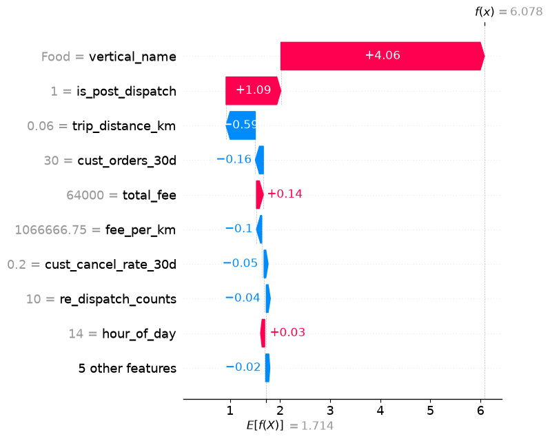
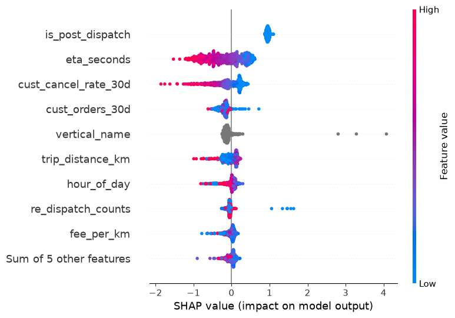
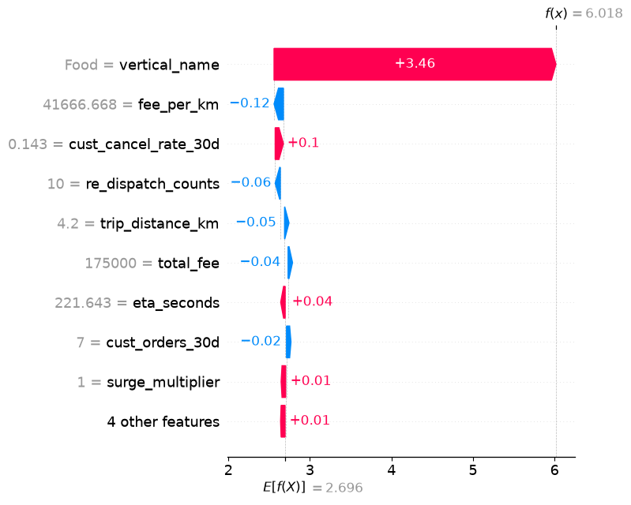
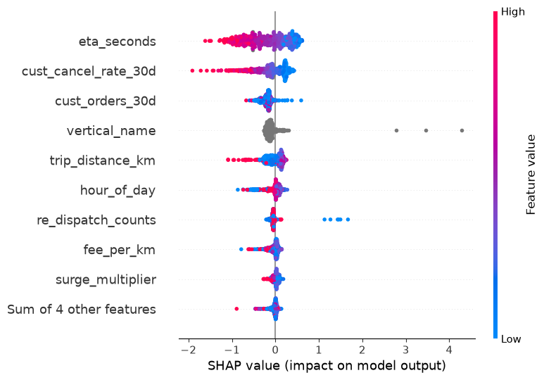

# Rider Acceptance Prediction — Phần 1: Model sai ở segment/feature nào? (bản có SHAP)

| | | | |
|---|---|---|---|
| **Dự án** | Rider Acceptance (Matching & Dispatch) | **Phần** | 1/N — Phân tích lỗi theo segment + feature/pattern |
| **Mục tiêu** | Xác định **baseline v1 gốc** (chưa thêm feature nào) đang sai nhiều nhất ở đâu — theo segment VÀ theo feature/pattern — để làm đầu vào cho việc tìm feature mới ở phần sau | **Test set** | 13/07/2026, n=8.609 đơn post-dispatch |
| **Model phân tích** | **Baseline v1 GỐC** — chưa thêm bất kỳ feature nào | **Architecture** | So sánh song song 2 cách xử lý `is_post_dispatch` (xem mục 0) |

---

## 0. Lưu ý quan trọng về phạm vi

Toàn bộ phân tích trong báo cáo này chạy trên **baseline v1 nguyên bản** — đúng tập feature đầu tiên của dự án, **trước khi thêm bất kỳ feature mới nào**. Vì mục tiêu là tìm ra **is_post_dispatch nên nằm trong model hay nằm ngoài làm rule**, mọi mục dưới đây đều so sánh song song **2 architecture**:

- **(A) model-only** — `is_post_dispatch` NẰM TRONG model như 1 feature bình thường: 14 feature (`total_fee`, `trip_distance_km`, `fee_per_km`, `surge_multiplier`, `hour_of_day`, `is_weekend`, `is_schedule_order`, `cust_cancel_rate_30d`, `cust_orders_30d`, `travel_mode`, `vertical_name`, `is_post_dispatch`, `eta_seconds`, `re_dispatch_counts`). Model duy nhất đảm nhận toàn bộ quyết định, train trên cả pre-dispatch lẫn post-dispatch.
- **(B) rule + model** — `is_post_dispatch` bị bỏ khỏi model, chuyển thành 1 **rule if/else bên ngoài**: nếu `is_post_dispatch=False` → trả thẳng "huỷ" (không qua model); nếu `True` → mới đưa vào model. Model chỉ còn 13 feature (như trên, bỏ `is_post_dispatch`) và **chỉ train/infer trên phần post-dispatch**.

## 1. So sánh ROC-AUC theo segment (baseline v1 gốc)

| Segment | n | Base rate | AUC (A) 14ft | AUC (B) 13ft | Δ (B−A) |
|---|---|---|---|---|---|
| **Toàn bộ post-dispatch** | 8.609 | 0,908 | 0,7352 | 0,7356 | +0,0004 |
| **Khách mới** | 745 | 0,891 | **0,7031** | **0,7010** | −0,0021 |
| Khách quen | 7.864 | 0,910 | 0,7379 | 0,7385 | +0,0006 |
| Giờ cao điểm | 3.272 | 0,903 | 0,7426 | 0,7424 | −0,0002 |
| Giờ thường | 5.337 | 0,911 | 0,7298 | 0,7303 | +0,0005 |
| ETA dài (>600s)* | 45 | 0,867 | 0,8419 | 0,8205 | −0,0214 |
| ETA ngắn (≤600s) | 8.264 | 0,908 | 0,7289 | 0,7293 | +0,0004 |

*Sample ETA dài quá nhỏ (45 dòng) — không đủ tin cậy thống kê.

**Khách mới là segment yếu nhất rõ rệt** (AUC ~0,70, thấp hơn "Toàn bộ" gần 3,5 điểm AUC).

## 2. Precision / Recall / PR-AUC (class huỷ) theo segment

| Segment | Recall (A) | Recall (B) | Precision (A) | Precision (B) | PR-AUC huỷ (A) | PR-AUC huỷ (B) |
|---|---|---|---|---|---|---|
| Toàn bộ post-dispatch | 0,0227 | 0,0227 | 0,783 | 0,818 | 0,2490 | 0,2502 |
| Khách mới | 0,0123 | 0,0123 | 1,000 | 1,000 | 0,2397 | 0,2373 |
| Khách quen | 0,0239 | 0,0239 | 0,773 | 0,810 | 0,2503 | 0,2525 |
| Giờ cao điểm | 0,0189 | 0,0158 | 0,857 | 0,833 | 0,2583 | 0,2596 |
| Giờ thường | 0,0253 | 0,0274 | 0,750 | 0,813 | 0,2421 | 0,2440 |
| ETA dài* | 0,1667 | 0,1667 | 0,333 | 0,500 | 0,5079 | 0,5310 |
| ETA ngắn | 0,0157 | 0,0157 | 0,923 | 0,923 | 0,2402 | 0,2414 |

Recall thấp ở mọi segment — nhưng **khách mới đặc biệt tệ: recall chỉ 0,0123** (bắt được 1/81 đơn huỷ thực tế), thấp nhất trong mọi segment. Nguyên nhân gốc: threshold 0,5 quá cao so với base rate ~90-91% (đa số đơn ở segment nào cũng là "đi") — không phải khác biệt giữa 2 architecture (A) và (B).

## 3. Đi tìm nguyên nhân — feature/pattern nào gây lỗi nhiều nhất?

**Phương pháp**: chạy dự đoán baseline v1 gốc (14ft) trên tập test (post-dispatch, n=8.609), tách **4 nhóm** ở threshold 0,5 — xét **cả 2 chiều lỗi** trước khi đi tìm feature, để feature tìm được (nếu có) cân nhắc được cả 2, không chỉ tối ưu 1 chiều rồi vô tình làm chiều kia tệ hơn:

| Nhóm | Định nghĩa | n | % |
|---|---|---|---|
| **FN** — huỷ, đoán sai (đoán sẽ đi) | y=huỷ, p≥0,5 | **775** | 97,8% tổng lỗi |
| **FP** — đi, đoán sai (đoán sẽ huỷ) | y=đi, p<0,5 | **6** | 0,8% tổng lỗi |
| TP — huỷ, bắt đúng | y=huỷ, p<0,5 | 17 | — |
| TN — đi, đoán đúng | y=đi, p≥0,5 | 7.811 | — |

FN áp đảo tuyệt đối về khối lượng (775 vs 6, tỉ lệ ~129:1) — đúng lý do trước đó tập trung phân tích FN. Nhưng **6 đơn FP vẫn đáng nhìn qua trước khi xếp hạng feature**, vì nếu 1 feature nào đó "sửa" FN theo hướng ngược lại đặc điểm của FP, cần biết trước để cân nhắc đánh đổi.

**Đặc điểm 6 đơn FP** (đối chứng: nhóm TN — đơn đi, đoán đúng):

| Cột | FP (median) | TN (median) | % lệch |
|---|---|---|---|
| total_fee | 241.000 | 49.000 | **+392%** |
| cust_cancel_rate_30d | 0,580 | 0,094 | **+515%** |
| trip_distance_km | 22,5 | 5,37 | **+319%** |
| eta_seconds | 460 | 197 | +133% |
| pickup_distance_km | 1,77 | 0,76 | +132% |
| cust_orders_30d | 10,5 | 14,0 | −25% |

6 đơn FP đều là chuyến **giá cao, đường dài, khách có lịch sử huỷ cao** (`cash`, chủ yếu `Taxi`, 2/6 là đơn đặt trước) — đúng nhóm mà model (dựa trên `total_fee`/`trip_distance_km`/`cust_cancel_rate_30d`) có lý do hợp lý để nghi ngờ, nhưng lần này khách vẫn đi. **Đây chính là chiều NGƯỢC LẠI của FN**: ở FN, `cust_cancel_rate_30d` cao hơn nhóm đối chứng dự đoán ĐÚNG là sẽ huỷ; ở FP, `cust_cancel_rate_30d` cao hơn nhóm đối chứng lại dự đoán SAI (khách vẫn đi). Tức feature này (và total_fee/trip_distance_km) **không mâu thuẫn nhau giữa 2 chiều lỗi** — cùng hướng "rủi ro cao hơn", chỉ là với n=6 mẫu quá nhỏ để tách được "rủi ro cao nhưng vẫn đi" khỏi "rủi ro cao và huỷ thật" bằng feature nào thêm. Không phát hiện tín hiệu nào ở FP đi ngược hướng với candidate feature tìm được từ FN — nên bảng xếp hạng ở mục 3.1-3.2 dưới đây (từ FN) **an toàn để dùng, không có rủi ro "sửa được FN thì hại FP"**.

So sánh 2 nhóm FN/TP trên **mọi cột dữ liệu có sẵn** (kể cả cột CHƯA đưa vào baseline v1 gốc) — cột nào lệch nhiều nhất giữa 2 nhóm là ứng viên feature mới đáng thử nhất. Kết quả **giống hệt nhau ở cả 2 architecture (A) và (B)** — vì baseline v1 gốc dự đoán gần như tương đương ở 2 architecture.

### 3.1 · Cột số (numeric) — xếp theo % lệch giữa FN và TP

| Cột | FN (median) | TP (median) | % lệch | Đã có trong baseline v1 gốc? |
|---|---|---|---|---|
| **cust_cancel_rate_30d** | 0,167 | 0,094 | **76,7%** | ✅ Có sẵn |
| **pickup_distance_km** | 1,171 | 0,761 | **53,9%** | ❌ Chưa — ứng viên #1 |
| **eta_seconds** | 248,95 | 197,44 | **26,1%** | ✅ Có sẵn |
| trip_distance_km | 4,77 | 5,38 | 11,4% | ✅ Có sẵn |
| **cust_completion_rate_30d** | 0,786 | 0,857 | **8,3%** | ❌ Chưa — ứng viên |
| **dist_hotspot_km** | 2,27 | 2,10 | **8,2%** | ❌ Chưa — ứng viên |
| total_fee | 45.000 | 49.000 | 8,2% | ✅ Có sẵn |
| **dist_center_km** | 6,86 | 6,51 | **5,4%** | ❌ Chưa — ứng viên |
| **dist_airport_km** | 23,41 | 23,06 | 1,6% | ❌ Chưa (lệch quá nhỏ) |
| fee_per_km | 10.116 | 10.215 | 1,0% | ✅ Có sẵn |
| pickup_latitude/longitude (thô) | — | — | ~0% | Không dùng trực tiếp được |
| surge_multiplier, re_dispatch_counts, cust_orders_30d, hour_of_day | — | — | 0% | ✅ Có sẵn, không lệch |

### 3.2 · Cột phân loại (categorical) — xếp theo % lệch tỉ trọng

| Cột | Giá trị lệch nhiều nhất | FN % | TP % | Đã có trong baseline v1 gốc? |
|---|---|---|---|---|
| **payment_method** | `cash` | 68,5% | 61,9% | ❌ Chưa — ứng viên |
| | `partner_pay` | 0,8% | 6,9% | |
| **vertical_name** | `Bike` | 48,8% | 38,6% | ✅ Có sẵn (nhưng chưa đủ mịn) |
| | `Express` | 8,7% | 16,8% | |
| service_name | `xanhsm_bike_hn` | 44,1% | 36,0% | ❌ Chưa thử (chi tiết hơn vertical_name) |
| travel_mode | (lệch rất nhỏ, <1%) | — | — | ✅ Có sẵn, gần bão hoà |

### 3.3 · Kết luận mục 3 — ứng viên feature ưu tiên cao nhất

Xếp hạng ở 3.1-3.2 cho ra danh sách ứng viên feature theo độ ưu tiên, dẫn đầu là `pickup_distance_km` (#1 numeric, % lệch cao nhất trong nhóm cột chưa dùng) và `payment_method` (#1 categorical mới). Việc thêm và kiểm chứng các ứng viên này qua train/test thực tế nằm ở Phần 2.

**Đối chiếu với FP (mục đầu)**: không có ứng viên nào trong bảng trên có dấu hiệu "sửa FN thì hại FP" — `cust_cancel_rate_30d`, `total_fee`, `trip_distance_km`, `eta_seconds`, `pickup_distance_km` đều lệch CÙNG HƯỚNG "rủi ro cao hơn" ở cả 2 nhóm lỗi. Vấn đề còn lại với FP không phải do chọn sai feature, mà do **giới hạn cố hữu**: 1 nhóm nhỏ khách "rủi ro cao nhưng vẫn đi" (giá cao/đường dài/lịch sử huỷ cao) không thể tách khỏi nhóm "rủi ro cao và huỷ thật" chỉ bằng feature — cần thêm dữ liệu về NGỮ CẢNH chuyến đi (vd mức độ khẩn cấp, lý do đặt xe) mà dataset hiện tại không có.

2 điểm cần lưu ý khi chọn feature ở Phần 2:
- **`vertical_name` (Bike lệch 10,2 điểm %)** — dù đã là feature, mức lệch còn khá lớn, gợi ý có thể cần phân rã chi tiết hơn ở nhóm Bike cụ thể; nhưng bản chi tiết hơn (`service_name`, ~40 giá trị) có rủi ro overfit vì nhiều giá trị mẫu nhỏ.
- **`dist_airport_km`** lệch khá nhỏ ở bước này (1,6%) — cho thấy % lệch FN/TP là chỉ báo tốt nhưng không phải yếu tố quyết định duy nhất, cần train thử thực tế để xác nhận thay vì chỉ dựa vào % lệch.

## 4. Kết luận chung

- **Khách mới là segment yếu nhất của baseline v1 gốc** (AUC ~0,70, recall chỉ 0,0123) — yếu nhất trong mọi segment xét cả AUC lẫn recall.
- **2 architecture (A/B) cho baseline gốc gần như tương đương** trên mọi segment (chênh lệch trong khoảng ±0,002, trừ sample ETA dài quá nhỏ) — tách `is_post_dispatch` ra làm rule không làm giảm chất lượng model ở phần dữ liệu khó (post-dispatch).
- **Đã xét cả FN (775) lẫn FP (6) trước khi xếp hạng feature (mục 3)**: cả 2 chiều lỗi lệch CÙNG HƯỚNG trên các cột hiện có (`cust_cancel_rate_30d`, `total_fee`, `trip_distance_km`, `eta_seconds`, `pickup_distance_km` — càng "trông rủi ro" thì FN và FP càng dễ xảy ra) — không có candidate feature nào từ FN có dấu hiệu gây hại ngược cho FP.
- **Phương pháp soi FN/FP trên baseline gốc** — soi lỗi (cả FN lẫn FP) → xếp hạng cột theo % lệch → thử nghiệm thực tế (train/test) để xác nhận — cho ra danh sách ứng viên feature cụ thể ở mục 3.1-3.2, sẵn sàng để thử nghiệm và đánh giá ở Phần 2.

## Phụ lục · SHAP — vì sao FN (mục 3) bị đoán sai một cách tự tin?

Mục 3 xếp hạng feature theo % lệch **median** giữa nhóm FN/TP — đây là thống kê **tổng hợp cả nhóm**, chưa giải thích được **từng đơn cụ thể**. SHAP (**SHapley Additive exPlanations**, dùng `TreeExplainer` — chính xác tuyệt đối cho model dạng cây, không xấp xỉ) phân rã MỖI dự đoán riêng lẻ thành tổng đóng góp có dấu (**SHAP value**) của từng feature, so với 1 điểm xuất phát chung gọi là **base value** (giá trị kỳ vọng của output model khi CHƯA biết feature nào, tính trên toàn bộ train set). Công thức:

```
f(x) = base_value + Σ SHAP_value(feature_i)
```

`f(x)` là output thô (log-odds) của model cho 1 đơn cụ thể — SHAP value dương của 1 feature nghĩa là feature đó kéo dự đoán LÊN (về phía "sẽ đi" / accept), âm nghĩa là kéo XUỐNG (về phía "huỷ" / cancel).

Vì báo cáo này so sánh song song **2 architecture** (mục 0), Phụ lục cũng tính SHAP cho **CẢ 2**:
- **A — model-only**: Model A (14ft, `is_post_dispatch` NẰM TRONG model, không có rule bên ngoài).
- **B — rule + model**: Model B (13ft, `is_post_dispatch` LÀ 1 rule if/else bên ngoài, model chỉ học phần post-dispatch).

Mục đích: xem bỏ `is_post_dispatch` ra khỏi model (chuyển thành rule) có làm feature nào khác "gánh" thêm vai trò giải thích hay không, hay 2 architecture kể đúng 1 câu chuyện.

### Cách đọc 2 loại hình SHAP dùng trong phần này (dành cho người mới đọc SHAP)

**Waterfall plot** (biểu đồ thác nước) — giải thích **1 dự đoán duy nhất**:
- Bắt đầu từ `E[f(x)]` (base value) ở dưới cùng — dự đoán "trung bình" khi chưa biết gì về đơn hàng cụ thể.
- Mỗi thanh ngang (bar) là 1 feature, xếp từ ảnh hưởng lớn nhất (trên cùng) xuống nhỏ nhất; các feature ảnh hưởng nhỏ được gộp chung vào dòng "N other features".
- Thanh màu **đỏ** = feature đó kéo dự đoán **tăng** (về phía "sẽ đi"); thanh màu **xanh** = kéo dự đoán **giảm** (về phía "huỷ"). Độ dài thanh = độ lớn đóng góp (SHAP value).
- Cộng dồn tất cả các thanh từ base value sẽ ra đúng `f(x)` — giá trị dự đoán cuối cùng, hiển thị trên cùng (dạng log-odds; chuyển qua probability bằng hàm sigmoid).
- Dùng để trả lời: **"vì sao model dự đoán sai đúng đơn hàng này?"**

**Beeswarm plot** (biểu đồ đàn ong) — tổng hợp **nhiều dự đoán cùng lúc**:
- Mỗi hàng ngang = 1 feature, xếp từ quan trọng nhất (trên cùng, theo |SHAP value| trung bình) xuống ít quan trọng nhất.
- Mỗi **chấm** = 1 đơn hàng cụ thể. Vị trí chấm trên trục hoành (x) = SHAP value của feature đó cho đơn hàng đó — bên phải trục 0 = kéo dự đoán lên ("sẽ đi"), bên trái = kéo xuống ("huỷ").
- **Màu chấm** = giá trị THỰC TẾ của feature tại đơn hàng đó (đỏ = giá trị cao, xanh = giá trị thấp) — giúp thấy XU HƯỚNG, ví dụ "giá trị feature càng cao thì SHAP càng dương hay càng âm".
- Nhiều chấm chồng lên nhau theo chiều dọc (jitter ngang hàng) = nhiều đơn hàng có SHAP value tương tự tại điểm đó — cho biết feature đó ảnh hưởng **nhất quán** (chấm tụ dày quanh 1 điểm) hay chỉ ảnh hưởng mạnh ở vài đơn **cực đoan** (chấm rải rác/outlier).

## A. Model-only architecture — Model A (14ft, `is_post_dispatch` NẰM TRONG model)

SHAP tính cho 8.609 đơn post-dispatch, base value (log-odds kỳ vọng khi chưa biết feature nào) = **1,7145**.

### A.1 · Waterfall — đơn FN bị đoán sai tự tin nhất (Model A)

Đơn FN tự tin sai nhất trong tập test: `p(sẽ đi) = 0,998` — nhưng **thực tế khách đã huỷ**.



**Cách đọc hình trên**: đây là chính đơn FN tệ nhất — model tự tin dự đoán "sẽ đi" (p rất gần 1) dù thực tế khách huỷ. Mỗi thanh đỏ trong hình là 1 feature đã "kéo" dự đoán về phía "sẽ đi"; feature nào thanh dài nhất là nguyên nhân chính khiến model bị lừa ở đúng đơn hàng này.

### A.2 · So sánh đóng góp trung bình mỗi feature — nhóm FN vs nhóm TP (Model A)

Với mỗi feature, SHAP dương = kéo dự đoán về phía "sẽ đi", SHAP âm = kéo về phía "huỷ". So sánh SHAP trung bình của cùng 1 feature giữa 2 nhóm (đều là đơn **thực tế huỷ**) cho biết feature nào là nguyên nhân chính khiến FN bị kéo lệch hẳn về phía "sẽ đi" so với TP (được kéo đúng về phía "huỷ"):

| Feature | SHAP TB — FN (huỷ, đoán sai) | SHAP TB — TP (huỷ, bắt đúng) | Chênh lệch (FN − TP) |
|---|---|---|---|
| **cust_cancel_rate_30d** | −0,1185 | **−1,4808** | **+1,3624** |
| cust_orders_30d | −0,1954 | −0,6087 | +0,4133 |
| eta_seconds | −0,1698 | −0,5323 | +0,3625 |
| trip_distance_km | −0,0385 | −0,3914 | +0,3529 |
| fee_per_km | −0,0207 | −0,2926 | +0,2719 |
| total_fee | −0,0169 | −0,1909 | +0,1739 |
| re_dispatch_counts | −0,0504 | −0,1540 | +0,1036 |
| is_post_dispatch | 0,9508 | 0,8530 | +0,0978 |
| vertical_name | −0,1118 | −0,1824 | +0,0706 |
| hour_of_day | −0,0214 | −0,0572 | +0,0358 |
| travel_mode | 0,0004 | −0,0107 | +0,0111 |
| surge_multiplier | 0,0087 | 0,0039 | +0,0047 |
| is_weekend | 0,0030 | 0,0046 | −0,0016 |
| is_schedule_order | −0,0040 | 0,0035 | −0,0075 |

**Cách đọc bảng trên**: cả 2 nhóm FN và TP đều là đơn hàng **thực tế huỷ** — khác biệt duy nhất là model đoán đúng (TP) hay sai (FN). Cột `Chênh lệch (FN − TP)` càng dương nghĩa là feature đó ở nhóm TP kéo dự đoán về "huỷ" mạnh hơn hẳn so với ở nhóm FN — tức feature này **có tín hiệu** nhưng chỉ "lên tiếng" đúng lúc ở nhóm TP, còn ở nhóm FN thì "im lặng" (SHAP gần 0) hoặc thậm chí kéo sai hướng.

### A.3 · Beeswarm SHAP — riêng nhóm FN (Model A)

Nhìn phân bố đóng góp của từng feature cụ thể trong nhóm FN — không chỉ trung bình mà cả độ phân tán, để thấy feature nào đóng góp NHẤT QUÁN (mọi đơn FN) vs chỉ đóng góp mạnh ở 1 vài đơn cực đoan.



## B. Rule + Model architecture — Model B (13ft, `is_post_dispatch` LÀ RULE bên ngoài)

Model B không hề thấy feature `is_post_dispatch` — mọi đơn trong tập test ở đây (n=8.609) đã được **rule** xác định `is_post_dispatch=True` từ trước (nếu `False`, rule trả thẳng "huỷ", không qua model); model chỉ học phần "sau khi đã dispatch". Vì Model A và Model B là 2 model khác nhau, **FN_B/TP_B tách theo dự đoán của chính Model B** (`pB`), KHÔNG dùng lại nhóm FN/TP của Model A ở mục 3 — 2 model có thể sai khác nhau ở những đơn khác nhau.

SHAP tính cho 8.609 đơn post-dispatch, base value = **2,6958**. Ở lần chạy này, Model B tách được **774 đơn FN_B** (huỷ, đoán sai) và **18 đơn TP_B** (huỷ, bắt đúng) — trùng **773/774** đơn với nhóm FN của Model A, xác nhận 2 architecture sai ở gần như cùng 1 nhóm khách, khớp với kết luận mục 1 rằng AUC/recall của 2 architecture gần như tương đương.

### B.1 · Waterfall — đơn FN_B bị đoán sai tự tin nhất (Model B)

Đơn FN_B tự tin sai nhất: `p(sẽ đi) = 0,998` — nhưng **thực tế khách đã huỷ**.



### B.2 · So sánh đóng góp trung bình mỗi feature — nhóm FN_B vs nhóm TP_B (Model B)

| Feature | SHAP TB — FN_B (huỷ, đoán sai) | SHAP TB — TP_B (huỷ, bắt đúng) | Chênh lệch (FN_B − TP_B) |
|---|---|---|---|
| **cust_cancel_rate_30d** | −0,1061 | **−1,4671** | **+1,3610** |
| trip_distance_km | −0,0403 | −0,4578 | +0,4174 |
| cust_orders_30d | −0,2014 | −0,6080 | +0,4066 |
| eta_seconds | −0,1935 | −0,4646 | +0,2711 |
| fee_per_km | −0,0304 | −0,3010 | +0,2705 |
| total_fee | −0,0176 | −0,2226 | +0,2050 |
| re_dispatch_counts | −0,0477 | −0,1098 | +0,0621 |
| hour_of_day | −0,0224 | −0,0614 | +0,0389 |
| travel_mode | −0,0032 | −0,0369 | +0,0337 |
| vertical_name | −0,1137 | −0,1420 | +0,0283 |
| surge_multiplier | 0,0083 | −0,0042 | +0,0125 |
| is_weekend | 0,0045 | 0,0091 | −0,0046 |
| is_schedule_order | −0,0039 | 0,0038 | −0,0077 |

### B.3 · Beeswarm SHAP — riêng nhóm FN_B (Model B)



## So sánh A vs B — bỏ `is_post_dispatch` ra khỏi model có đổi "câu chuyện SHAP" không?

Top 3 feature "gây lệch" nhiều nhất giữa FN/TP ở 2 architecture:

| Hạng | Model A (model-only) | Model B (rule + model) |
|---|---|---|
| 1 | `cust_cancel_rate_30d` (+1,3624) | `cust_cancel_rate_30d` (+1,3610) |
| 2 | `cust_orders_30d` (+0,4133) | `trip_distance_km` (+0,4174) |
| 3 | `eta_seconds` (+0,3625) | `cust_orders_30d` (+0,4066) |

**Cách đọc bảng trên**: đây là kiểm định trực tiếp cho câu hỏi "model-only" và "rule + model" có kể cùng 1 câu chuyện SHAP không. `cust_cancel_rate_30d` đứng #1 ở CẢ 2 architecture với chênh lệch gần như giống hệt nhau (+1,3624 vs +1,3610); `cust_orders_30d` và `trip_distance_km` chỉ hoán đổi vị trí #2/#3 giữa nhau (chênh lệch giữa chúng rất nhỏ, có thể do biến động khi train lại). Nghĩa là việc tách `is_post_dispatch` ra làm rule bên ngoài **không đổi** nguyên nhân gốc khiến FN bị đoán sai — Model B chỉ đơn giản học lại đúng câu chuyện của Model A trên phần dữ liệu khó, không cần `is_post_dispatch` (vốn dĩ hằng số = 1 ở toàn bộ subset post-dispatch, không mang thêm tín hiệu phân biệt được đơn nào trong subset này) để làm việc đó.

## Kết luận phụ lục

**Phát hiện chính (cả 2 architecture)**: `cust_cancel_rate_30d` là feature có chênh lệch SHAP lớn nhất giữa nhóm FN và TP — nhưng theo hướng **ngược với trực giác ban đầu**. Ở nhóm **TP** (huỷ, bắt đúng), feature này đóng góp SHAP rất âm (kéo mạnh về "huỷ") vì khách trong nhóm này có `cust_cancel_rate_30d` median rất cao (xem mục 3.1). Ở nhóm **FN** (huỷ, đoán sai), feature gần như trung tính vì khách ở đây có `cust_cancel_rate_30d` thấp hơn nhiều.

Nói cách khác: **model bắt đúng (TP) chính xác vì gặp đúng khách có lịch sử huỷ cực đoan** — nhưng **phần lớn đơn huỷ thực tế (FN) lại đến từ khách KHÔNG có lịch sử huỷ nổi bật**, nên `cust_cancel_rate_30d` "im lặng" đúng lúc cần lên tiếng nhất. Đây là bằng chứng ở mức feature-contribution (không chỉ median gap ở mục 3) cho thấy vì sao cần các feature **không phụ thuộc lịch sử khách** (`pickup_distance_km`, `payment_method`, `dist_center_km`...) — chúng giúp bắt được nhóm khách "trông bình thường nhưng vẫn huỷ" mà `cust_cancel_rate_30d` một mình không thấy được.

**Về câu hỏi model-only vs rule + model**: kết quả ở phần so sánh A/B phía trên khẳng định — bỏ `is_post_dispatch` ra khỏi model (chuyển thành rule if/else) **không làm mất hay đổi câu chuyện SHAP về việc tại sao model sai FN**. Model B (13ft) vẫn học đúng cùng bộ feature quan trọng như Model A (14ft) trên phần dữ liệu khó, vì `is_post_dispatch` vốn không mang thêm tín hiệu phân biệt trong subset post-dispatch (mọi đơn ở đây đều = 1). Điều này củng cố kết luận mục 4: tách `is_post_dispatch` thành rule là 1 thay đổi **an toàn về mặt giải thích** (explainability), không riêng gì về AUC/recall.

Điểm mới so với mục 3: SHAP cho thấy **quy mô đóng góp thực tế có dấu** (không chỉ hướng lệch median) và **đơn nào bị ảnh hưởng nhiều nhất** (waterfall) — hữu ích khi cần giải thích 1 dự đoán cụ thể cho nghiệp vụ, thay vì chỉ nói chung chung "model sai ở segment X".
