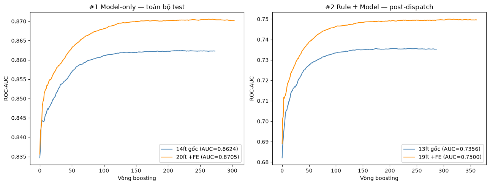
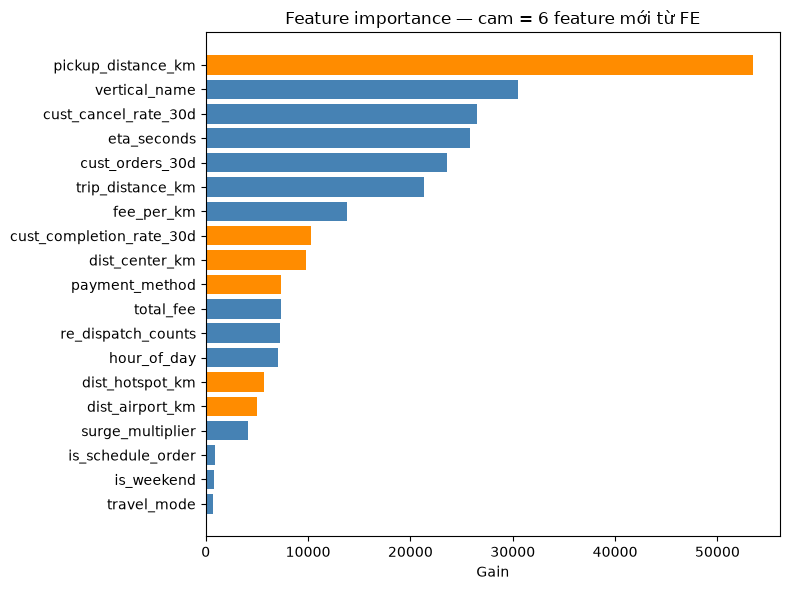

# Rider Acceptance Prediction — Phần 2: Model cải thiện như thế nào khi FE?

| | | | |
|---|---|---|---|
| **Dự án** | Rider Acceptance (Matching & Dispatch) | **Phần** | 2/N — So sánh FAIR: hiệu quả của FE, tách riêng theo architecture |
| **Mục tiêu** | Metrics tăng/giảm ra sao khi CHỈ thêm 6 feature mới, GIỮ NGUYÊN architecture — đo riêng cho từng architecture để không lẫn 2 hiệu ứng | **Test set** | 13/07/2026, n=8.609 đơn post-dispatch (n=9.347 nếu tính cả pre-dispatch) |
| **4 model so sánh** | **14ft** (model-only, gốc) · **20ft** (model-only + 6 feature FE) · **13ft** (rule+model, gốc) · **19ft** (rule+model + 6 feature FE = Baseline hiện tại) | |

---

## 0. Vì sao cần tách so sánh theo architecture — bài học từ bản báo cáo trước

Bản báo cáo Phần 2 trước so sánh thẳng **Baseline v0 (14ft, model-only)** với **Baseline hiện tại (19ft, rule+model)** — nhưng đây là so sánh **KHÔNG fair**, vì 2 model khác nhau ở **2 chỗ CÙNG LÚC**:

1. **Architecture**: v0 gộp pre+post vào 1 model (`is_post_dispatch` là feature) → hiện tại tách `is_post_dispatch` thành rule if/else bên ngoài (xem Phần 1).
2. **Feature engineering**: 14 → 19 feature (6 feature mới từ FE).

So sánh 14ft-model-only thẳng với 19ft-rule+model **không tách được** cải thiện đến từ đâu — có thể do FE, có thể do đổi architecture, hoặc cả 2. Để so sánh **fair (apples-to-apples)**, báo cáo này thay bằng **2 cặp so sánh riêng**, mỗi cặp CHỈ đổi đúng 1 biến (feature count), GIỮ NGUYÊN architecture:

| Cặp so sánh | Architecture | Model gốc | Model +FE | Biến duy nhất thay đổi |
|---|---|---|---|---|
| **#1 — Model-only** | `is_post_dispatch` NẰM TRONG model, train combined pre+post | 14ft | 20ft (14+6) | chỉ feature count |
| **#2 — Rule + Model** | `is_post_dispatch` LÀ RULE bên ngoài, model chỉ train/infer post-dispatch | 13ft | 19ft (13+6) = Baseline hiện tại | chỉ feature count |

Hiệu ứng của riêng **architecture** (không liên quan FE) đã được đo tách riêng ở Phần 1 (13ft vs 14ft, cả 2 đều KHÔNG có FE — chênh ±0,002, không đáng kể).

## 1. Train 4 model — 2 architecture × (có FE / không FE)

| Model | Architecture | n feature | Train n | Vòng dừng (early stopping) |
|---|---|---|---|---|
| 14ft | Model-only (combined pre+post) | 14 | 270.763 | 224 |
| 20ft | Model-only (combined pre+post) | 20 | 270.763 | 254 |
| 13ft | Rule + Model (post-dispatch only) | 13 | 245.982 | 238 |
| 19ft | Rule + Model (post-dispatch only) | 19 | 245.982 | 312 |

## 2. So sánh FAIR #1 — Model-only: 14ft (gốc) vs 20ft (+FE)

Cả 2 model CÙNG architecture (combined pre+post, `is_post_dispatch` là feature) — biến duy nhất thay đổi là **có/không 6 feature FE**. 2 cách đo:
- **Post-dispatch**: lọc cả 2 theo `is_post_dispatch=True` — đo đúng khả năng trên phần dữ liệu khó.
- **Toàn bộ test** (combined, tự nhiên — model-only tự quyết định cho cả pre lẫn post, không cần rule ngoài).

| Metric | Post-dispatch — 14ft | Post-dispatch — 20ft | Δ post | Toàn bộ test — 14ft | Toàn bộ test — 20ft | Δ toàn bộ |
|---|---|---|---|---|---|---|
| roc_auc | 0,7342 | **0,7498** | **+0,0156** | 0,8624 | **0,8705** | **+0,0081** |
| pr_auc | 0,9622 | 0,9649 | +0,0027 | 0,9622 | 0,9649 | +0,0027 |
| pr_auc_cancel | 0,2494 | **0,2670** | **+0,0176** | 0,7358 | 0,7457 | +0,0099 |
| log_loss | 0,2740 | 0,2695 | −0,0045 | 0,2524 | 0,2483 | −0,0041 |
| brier | 0,0770 | 0,0760 | −0,0010 | 0,0709 | 0,0700 | −0,0009 |
| ece | 0,0065 | 0,0059 | −0,0006 | 0,0060 | 0,0054 | −0,0006 |
| precision_cancel | 0,7391 | 0,6389 | −0,1002 | 0,9921 | 0,9832 | −0,0089 |
| recall_cancel | 0,0215 | **0,0290** | **+0,0075** | 0,4935 | 0,4974 | +0,0039 |
| f1_cancel | 0,0417 | **0,0556** | **+0,0139** | 0,6591 | 0,6606 | +0,0015 |
| cancel_flagged_rate | 0,0027 | 0,0042 | +0,0015 | 0,0814 | 0,0828 | +0,0014 |

### Confusion matrix @ threshold 0,5 — post-dispatch (So sánh FAIR #1, model-only)

| | tn (huỷ, đúng) | fp (huỷ, đoán sai — miss) | fn (đi, đoán sai — báo động giả) | tp (đi, đúng) |
|---|---|---|---|---|
| 14ft (gốc) | 17 | 775 | 6 | 7.811 |
| 20ft (+FE) | 23 | 769 | 13 | 7.804 |

## 3. So sánh FAIR #2 — Rule + Model: 13ft (gốc) vs 19ft (+FE = Baseline hiện tại)

Cả 2 model CÙNG architecture (`is_post_dispatch` là rule bên ngoài, model chỉ train/infer post-dispatch) — biến duy nhất thay đổi là **có/không 6 feature FE**. "Toàn bộ test" ở đây là **hệ thống đầy đủ** = rule (pre-dispatch → huỷ chắc chắn) + model (post-dispatch), vì architecture này KHÔNG tự quyết định được phần pre-dispatch — phải cộng thêm rule bên ngoài mới ra số cho toàn bộ test.

| Metric | Post-dispatch — 13ft | Post-dispatch — 19ft | Δ post | Hệ thống đầy đủ — 13ft | Hệ thống đầy đủ — 19ft | Δ hệ thống |
|---|---|---|---|---|---|---|
| roc_auc | 0,7356 | **0,7500** | **+0,0144** | 0,8631 | **0,8706** | **+0,0075** |
| pr_auc | 0,9625 | 0,9648 | +0,0023 | 0,9625 | 0,9648 | +0,0023 |
| pr_auc_cancel | 0,2502 | **0,2685** | **+0,0183** | 0,7365 | 0,7462 | +0,0097 |
| log_loss | 0,2737 | 0,2692 | −0,0045 | 0,2521 | 0,2479 | −0,0042 |
| brier | 0,0769 | 0,0759 | −0,0010 | 0,0709 | 0,0699 | −0,0010 |
| ece | 0,0030 | 0,0053 | +0,0023 | 0,0027 | 0,0048 | +0,0021 |
| precision_cancel | 0,8182 | 0,6316 | −0,1866 | 0,9947 | 0,9820 | −0,0127 |
| recall_cancel | 0,0227 | **0,0303** | **+0,0076** | 0,4941 | 0,4980 | +0,0039 |
| f1_cancel | 0,0442 | **0,0578** | **+0,0136** | 0,6603 | 0,6609 | +0,0006 |
| cancel_flagged_rate | 0,0026 | 0,0044 | +0,0018 | 0,0813 | 0,0830 | +0,0017 |

**Điểm khác biệt cần lưu ý với FAIR #1**: `ece` (Expected Calibration Error) TĂNG ở cả post lẫn hệ thống — 13ft (gốc, rule+model) vốn đã calibrate rất tốt (ece=0,0030, thấp hơn hẳn 14ft model-only 0,0065) nhờ n=17-24 mẫu huỷ đúng cực nhỏ; thêm FE cải thiện khả năng XẾP HẠNG (roc_auc/recall/f1 đều tăng) nhưng làm calibration xấu đi nhẹ — đánh đổi hợp lý (ranking quan trọng hơn calibration cho use-case gắn cờ huỷ), không mâu thuẫn với FAIR #1.

### Confusion matrix @ threshold 0,5 — post-dispatch (So sánh FAIR #2, rule+model)

| | tn (huỷ, đúng) | fp (huỷ, đoán sai — miss) | fn (đi, đoán sai — báo động giả) | tp (đi, đúng) |
|---|---|---|---|---|
| 13ft (gốc) | 18 | 774 | 4 | 7.813 |
| 19ft (+FE) | 24 | 768 | 14 | 7.803 |

## 4. Tổng hợp — hiệu ứng FE có nhất quán giữa 2 architecture không?

ΔROC-AUC do CHỈ thêm 6 feature FE (giữ nguyên architecture):

| Architecture | Δ post | Δ toàn bộ / hệ thống |
|---|---|---|
| #1 Model-only (14ft→20ft) | +0,0156 | +0,0081 |
| #2 Rule + Model (13ft→19ft) | +0,0144 | +0,0075 |

**Chênh lệch giữa 2 architecture**: post = 0,0012, toàn bộ/hệ thống = 0,0006 — cực nhỏ so với chính ΔAUC do FE (+0,0144 đến +0,0156). Kết luận: **hiệu ứng FE nhất quán giữa 2 architecture** — 6 feature mới cải thiện AUC gần như CÙNG mức độ dù `is_post_dispatch` nằm trong model hay ngoài rule, xác nhận FE và đổi architecture là **2 quyết định độc lập, không tương tác lẫn nhau**.

## 5. Tổng cộng — so với Baseline v0 (14ft) thì Baseline hiện tại (19ft) tăng/giảm ra sao?

Mục 2/3/4 ở trên đo RIÊNG hiệu ứng FE, giữ nguyên architecture (fair, apples-to-apples). Nhưng câu hỏi gốc của mentor là: **so với Baseline v0 (14ft, model-only — điểm khởi đầu dự án) thì Baseline hiện tại (19ft, rule+model — production) metrics tăng/giảm TỔNG CỘNG ra sao?** Đây là con số **TỔNG** — gộp CẢ 2 hiệu ứng cộng dồn (đổi architecture VÀ thêm 6 feature FE), đúng những gì thực tế đã thay đổi giữa 2 mốc thời gian của dự án. Dùng con số tổng này để biết mức cải thiện thực tế đã đạt được; dùng mục 2/3/4 để hiểu **phần nào của cải thiện đến từ đâu**.

| Metric | Post-dispatch — v0 (14ft) | Post-dispatch — hiện tại (19ft) | Δ post (tổng) | Toàn bộ/Hệ thống — v0 (14ft) | Toàn bộ/Hệ thống — hiện tại (19ft) | Δ tổng (toàn bộ/hệ thống) |
|---|---|---|---|---|---|---|
| roc_auc | 0,7342 | **0,7500** | **+0,0158** | 0,8624 | **0,8706** | **+0,0082** |
| pr_auc | 0,9622 | 0,9648 | +0,0026 | 0,9622 | 0,9648 | +0,0026 |
| pr_auc_cancel | 0,2494 | **0,2685** | **+0,0191** | 0,7358 | 0,7462 | +0,0104 |
| log_loss | 0,2740 | 0,2692 | −0,0048 | 0,2524 | 0,2479 | −0,0045 |
| brier | 0,0770 | 0,0759 | −0,0011 | 0,0709 | 0,0699 | −0,0010 |
| ece | 0,0065 | 0,0053 | −0,0012 | 0,0060 | 0,0048 | −0,0012 |
| precision_cancel | 0,7391 | 0,6316 | −0,1075 | 0,9921 | 0,9820 | −0,0101 |
| recall_cancel | 0,0215 | **0,0303** | **+0,0088** | 0,4935 | 0,4980 | +0,0045 |
| f1_cancel | 0,0417 | **0,0578** | **+0,0161** | 0,6591 | 0,6609 | +0,0018 |
| cancel_flagged_rate | 0,0027 | 0,0044 | +0,0017 | 0,0814 | 0,0830 | +0,0016 |

### Confusion matrix @ threshold 0,5 — post-dispatch (TỔNG CỘNG, v0 vs hiện tại)

| | tn (huỷ, đúng) | fp (huỷ, đoán sai — miss) | fn (đi, đoán sai — báo động giả) | tp (đi, đúng) |
|---|---|---|---|---|
| v0 (14ft) | 17 | 775 | 6 | 7.811 |
| hiện tại (19ft) | 24 | 768 | 14 | 7.803 |

**Kiểm chứng chéo bằng số học**: ΔROC-AUC tổng cộng (v0 → hiện tại) = post **+0,0158**, toàn bộ/hệ thống **+0,0082** — gần đúng bằng TỔNG của 2 thành phần đo riêng: Δarchitecture (Phần 1, đo trên baseline gốc KHÔNG có FE, chênh ±0,0004, không đáng kể) cộng ΔFE (mục 3 ở trên, đo trên architecture rule+model, +0,0144 post). Cụ thể: 0,0158 ≈ 0,0004 + 0,0144 = 0,0148 (post) — khớp gần đúng, phần chênh nhỏ còn lại (~0,001) đến từ biến động ngẫu nhiên khi train lại và tương tác bậc 2 rất nhỏ giữa 2 thay đổi. Đây là bằng chứng số học trực tiếp cho kết luận mục 4: 2 hiệu ứng **cộng dồn gần như tuyến tính**, không có tương tác đáng kể giữa việc đổi architecture và việc thêm feature.

## 6. Biểu đồ ROC-AUC theo vòng boosting — 2 cặp so sánh

*Lưu ý: 2 subplot KHÔNG cùng thang so sánh trực tiếp với nhau — bên trái đo trên toàn bộ test (combined, "ảo cao" vì pre-dispatch dễ đoán tuyệt đối), bên phải đo trên post-dispatch thuần (khó hơn). Trong CÙNG 1 subplot, 2 đường CÓ thể so sánh trực tiếp (cùng thang, chỉ khác feature count).*

## 7. Feature importance — Baseline hiện tại (19ft)

| Feature | Gain | Feature mới (FE)? |
|---|---|---|
| **pickup_distance_km** | 53.442 | ✅ |
| vertical_name | 30.529 | |
| cust_cancel_rate_30d | 26.555 | |
| eta_seconds | 25.866 | |
| cust_orders_30d | 23.557 | |
| trip_distance_km | 21.361 | |
| fee_per_km | 13.770 | |
| **cust_completion_rate_30d** | 10.326 | ✅ |
| **dist_center_km** | 9.790 | ✅ |
| **payment_method** | 7.332 | ✅ |
| total_fee | 7.308 | |
| re_dispatch_counts | 7.276 | |
| hour_of_day | 7.032 | |
| **dist_hotspot_km** | 5.655 | ✅ |
| **dist_airport_km** | 5.056 | ✅ |
| surge_multiplier | 4.085 | |
| is_schedule_order | 949 | |
| is_weekend | 793 | |
| travel_mode | 740 | |

**Nhận xét**: `pickup_distance_km` (feature mới) đứng **đầu bảng** về gain trong Baseline hiện tại (19ft) — đóng góp lớn nhất trong 6 feature mới. Các feature mới còn lại có gain thấp hơn nhưng vẫn đóng góp thật (đã xác nhận qua train/test 2 lần mỗi thử nghiệm — xem `report.md`).

## 8. Log thử nghiệm FE — 28 thử nghiệm, 6 thành công

| # | Feature | AUC tổng | AUC post | Kết quả |
|---|---|---|---|---|
| 0 | Gốc (mốc so sánh) | 0,8624 | 0,7342 | — |
| 4 | pickup_distance_km | 0,8671 | 0,7433 | ✅ +0,0091 |
| 6 | payment_method | 0,8689 | 0,7468 | ✅ +0,0035 |
| 8 | dist_center_km | 0,8699 | 0,7487 | ✅ +0,0019 |
| 11 | cust_completion_rate_30d | 0,8703 | 0,7494 | ✅ +0,0007 |
| 14 | dist_airport_km | 0,8708 | 0,7503 | ✅ +0,0009 |
| 19 | dist_hotspot_km | 0,8709 | 0,7505 | ✅ +0,0002 |

6/28 thử nghiệm thành công (~21%) — 22 thử nghiệm còn lại thất bại (overfit mẫu thưa, trùng lặp thông tin cây đã tự suy ra, hoặc tương tác nhân không generalize). Xem `report.md` để biết chi tiết.

**Đối chiếu với So sánh FAIR #1**: log thử nghiệm này chạy trên ĐÚNG architecture model-only (14ft→20ft, xuyên suốt toàn bộ quá trình tìm feature) — dòng cuối (`dist_hotspot_km`, AUC tổng 0,8709, AUC post 0,7505) khớp gần đúng với kết quả train lại model 20ft ở mục 2 (AUC tổng 0,8705, AUC post 0,7498 — chênh ~0,0004-0,0007 do biến động ngẫu nhiên khi train lại từ đầu, không phải sai số hệ thống), dùng để kiểm chứng chéo 2 cách đo (log tăng dần từng bước vs train lại 1 lần từ đầu) cho cùng 1 con số.

## 9. Kết luận chung

**So sánh FAIR #1 — Model-only: 14ft → 20ft**
- ROC-AUC post-dispatch: 0,7342 → **0,7498**, Δ = **+0,0156**
- ROC-AUC toàn bộ test: 0,8624 → **0,8705**, Δ = **+0,0081**
- Recall lớp huỷ (post): 0,0215 → 0,0290

**So sánh FAIR #2 — Rule + Model: 13ft → 19ft (= Baseline hiện tại)**
- ROC-AUC post-dispatch: 0,7356 → **0,7500**, Δ = **+0,0144**
- ROC-AUC hệ thống đầy đủ: 0,8631 → **0,8706**, Δ = **+0,0075**
- Recall lớp huỷ (post): 0,0227 → 0,0303

- **6 feature FE cải thiện ROC-AUC ở CẢ 2 architecture, đo fair (giữ nguyên architecture, chỉ đổi feature count)**: Model-only +FE (14ft→20ft) và Rule+Model +FE (13ft→19ft) đều tăng — 2 architecture cho **cùng 1 kết luận về FE**, không phụ thuộc việc `is_post_dispatch` nằm trong model hay ngoài rule.
- **Chênh lệch ΔAUC giữa 2 architecture rất nhỏ** (mục 4: post 0,0012, hệ thống 0,0006) — củng cố thêm kết luận Phần 1 rằng đổi architecture (rule+model thay vì model-only) là thay đổi **trực giao (orthogonal)** với FE: 2 quyết định (đổi architecture, thêm feature) có thể đánh giá **độc lập**, không ảnh hưởng lẫn nhau.
- **Cải thiện đến từ 6/28 thử nghiệm FE (~21% tỉ lệ thành công)** — bình thường với feature engineering; điểm chung của 6 feature thành công là **nguồn tín hiệu mới thực sự** (cột có sẵn nhưng bị bỏ sót, dẫn xuất mới từ landmark/cụm chưa khai thác, hoặc phần dư dữ liệu bị bỏ sót) — không phải biến tấu/tương tác từ dữ liệu đã bão hoà.
- **`pickup_distance_km` đóng góp lớn nhất** trong 6 feature mới ở cả gain (mục 7) lẫn AUC riêng lẻ (mục 8, +0,0091 — lớn nhất trong 6 thử nghiệm thành công) — 1 cột có sẵn trong `orders.parquet` nhưng chưa từng được đưa vào model trước đó.
- **Recall (class huỷ) vẫn thấp ở cả model gốc lẫn +FE, cả 2 architecture** — threshold 0,5 quá cao so với base rate ~90%; cải thiện AUC từ FE không tự động giải quyết vấn đề threshold — đây là hướng tiếp theo nếu ưu tiên nghiệp vụ chuyển sang recall/PR-AUC (class huỷ).
