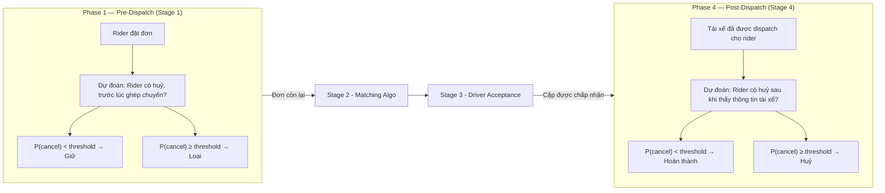

# Rider Cancellation Prediction — Baseline Model

## 1. Tổng quan bài toán

### Mục tiêu

Xây dựng mô hình dự đoán xác suất khách hàng (rider) huỷ đơn tại hai thời điểm trong quy trình dispatch. Kết quả dự đoán phục vụ: tối ưu hệ thống simulation — lọc bỏ các đơn/cặp có xác suất huỷ cao trước khi vào giải thuật Matching, giúp mô phỏng sát thực tế hơn.

### Định nghĩa bài toán

- Hai pha dự đoán: **Pre-Dispatch** (Stage 1) và **Post-Dispatch** (Stage 4) trong pipeline dispatch 4 bước.
- Dịch vụ: Bike và Car (dùng chung mô hình).
- Mô hình hiện tại: Baseline với 6 features — đã tích hợp, hoạt động ổn định, sẽ nâng cấp feature set trong tương lai.

> ⚠️ So với mô hình Driver Acceptance (features, pipeline FE đầy đủ), mô hình Rider Cancellation hiện ở dạng baseline tối thiểu. Kế hoạch mở rộng features nằm ở phase sau.

### Mô tả bài toán theo chu trình Dispatch

Quy trình dispatch từ lúc khách hàng tìm chuyến đi qua 4 stages. Rider Behavior được gọi tại stage pre-dispatch và stage post-dispatch:



| Hạng mục | Phase 1 — Pre-Dispatch | Phase 2 — Post-Dispatch |
|---|---|---|
| Thời điểm | Trước khi có ghép chuyến | Sau khi tài xế được dispatch |
| Câu hỏi | "Rider có huỷ đơn trong lúc chờ tài xế?" | "Rider có huỷ sau khi thấy thông tin tài xế / ETA?" |
| Dispatch stage | Stage 1 | Stage 4 |
| Tín hiệu chính | Thời gian chờ / ETA dài | Thông tin tài xế, cước phí, ETA đến điểm đón |
| Model artifact dir | `rider-predispatch-prediciton/sim/` | `rider-postdispatch-prediction/sim/` |

## 2. Mô hình ML (Base version)

### 2.1 Thông số mô hình

*(chưa có nội dung chi tiết)*

### 2.2 Danh sách đặc trưng

| # | Feature | Loại | Cột nguồn | Mô tả |
|---|---|---|---|---|
| 1 | `estimate_time_arrival` | Số | `estimate_time_arrival` | ETA (giây) từ tài xế đến điểm đón |
| 2 | `estimate_distance_arrival` | Số | `estimate_distance_arrival` | Khoảng cách (km) từ tài xế đến điểm đón |
| 3 | `total_fee` | Số | `total_fee` | Tổng cước phí hiển thị cho rider (VNĐ) |
| 4 | `dispatch_mode` | Phân loại | `dispatch_mode` / `dispatch_types` | Loại dispatch |
| 5 | `driver_contract_type` | Phân loại | `driver_contract_type` | Loại hợp đồng tài xế |
| 6 | `service_type` | Phân loại | `service_type` | Loại dịch vụ |

Mỗi thư mục model chứa:

```
rider-postdispatch-prediction/sim/      # hoặc rider-predispatch-prediciton/sim/
├── lightgbm_cr_model.txt               # LightGBM Booster (text format)
├── calib_cr_model.pkl                   # SplineCalib calibration model (joblib)
├── features_n_orders.json              # Danh sách feature theo thứ tự
├── dispatch_mode_mapping.json           # Mapping categorical → int
├── driver_contract_type_mapping.json    # Mapping categorical → int
└── service_type_type_mapping.json       # Mapping categorical → int
```

### 2.3 Fallback

Khi model ML chưa sẵn sàng hoặc trong quá trình phát triển, dự đoán dựa trên rule theo ETA, trong đó `base_accept_rate` được tính toán thống kê và cấu hình theo Location x Time:

```
P(stay) = base_accept_rate − ETA_penalty

với:
    base_accept_rate = 0.92  # ví dụ
    ETA_penalty = max(0, (ETA − eta_threshold) / 100) × eta_penalty_factor
    eta_threshold = 600 giây (10 phút)
    eta_penalty_factor = 0.02 mỗi 100s vượt ngưỡng
```

## 3. Tích hợp trong Simulation & Cải tiến

`SimulationRunner` khởi tạo predictors khi startup:

- Đọc `behavior_prediction_config` từ `SimulationConfig`.
- Với mỗi pha, tạo ML predictor nếu model dir tồn tại, ngược lại fallback về mock.
- Truyền cả 3 predictors (pre-dispatch, driver acceptance, post-dispatch) vào `DispatchFlowOrchestrator`.

### Hướng cải tiến

| # | Nội dung | Ghi chú |
|---|---|---|
| 1 | Mở rộng feature set — thêm lịch sử hành vi của Rider trong khoảng time-frame trước đó | Hiện tại chỉ 6 features theo orders, cần bổ sung |
| 2 | Mở rộng dữ liệu huấn luyện — tăng khoảng thời gian training | Nhiều data hơn → calibration tốt hơn ở đuôi phân phối |
| 3 | Fine-tune Model | Theo dõi cải thiện từ v1 → v2 |
